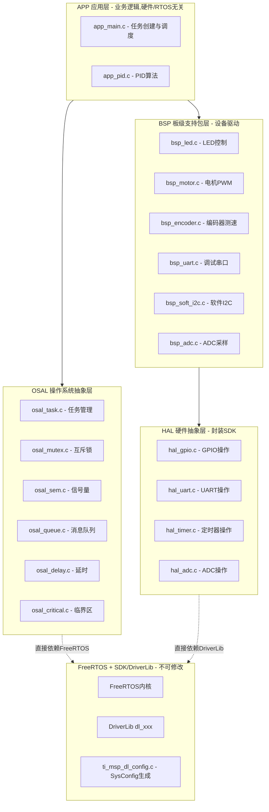

## 产品概述

为MSPM0G3507微控制器设计一套严格五层分层的嵌入式工程代码框架，实现硬件依赖完全隔离、模块化驱动封装和FreeRTOS/裸机双模式支持。

## 核心功能

- **严格五层架构**: APP → OSAL + BSP → HAL → FreeRTOS + SDK，层间仅通过头文件接口隔离，禁止反向依赖和跨层调用
- **HAL独立封装SDK**: 所有DL_xxx调用封装在HAL层，BSP层不直接引用任何SDK头文件；更换MCU仅需重写HAL层
- **OSAL抽象RTOS**: 统一的任务/互斥锁/信号量/队列/延时/临界区接口，APP和BSP层代码与RTOS无关
- **GPIO/UART/软件I2C驱动**: HAL提供GPIO/UART/Timer/ADC的硬件操作封装；BSP基于HAL实现设备逻辑，软件I2C基于hal_gpio位操作实现
- **不重复初始化**: SYSCFG_DL_init()已完成的外设初始化不重复，BSP仅补充运行时操作(如NVIC使能、回调注册)
- **标准驱动模板**: HAL和BSP各提供五函数接口模板(init/deinit/read/write/control)，含错误码和中文注释
- **统一命名规范**: 函数`模块_动作()`，类型`PascalCase_t`，宏`UPPER_SNAKE_CASE`，全局`g_`前缀，文件静态`s_`前缀
- **全量中文注释**: 每个函数、变量、类型定义均提供中文注释

## 技术栈

- **MCU**: MSPM0G3507 (Cortex-M0+, 80MHz, 32KB SRAM, 128KB Flash)
- **SDK**: TI MSPM0 SDK 2.05.00.05 (DriverLib dl_xxx API)
- **RTOS**: FreeRTOS V202112.00 (heap_4, 静态分配, 抢占式调度)
- **构建**: Keil MDK (ARM Compiler)
- **配置工具**: TI SysConfig (生成ti_msp_dl_config.c/h，不可编辑)
- **语言**: 嵌入式C (C99, 固定宽度整数类型stdint.h)

## 实现方案

### 核心策略

采用严格五层架构，依赖方向为 APP → OSAL + BSP → HAL → FreeRTOS + SDK，禁止反向依赖和跨层调用。HAL层封装全部DL_xxx SDK调用，BSP层通过HAL头文件接口操作硬件，OSAL层封装全部FreeRTOS API。更换MCU仅需重写HAL层，切换RTOS仅需重写OSAL层。

**关键原则**: SYSCFG_DL_init()已完成的外设初始化(GPIO复用/时钟/UART配置/Timer配置/ADC配置)HAL层不重复；BSP通过project_config.h获取引脚映射，以参数形式传入HAL函数；软件I2C等SysConfig未配置的外设，BSP层通过HAL GPIO完整实现。

### 架构分层设计



**依赖规则(严格遵守)**:

- **APP** 可include: `osal_api.h`, `bsp_xxx.h`, `project_config.h` — 禁止include `hal_xxx.h`或`dl_xxx.h`
- **BSP** 可include: `hal_xxx.h`, `bsp_common.h`, `project_config.h`, `osal_api.h` — 禁止include `dl_xxx.h`或`FreeRTOS.h`
- **OSAL** 可include: `FreeRTOS.h`, `task.h`等 — 禁止include `hal_xxx.h`或`bsp_xxx.h`
- **HAL** 可include: `dl_xxx.h`, `ti_msp_dl_config.h` — 禁止include `osal`或`bsp`头文件

### 关键技术决策

1. **HAL不依赖OSAL**: HAL层API非线程安全，BSP层使用OSAL互斥锁/临界区保护HAL调用，避免循环依赖
2. **条件编译切换RTOS/裸机**: osal_config.h中`USE_FREERTOS`宏控制，OSAL内部条件编译，零运行时开销
3. **引脚映射集中配置**: project_config.h定义所有端口/引脚/IOMUX宏，BSP读取后以结构体参数传入HAL，更换硬件仅改配置
4. **HAL薄封装原则**: HAL函数为DL_xxx调用的薄封装，1:1映射，仅增加错误码返回和参数校验，不添加业务逻辑
5. **UART环形缓冲区**: ISR中仅调hal_uart接收单个字节→BSP环形缓冲区存储，RTOS模式可配合OSAL信号量通知
6. **软件I2C基于HAL GPIO**: SCL/SDA方向动态切换，使用hal_gpio_set_direction + osal_delay_us控制时序

### 实现注意事项

- **性能**: HAL薄封装开销极低(内联或直接调用)，软件I2C时序依赖osal_delay_us精度(需基于SysTick倒计数)
- **爆破半径**: 新架构文件放在MSPM0G3507_FreeRTOS/根目录下新建的App/OSAL/BSP/HAL/Config/目录，旧代码keil/USER/BSP/暂保留
- **FreeRTOS安全**: 所有init在调度器启动前调用；BSP的read/write在任务中通过OSAL临界区保护HAL调用
- **ISR处理**: ISR中仅调用HAL函数填充缓冲区/置标志，不做协议解析，ISR不使用OSAL API(除osal_sem_release_from_isr)

### 数据流

```
传感器输入 → ISR(极简:仅调hal_xxx填充缓冲/置标志)
    → BSP层(环形缓冲区读取/数据解析/格式转换)
    → APP层(PID计算/状态机/决策)
    → BSP层(执行器输出:电机PWM/LED)
    → HAL层(DL_xxx寄存器操作)
```

## 目录结构

```
MSPM0G3507_FreeRTOS/
├── main.c                          # [NEW] 系统入口:调SYSCFG_DL_init+各层init+启动调度器
├── ti_msp_dl_config.c             # [KEEP] SysConfig生成,勿编辑
├── ti_msp_dl_config.h             # [KEEP] SysConfig生成,勿编辑
├── FreeRTOSConfig.h               # [KEEP] FreeRTOS配置
│
├── App/                            # 应用层 - 业务逻辑,硬件/RTOS无关
│   ├── app_main.c                 # [NEW] 应用初始化,FreeRTOS任务创建/裸机主循环
│   ├── app_main.h                 # [NEW] 应用层接口声明
│   ├── app_pid.c                  # [NEW] PID控制器(从bsp_pid.c迁移,去除硬件依赖)
│   └── app_pid.h                  # [NEW] PID接口(纯算法,仅依赖stdint.h)
│
├── OSAL/                           # OS抽象层 - 统一RTOS/裸机接口
│   ├── osal_config.h              # [NEW] OSAL编译配置(USE_FREERTOS开关/参数)
│   ├── osal_api.h                 # [NEW] 统一OS接口声明(任务/互斥锁/信号量/队列/延时/临界区)
│   ├── osal_task.c                # [NEW] 任务创建/删除/延时(条件编译RTOS/裸机)
│   ├── osal_mutex.c               # [NEW] 互斥锁(RTOS:xSemaphore / 裸机:关中断)
│   ├── osal_sem.c                 # [NEW] 信号量(RTOS:xSemaphore / 裸机:volatile标志)
│   ├── osal_queue.c               # [NEW] 消息队列(RTOS:xQueue / 裸机:环形缓冲区)
│   ├── osal_delay.c               # [NEW] 延时(RTOS:vTaskDelay / 裸机:SysTick轮询)
│   └── osal_critical.c            # [NEW] 临界区(RTOS:taskENTER_CRITICAL / 裸机:__disable_irq)
│
├── BSP/                            # 板级支持包层 - 设备驱动,通过HAL操作硬件
│   ├── bsp_common.h               # [NEW] 统一错误码(bsp_status_t)/通用类型/断言宏
│   ├── bsp_led.c                  # [NEW] LED驱动(on/off/toggle,基于hal_gpio)
│   ├── bsp_led.h                  # [NEW] LED接口定义
│   ├── bsp_motor.c                # [NEW] 电机驱动(PWM+方向,基于hal_timer+hal_gpio)
│   ├── bsp_motor.h                # [NEW] 电机接口定义
│   ├── bsp_encoder.c              # [NEW] 编码器驱动(脉冲计数/角速度,基于hal_timer)
│   ├── bsp_encoder.h              # [NEW] 编码器接口定义
│   ├── bsp_uart.c                 # [NEW] 调试串口(环形缓冲区收发/printf,基于hal_uart)
│   ├── bsp_uart.h                 # [NEW] 调试串口接口定义
│   ├── bsp_soft_i2c.c             # [NEW] 软件I2C(start/stop/read_byte/write_byte/read_reg/write_reg,基于hal_gpio)
│   ├── bsp_soft_i2c.h             # [NEW] 软件I2C接口定义
│   ├── bsp_adc.c                  # [NEW] ADC采样(单次/连续,基于hal_adc)
│   ├── bsp_adc.h                  # [NEW] ADC接口定义
│   └── _bsp_template.c            # [NEW] 标准BSP驱动模板(复制后修改即可创建新驱动)
│
├── HAL/                            # 硬件抽象层 - 封装SDK,上层唯一硬件入口
│   ├── hal_common.h               # [NEW] HAL统一类型定义(hal_status_t/hal_gpio_port_t等)
│   ├── hal_gpio.h                 # [NEW] GPIO接口(init/read/write/toggle/set_direction)
│   ├── hal_gpio.c                 # [NEW] GPIO实现(封装DL_GPIO_xxx调用)
│   ├── hal_uart.h                 # [NEW] UART接口(init/transmit/receive/enable_irq)
│   ├── hal_uart.c                 # [NEW] UART实现(封装DL_UART_Main_xxx调用)
│   ├── hal_timer.h                # [NEW] Timer接口(init/start/stop/set_cc/get_count/enable_irq)
│   ├── hal_timer.c                # [NEW] Timer实现(封装DL_TimerA/G_xxx调用)
│   ├── hal_adc.h                  # [NEW] ADC接口(init/start_conv/read_result/enable_irq)
│   ├── hal_adc.c                  # [NEW] ADC实现(封装DL_ADC12_xxx调用)
│   └── _hal_template.c            # [NEW] 标准HAL驱动模板(复制后修改即可添加新外设)
│
├── Config/                         # 配置文件 - 引脚映射与项目参数
│   └── project_config.h           # [NEW] 引脚映射/外设实例分配/硬件参数集中定义
│
└── keil/                           # Keil工程目录(保持不变,逐步更新包含路径)
    ├── USER/BSP/                  # [KEEP] 旧BSP代码暂保留,迁移完成后删除
    ├── FreeRTOS/                  # [KEEP] FreeRTOS源码
    └── ti/                        # [KEEP] DriverLib源码
```

## 关键代码结构

### HAL统一类型与错误码 (hal_common.h)

```c
/* HAL操作返回状态码 */
typedef enum {
    HAL_OK              = 0,    /* 操作成功 */
    HAL_ERR_INVALID_PARAM = -1, /* 无效参数 */
    HAL_ERR_BUSY        = -2,   /* 外设忙 */
    HAL_ERR_TIMEOUT     = -3,   /* 操作超时 */
    HAL_ERR_HW_FAULT    = -4,   /* 硬件故障 */
    HAL_ERR_NOT_INIT    = -5,   /* 外设未初始化 */
} hal_status_t;

/* GPIO端口抽象类型 - 隐藏GPIO_Regs* */
typedef enum {
    HAL_GPIO_PORT_A = 0,    /* GPIOA */
    HAL_GPIO_PORT_B,        /* GPIOB */
    HAL_GPIO_PORT_COUNT     /* 端口总数 */
} hal_gpio_port_t;

/* Timer实例抽象类型 - 隐藏GPTIMER_Regs* */
typedef enum {
    HAL_TIMER_PWM_MOTOR = 0,   /* TIMA0 - 电机PWM */
    HAL_TIMER_CAPTURE_LF,      /* TIMG8 - 左前编码器 */
    HAL_TIMER_CAPTURE_LB,      /* TIMG7 - 左后编码器 */
    HAL_TIMER_CAPTURE_RF,      /* TIMG6 - 右前编码器 */
    HAL_TIMER_CAPTURE_RB,      /* TIMG0 - 右后编码器 */
    HAL_TIMER_SYS_TICK,        /* TIMA1 - 系统定时 */
    HAL_TIMER_COUNT            /* 实例总数 */
} hal_timer_id_t;

/* UART实例抽象类型 - 隐藏UART_Regs* */
typedef enum {
    HAL_UART_DEBUG = 0,    /* UART0 - 调试串口 */
    HAL_UART_COUNT         /* 实例总数 */
} hal_uart_id_t;

/* ADC实例抽象类型 */
typedef enum {
    HAL_ADC_VOLTAGE = 0,   /* ADC0 - 电压采样 */
    HAL_ADC_COUNT          /* 实例总数 */
} hal_adc_id_t;

/* GPIO引脚配置结构体 */
typedef struct {
    hal_gpio_port_t port;      /* GPIO端口 */
    uint32_t        pin;       /* 引脚编号 */
    uint32_t        iomux;     /* 引脚复用配置 */
} hal_gpio_pin_config_t;

/* GPIO方向枚举 */
typedef enum {
    HAL_GPIO_DIR_INPUT  = 0,   /* 输入方向 */
    HAL_GPIO_DIR_OUTPUT = 1,   /* 输出方向 */
} hal_gpio_dir_t;
```

### HAL GPIO接口 (hal_gpio.h)

```c
/* 初始化GPIO为数字输出(针对SysConfig未配置的引脚,如软件I2C) */
hal_status_t hal_gpio_init_output(const hal_gpio_pin_config_t *cfg);
/* 初始化GPIO为数字输入 */
hal_status_t hal_gpio_init_input(const hal_gpio_pin_config_t *cfg,
    hal_gpio_pull_t pull);
/* 设置GPIO引脚电平 */
hal_status_t hal_gpio_write_pin(hal_gpio_port_t port, uint32_t pin, bool high);
/* 读取GPIO引脚电平 */
bool hal_gpio_read_pin(hal_gpio_port_t port, uint32_t pin);
/* 翻转GPIO引脚电平 */
hal_status_t hal_gpio_toggle_pin(hal_gpio_port_t port, uint32_t pin);
/* 设置GPIO引脚方向(用于软件I2C的SDA方向切换) */
hal_status_t hal_gpio_set_direction(const hal_gpio_pin_config_t *cfg,
    hal_gpio_dir_t dir);
```

### HAL UART接口 (hal_uart.h)

```c
/* 使能UART中断(补充SYSCFG_DL_init未做的运行时配置) */
hal_status_t hal_uart_enable_irq(hal_uart_id_t id);
/* 禁止UART中断 */
hal_status_t hal_uart_disable_irq(hal_uart_id_t id);
/* 发送单字节(阻塞等待发送完成) */
hal_status_t hal_uart_transmit(hal_uart_id_t id, uint8_t data);
/* 接收单字节(从UART数据寄存器读取,ISR中调用) */
hal_status_t hal_uart_receive(hal_uart_id_t id, uint8_t *data);
/* 查询UART是否忙 */
bool hal_uart_is_busy(hal_uart_id_t id);
```

### HAL Timer接口 (hal_timer.h)

```c
/* 使能定时器中断 */
hal_status_t hal_timer_enable_irq(hal_timer_id_t id);
/* 禁止定时器中断 */
hal_status_t hal_timer_disable_irq(hal_timer_id_t id);
/* 启动定时器计数 */
hal_status_t hal_timer_start(hal_timer_id_t id);
/* 停止定时器计数 */
hal_status_t hal_timer_stop(hal_timer_id_t id);
/* 设置PWM占空比(仅PWM类型定时器) */
hal_status_t hal_timer_set_pwm_duty(hal_timer_id_t id,
    uint32_t channel, uint32_t value);
/* 获取定时器当前计数值 */
uint32_t hal_timer_get_count(hal_timer_id_t id);
/* 获取定时器中断挂起标志(ISR中调用) */
uint32_t hal_timer_get_pending_irq(hal_timer_id_t id);
```

### OSAL统一接口 (osal_api.h)

```c
/* ---- 任务管理 ---- */
typedef void (*osal_task_func_t)(void *param);  /* 任务函数类型 */
osal_task_handle_t osal_task_create(osal_task_func_t func,
    const char *name, uint16_t stack_size, void *param,
    uint32_t priority);
void osal_task_delay_ms(uint32_t ms);            /* 任务延时(毫秒) */
void osal_task_delay_us(uint32_t us);            /* 任务延时(微秒,裸机精确/RTOS近似) */

/* ---- 互斥锁 ---- */
osal_mutex_t osal_mutex_create(void);            /* 创建互斥锁 */
void osal_mutex_lock(osal_mutex_t mutex);        /* 获取互斥锁(阻塞) */
void osal_mutex_unlock(osal_mutex_t mutex);      /* 释放互斥锁 */

/* ---- 信号量 ---- */
osal_sem_t osal_sem_create(uint32_t init_count);  /* 创建信号量 */
bool osal_sem_wait(osal_sem_t sem, uint32_t timeout_ms);  /* 等待信号量 */
void osal_sem_release(osal_sem_t sem);            /* 释放信号量(任务上下文) */
void osal_sem_release_from_isr(osal_sem_t sem);   /* 释放信号量(ISR上下文) */

/* ---- 临界区 ---- */
void osal_critical_enter(void);                   /* 进入临界区 */
void osal_critical_exit(void);                    /* 退出临界区 */

/* ---- 延时(非任务上下文) ---- */
void osal_delay_ms(uint32_t ms);                  /* 忙等延时(毫秒,可用于ISR/初始化) */
void osal_delay_us(uint32_t us);                  /* 忙等延时(微秒,可用于ISR/初始化) */
```

### BSP统一错误码 (bsp_common.h)

```c
/* BSP操作返回状态码 - 扩展自hal_status_t,增加业务层错误码 */
typedef enum {
    BSP_OK              = 0,    /* 操作成功 */
    BSP_ERR_NULL_PTR    = -1,   /* 空指针参数 */
    BSP_ERR_INVALID_PARAM = -2, /* 无效参数 */
    BSP_ERR_BUSY        = -3,   /* 设备忙 */
    BSP_ERR_TIMEOUT     = -4,   /* 操作超时 */
    BSP_ERR_NOT_INIT    = -5,   /* 设备未初始化 */
    BSP_ERR_NAK         = -6,   /* I2C从机无应答 */
    BSP_ERR_BUF_FULL    = -7,   /* 缓冲区已满 */
    BSP_ERR_BUF_EMPTY   = -8,   /* 缓冲区为空 */
} bsp_status_t;
```

### 引脚映射集中配置 (project_config.h)

```c
/* ============ LED引脚映射 ============ */
#define PIN_LED_PORT          HAL_GPIO_PORT_A
#define PIN_LED_PIN           (14U)
#define PIN_LED_IOMUX         (IOMUX_PINCM36)

/* ============ 调试UART引脚映射 ============ */
#define PIN_UART_DEBUG_ID     HAL_UART_DEBUG
#define PIN_UART_DEBUG_TX_PORT HAL_GPIO_PORT_A
#define PIN_UART_DEBUG_TX_PIN  (10U)
#define PIN_UART_DEBUG_RX_PORT HAL_GPIO_PORT_A
#define PIN_UART_DEBUG_RX_PIN  (11U)

/* ============ 电机引脚映射 ============ */
#define PIN_MOTOR_AIN1_PORT   HAL_GPIO_PORT_B
#define PIN_MOTOR_AIN1_PIN    (20U)
#define PIN_MOTOR_AIN2_PORT   HAL_GPIO_PORT_B
#define PIN_MOTOR_AIN2_PIN    (24U)
#define PIN_MOTOR_BIN1_PORT   HAL_GPIO_PORT_A
#define PIN_MOTOR_BIN1_PIN    (4U)
#define PIN_MOTOR_BIN2_PORT   HAL_GPIO_PORT_A
#define PIN_MOTOR_BIN2_PIN    (7U)

/* ============ 软件I2C引脚映射(OLED/传感器) ============ */
#define PIN_SOFT_I2C_SCL_PORT HAL_GPIO_PORT_B
#define PIN_SOFT_I2C_SCL_PIN  (21U)
#define PIN_SOFT_I2C_SCL_IOMUX (IOMUX_PINCM49)
#define PIN_SOFT_I2C_SDA_PORT HAL_GPIO_PORT_B
#define PIN_SOFT_I2C_SDA_PIN  (22U)
#define PIN_SOFT_I2C_SDA_IOMUX (IOMUX_PINCM50)
```