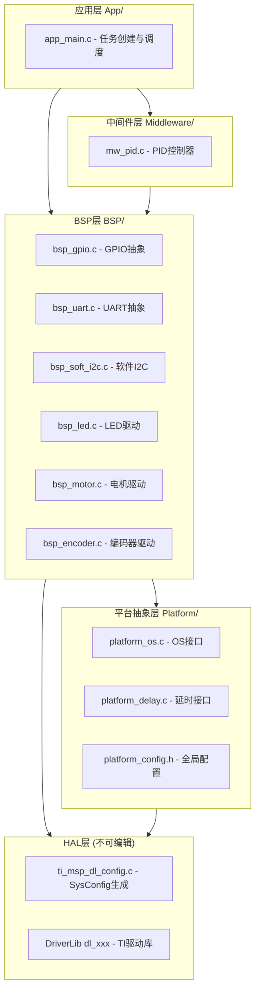

## 产品概述

为MSPM0G3507微控制器设计一套分层架构的嵌入式工程代码框架，实现硬件依赖隔离、模块化驱动封装和FreeRTOS/裸机双模式支持。

## 核心功能

- **五层分层架构**: 应用层→中间件层→BSP层→平台抽象层→HAL层(SysConfig)，层间通过头文件接口解耦，禁止跨层调用
- **硬件依赖隔离**: BSP层封装TI DriverLib调用，上层代码不直接引用`dl_xxx` API；引脚映射集中在project_config.h，更换硬件仅需修改配置
- **GPIO/UART/软件I2C驱动**: 提供规范化初始化与操作接口；已在SYSCFG_DL_init()中初始化的外设(如UART0)仅封装高层API，未初始化的(如软件I2C)提供完整初始化
- **FreeRTOS/裸机切换**: 通过platform_config.h中`USE_FREERTOS`宏条件编译，平台抽象层提供统一的互斥锁、延时、临界区接口
- **统一命名规范**: 文件`bsp_xxx.c`/`mw_xxx.c`/`app_xxx.c`，函数`模块_动作()`，类型`PascalCase_t`，宏`UPPER_SNAKE_CASE`，全局`g_`前缀，文件静态`s_`前缀
- **标准驱动模板**: 每个BSP模块遵循init/deinit/read/write/control五函数接口模式，含错误码返回和中文注释
- **全量中文注释**: 每个函数、变量、类型定义均提供中文注释说明用途

## 技术栈

- **MCU**: MSPM0G3507 (Cortex-M0+, 80MHz)
- **SDK**: TI MSPM0 SDK 2.05.00.05 (DriverLib层 dl_xxx API)
- **RTOS**: FreeRTOS V202112.00 (heap_4, 静态分配, 抢占式调度)
- **构建**: Keil MDK (ARM Compiler)
- **配置工具**: TI SysConfig (生成ti_msp_dl_config.c/h)
- **语言**: 嵌入式C (C99, 固定宽度整数类型)

## 实现方案

### 核心策略

采用五层架构+平台抽象层设计。HAL层(SysConfig生成)不可修改，BSP层通过不透明类型和函数指针封装硬件细节，平台层通过条件编译统一RTOS/裸机接口。关键原则：**SYSCFG_DL_init()已完成的外设初始化不重复**，BSP层仅在需要时补充配置(如NVIC使能、中断回调注册)；软件I2C等未在SysConfig中配置的外设，BSP层负责完整GPIO初始化和时序实现。

### 架构分层设计



### 关键技术决策

1. **条件编译而非运行时多态**: 使用`#if USE_FREERTOS`条件编译切换RTOS/裸机，零运行时开销，适合资源受限MCU
2. **不透明类型封装**: BSP模块结构体定义在.c文件中，头文件仅前向声明，实现真正的信息隐藏
3. **引脚映射集中配置**: 所有GPIO端口/引脚/IOMUX定义集中在project_config.h，BSP驱动通过配置结构体传入，更换硬件只改配置
4. **UART环形缓冲区**: 接收端使用ISR+环形缓冲区，应用层通过非阻塞读取获取数据，RTOS模式下可配合信号量通知
5. **软件I2C位操作**: SCL/SDA方向动态切换，使用platform_delay_us控制时序，支持标准100kHz和快速400kHz模式
6. **标准五函数接口**: init→deinit→read→write→control，所有BSP模块统一模式，control用于扩展功能(设置波特率/回调注册等)

### 实现注意事项

- **性能**: 软件I2C的delay_us必须准确，使用SysTick倒计数方式实现，与现有board.c一致；ISR中仅置标志/填充缓冲区，不做协议解析
- **爆破半径**: 新架构与旧代码并存——旧的`keil/USER/BSP/`文件暂保留，新架构文件放在项目根目录下的新目录中，逐步迁移
- **FreeRTOS安全**: 所有BSP的init/deinit在调度器启动前调用；read/write在任务中调用时通过platform层自动加锁
- **命名一致性**: 严格遵循`模块_动作`命名，避免现有代码中bsp_motor/board_led/UART0_Debug三种风格混用的问题

### 数据流

```
用户操作/传感器输入
    → ISR(极简: 仅置标志/填充缓冲区)
    → BSP层(数据解析/格式转换)
    → 中间件层(PID计算/滤波)
    → 应用层(决策/状态机)
    → BSP层(执行器输出: 电机PWM/LED)
```

## 目录结构

```
MSPM0G3507_FreeRTOS/
├── main.c                          # [NEW] 系统入口,仅调用各层init并启动调度器
├── ti_msp_dl_config.c             # [KEEP] SysConfig生成,勿编辑
├── ti_msp_dl_config.h             # [KEEP] SysConfig生成,勿编辑
├── FreeRTOSConfig.h               # [KEEP] FreeRTOS配置,已完善
│
├── App/                            # 应用层 - 业务逻辑与任务定义
│   ├── app_main.c                 # [NEW] 应用初始化,FreeRTOS任务创建/裸机主循环
│   └── app_main.h                 # [NEW] 应用层接口声明
│
├── Middleware/                      # 中间件层 - 算法与协议
│   ├── mw_pid.c                   # [NEW] PID控制器实现(从bsp_pid.c迁移重构)
│   └── mw_pid.h                   # [NEW] PID控制器接口
│
├── BSP/                            # 板级支持包层 - 硬件驱动封装
│   ├── bsp_common.h               # [NEW] 统一错误码、通用类型、断言宏
│   ├── bsp_gpio.c                 # [NEW] GPIO抽象驱动(初始化/读写/翻转)
│   ├── bsp_gpio.h                 # [NEW] GPIO接口定义
│   ├── bsp_uart.c                 # [NEW] UART驱动(环形缓冲区收发/printf重定向)
│   ├── bsp_uart.h                 # [NEW] UART接口定义
│   ├── bsp_soft_i2c.c             # [NEW] 软件I2C驱动(起始/停止/读字节/写字节/读寄存器/写寄存器)
│   ├── bsp_soft_i2c.h             # [NEW] 软件I2C接口定义
│   ├── bsp_led.c                  # [NEW] LED驱动(从board_led.c迁移,使用bsp_gpio接口)
│   ├── bsp_led.h                  # [NEW] LED接口定义
│   ├── bsp_motor.c                # [NEW] 电机驱动(从bsp_motor.c迁移重构,解耦DL_调用)
│   ├── bsp_motor.h                # [NEW] 电机接口定义
│   ├── bsp_encoder.c              # [NEW] 编码器驱动(从bsp_encoder.c迁移重构)
│   ├── bsp_encoder.h              # [NEW] 编码器接口定义
│   ├── bsp_adc.c                  # [NEW] ADC驱动封装
│   ├── bsp_adc.h                  # [NEW] ADC接口定义
│   └── _bsp_template.c            # [NEW] 标准驱动模板(复制后修改即可创建新驱动)
│
├── Platform/                       # 平台抽象层 - OS与硬件无关接口
│   ├── platform_config.h          # [NEW] 全局配置(USE_FREERTOS/CPUCLK_FREQ等开关)
│   ├── platform_os.h              # [NEW] OS抽象接口(互斥锁/信号量/任务/队列)
│   ├── platform_os.c              # [NEW] OS抽象实现(条件编译切换RTOS/裸机)
│   ├── platform_delay.h           # [NEW] 延时抽象接口
│   └── platform_delay.c           # [NEW] 延时实现(SysTick裸机/vTaskDelay RTOS)
│
├── Config/                         # 配置文件 - 硬件映射与项目参数
│   └── project_config.h           # [NEW] 引脚映射/外设实例分配/硬件参数集中定义
│
└── keil/                           # Keil工程目录(保持不变,逐步更新包含路径)
    ├── USER/BSP/                  # [KEEP] 旧BSP代码暂保留,迁移完成后删除
    ├── FreeRTOS/                  # [KEEP] FreeRTOS源码
    └── ti/                        # [KEEP] DriverLib源码
```

## 关键代码结构

### 统一错误码 (bsp_common.h)

```c
/* BSP操作返回状态码 */
typedef enum {
    BSP_OK              = 0,    /* 操作成功 */
    BSP_ERR_NULL_PTR    = -1,   /* 空指针参数 */
    BSP_ERR_INVALID_PARAM = -2, /* 无效参数 */
    BSP_ERR_BUSY        = -3,   /* 设备忙 */
    BSP_ERR_TIMEOUT     = -4,   /* 操作超时 */
    BSP_ERR_HW_FAULT    = -5,   /* 硬件故障 */
    BSP_ERR_NOT_INIT    = -6,   /* 设备未初始化 */
    BSP_ERR_NAK         = -7,   /* I2C从机无应答 */
} bsp_status_t;
```

### 平台配置 (platform_config.h)

```c
#define USE_FREERTOS         1     /* 1=FreeRTOS模式 0=裸机模式 */
#define CPUCLK_FREQ          80000000U  /* CPU时钟频率(Hz) */
#define BSP_UART_RX_BUF_SIZE 128U  /* UART接收环形缓冲区大小 */
#define BSP_SOFT_I2C_TIMEOUT 1000U /* 软件I2C超时(us) */
```

### BSP标准驱动模板接口 (五函数模式)

```c
/* 初始化外设,返回实例句柄 */
bsp_status_t bsp_xxx_init(const bsp_xxx_config_t *cfg, bsp_xxx_t **handle);
/* 反初始化外设,释放资源 */
bsp_status_t bsp_xxx_deinit(bsp_xxx_t *handle);
/* 读取数据 */
bsp_status_t bsp_xxx_read(bsp_xxx_t *handle, uint8_t *buf, uint16_t len);
/* 写入数据 */
bsp_status_t bsp_xxx_write(bsp_xxx_t *handle, const uint8_t *buf, uint16_t len);
/* 扩展控制(设置参数/注册回调等) */
bsp_status_t bsp_xxx_control(bsp_xxx_t *handle, uint32_t cmd, void *arg);
```

### 引脚映射集中配置 (project_config.h 片段)

```c
/* ---- LED引脚 ---- */
#define PIN_LED_PORT          GPIOA
#define PIN_LED_PIN           DL_GPIO_PIN_14
#define PIN_LED_IOMUX         IOMUX_PINCM36

/* ---- 调试UART引脚 ---- */
#define PIN_UART_DEBUG_INST   UART0
#define PIN_UART_DEBUG_TX_PORT GPIOA
#define PIN_UART_DEBUG_TX_PIN DL_GPIO_PIN_10
#define PIN_UART_DEBUG_RX_PORT GPIOA
#define PIN_UART_DEBUG_RX_PIN DL_GPIO_PIN_11

/* ---- 软件I2C引脚 (OLED/传感器) ---- */
#define PIN_SOFT_I2C_SCL_PORT GPIOB
#define PIN_SOFT_I2C_SCL_PIN  DL_GPIO_PIN_21
#define PIN_SOFT_I2C_SCL_IOMUX IOMUX_PINCM49
#define PIN_SOFT_I2C_SDA_PORT GPIOB
#define PIN_SOFT_I2C_SDA_PIN  DL_GPIO_PIN_22
#define PIN_SOFT_I2C_SDA_IOMUX IOMUX_PINCM50
```