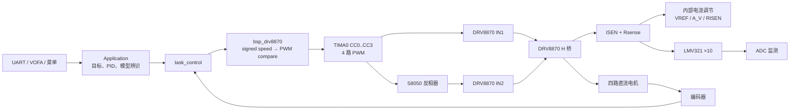
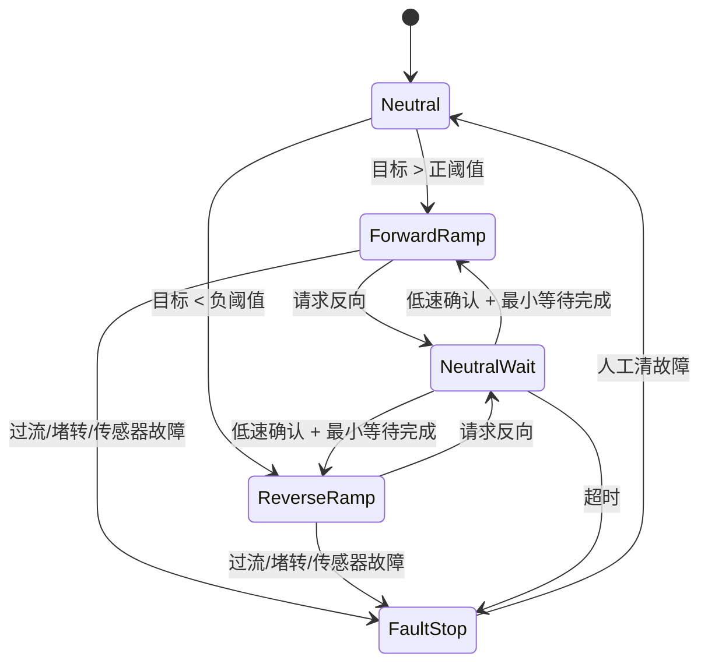
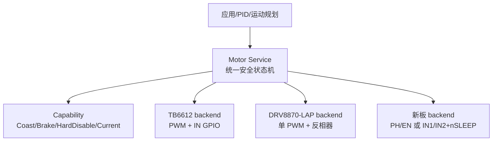

# DRV8870 驱动综合技术审查与安全重构方案

> **审查对象**：`DRV8870驱动开发与审查文档.md`（版本 2.0）与当前工程实现
> **工程**：`MSPM0G3507_Project` / 分支 `refactor/phase1`
> **安全结论**：在完成 P0 的限流、上电复位波形和反相器边沿实测前，本方案仅可用于限流台架验证；不得用于无人值守、满负载或整车落地运行。

---

## 1. 结论摘要

当前板级方案为单 PWM 锁相（Locked Anti-Phase）驱动：MCU PWM 直连 DRV8870 的 IN1，经 S8050 共射极反相后送入 IN2。该方案可在**仅有四路 PWM**时实现四电机双向驱动，但 IN1/IN2 已被硬件绑定，软件不能独立产生 Coast（00）或 Brake（11）。因此，50% PWM 只能定义为**平均电机端电压近似为零的中性命令**；它不是零电流、严格 Coast 或可保证的硬件刹车。

审查结论如下：

1. 原文的内部限流计算是**正确的**：`I_TRIP = VREF / (A_V × R_ISEN)`。按 `VREF=3.3 V`、`A_V≈10`、`R_ISEN=0.15 Ω`，典型阈值约 **2.2 A**。但必须以原理图、BOM、VREF 实测和 Rsense 实物值确认，不能仅凭网名或文档认定。
2. 原文“应用层当前仍使用 TB6612 / `bsp_motor`”已经过期。当前 `app_main.c`、`task_control.c`、`app_vofa.c` 已调用 `bsp_drv8870_*`；`bsp_motor.c/h` 应保留为 TB6612 兼容后端，但必须与 DRV8870 后端互斥构建。
3. 原文“DRV8870 内置约 220 ns dead-time，因此无需软件死区”的推论不充分。该 dead-time 只保护 IC 内部 MOSFET 上下桥臂，不保证 MCU→IN1 与 S8050→IN2 边沿严格互补，也不消除跨零换向时的绕组电流冲击。
4. OCP/TSD/UVLO 是失效保护，不是常规控制器。PWM 限幅只能限制**平均能量**，不能替代 VREF/Rsense 的硬件峰值控制、保险/电源保护、散热和默认禁能电路。
5. 2026-07-18已根据实测结果加入40%~55%机械死区补偿：正常有符号命令被分段映射到`<40%`反转区或`>55%`正转区，零命令保持50%。旧`drvtest/drvlogic`脉冲命令已由持续的`drvscope`示波器会话替代；该会话仅存在于专用FactoryTest构建，并直接输出原始绝对占空比。

---

## 2. 证据范围与现状

| 证据 | 已确认内容 | 不能据此断言的内容 |
|---|---|---|
| 根目录 `DRV8870驱动开发与审查文档.md` | 拓扑意图、VREF/Rsense 参数、原始审查结论 | 原理图/BOM 实物一致性、时序安全性 |
| `BSP/Peripherals/bsp_drv8870.[ch]` | 单 PWM 有符号 speed 映射、初始化、停止和测试接口 | 引脚/功率波形实际状态 |
| `Application/app_main.c`、`Task/task_control.c`、`app_vofa.c` | 主应用路径已使用 DRV8870 | RTOS 下保护响应的硬实时性 |
| `BSP/Peripherals/bsp_motor.[ch]` | TB6612 后端仍在代码树中，受 `BSP_MOTOR_ENABLE` 控制 | 可与 DRV8870 同时接管同一电机 |
| 当前 `Config/ti_msp_dl_config.c` | 可见 `.startTimer = DL_TIMER_START`，各 CC 初值为 500 | 上电首脉冲必然安全；必须示波器验证 |

> 当前 SysConfig/J-Link 未提交文件属于现场配置；本文不修改、不暂存、不提交它们。

---

## 3. 当前数据流与锁相状态边界



从芯片真值表角度，00 为 Coast、01/10 为两个方向驱动、11 为 Brake（具体输出与衰减路径以 TI 数据手册为准）。但当前硬件只有一根 PWM 加外部反相器：

- `duty > 55%`：实测正转有效区；
- `duty < 40%`：实测反转有效区；
- `40% <= duty <= 55%`：实测机械停止死区，50%作为默认零命令中性点；
- 电机绕组电流并不会因此必然为零；纹波、残余扭矩、发热和噪声受电感、反电动势、PWM 频率以及两路边沿偏差影响。

因此 `BSP_DRV8870_MODE_COAST` 和 `BSP_DRV8870_MODE_BRAKE` 在该后端只能保留为 API 兼容枚举，均映射为 50% 中性；不能向上层承诺真实 Coast/Brake。

---

## 4. 原文技术准确性审查

### 4.1 正确内容

| 原文结论 | 审查结论 | 补充条件 |
|---|---|---|
| `I_TRIP = 3.3/(10×0.15)=2.2 A` | **正确** | 前提是实际 VREF、Rsense 与假设一致；需计入全温容差 |
| 四路 PWM 分别驱动四个 DRV8870 | 可行 | 不具备独立 Coast/Brake |
| LMV321 + ADC 电流采样 | 可行 | 仅供 MCU 监测，不参与芯片内部限流比较 |
| OCP/TSD/UVLO 为硬件保护 | 正确 | 只能作故障最后防线 |

在 2.2 A 下，150 mΩ 检流电阻的瞬时 `I²R` 约为 **0.73 W**。平均热功耗仍受 PWM、电流调节和堵转时间影响，但这个数量级已要求核对 Rsense 的额定功耗、脉冲能力、温升、Kelvin 走线和铜皮散热。

### 4.2 需要修正的结论

| 优先级 | 原文/现状问题 | 风险 | 正确表述 |
|---|---|---|---|
| **P0** | “50% PWM = 停止并主动阻尼” | 将平均电压误作零电流/真实刹车 | “50% 是平均电压中性，需实测电流与机械响应” |
| **P0** | “220 ns dead-time，所以无需软件保护” | 忽略 S8050 储存时间、上拉 RC、走线、阈值和跨零电流 | 内部 dead-time 防 H 桥直通；仍需边沿验证和换向状态机 |
| **P0** | 把 OCP 当作常规限流余量 | OCP 阈值/响应有容差且会带来热与供电应力 | 正常峰值由 VREF/Rsense 控制；OCP/TSD 只作最后防线 |
| **P0** | 未将复位/Timer 启动列为阻断项 | MCU 未就绪时可能出现单向静态驱动 | 必须量测上电/复位；最终需硬件默认禁能 |
| **P1** | 应用层仍使用 TB6612 | 与当前代码不符 | DRV8870 已接入，TB6612 是兼容后端 |
| **P1** | Coast/Brake 枚举被视为当前真实功能 | 锁相硬件无法独立输出 00/11 | 用 capability 显式描述不支持 |
| **P1** | 绝对 duty 百分比易被误用为速度百分比 | 锁相下 0% 是全速反向，不是停止 | 区分 `absolute duty` 与 `signed speed` |

---

## 5. 保护机制职责边界

| 机制 | 能解决什么 | 不能替代什么 | 验证方式 |
|---|---|---|---|
| VREF + Rsense 内部电流调节 | 正常峰值电流控制 | 供电保险、短路能量、热设计 | ISEN/电流探头测启动与负载 |
| DRV8870 OCP | 严重过流/短路的芯片保护 | 重复限流控制、线束/PCB 完整保护 | 受控负载；**禁止直接短接 OUT** |
| TSD | 芯片过温保护 | 电机、Rsense、PCB 也安全 | 热像/热电偶；不以 TSD 为测试终点 |
| UVLO | 低压下抑制不确定驱动 | VM/逻辑电源上掉电时序 | VM/3.3 V 同步波形 |
| ADC 软件阈值 | 识别持续过流、堵转趋势 | 瞬时短路硬保护 | 标定、台阶负载、故障日志 |
| PWM 限幅与斜坡 | 降低平均能量、加速度和供电冲击 | VREF/Rsense、复位前输出 | 电流、速度、温升实测 |
| VM/EN 硬件门控 | MCU 未就绪时默认断能 | 需要硬件改板/外部控制 | 上电、复位、下载器连接测试 |

**重要边界**：软件 PWM 不能保证瞬时峰值低于硬件限流阈值。它只能降低平均能量；硬实时峰值边界依赖正确的 VREF/Rsense 与芯片保护。

---

## 6. P0：死区、边沿和启动安全

### 6.1 必测波形

每个通道应在“无 VM”“VM 限流空载”“受控机械负载”三种条件下，同步观察：

1. MCU PWM / IN1；
2. IN2（S8050 集电极）；
3. OUT1 或 OUT2；
4. ISEN（差分安全测量）或电流探头；
5. 可选 VM、3.3 V 与电机端差分电压。

归档项目：频率、占空比、IN1/IN2 边沿偏差、00/11 瞬态宽度、OUT 波形、ISEN 峰值、复位首脉冲、Timer 停止后的静态输出。没有这些证据，不能用“220 ns 内置 dead-time”宣布安全。

### 6.2 跨零换向的软件状态机



当前已完成第一步“静态死区分段映射”，确保非零命令不落入40%或55%边界；尚未完成跨零动态状态机。后续应独立提交并逐步启用：输出斜率限制 → 零点迟滞 → 跨零先中性 → 最小等待 → 编码器低速确认 → 反向低速斜坡 → 电流/速度持续时间故障锁存。该状态机仅降低换向能量，不能产生真Coast/Brake，也不能修复MCU初始化前风险。

### 6.3 启动安全

当前生成配置中可见 `.startTimer = DL_TIMER_START`，并把各 CC 初值设为 500。最终 compare=50% 并不证明首脉冲安全：Timer 寄存器、GPIO IOMUX、S8050 上拉、3.3 V 和 VM 的建立顺序都必须示波器验证。

本轮 `bsp_drv8870_init()` 改为不主动停止 PWM 计数器后再启动。对锁相硬件，Timer 停止时的引脚保持状态未经实测，不能假定它是安全中性；初始化只重写各通道的 50% compare。该软件加固只能避免额外引入未知静态驱动窗口；根因仍需 **VM/EN 默认关闭门控** 或带明确 `nSLEEP/nENABLE` 的驱动器解决。

---

## 7. 不改硬件时的软件策略

| 策略 | 具体逻辑 | 收益 | 残留风险 |
|---|---|---|---|
| speed 上限 | 每轮和全局限制 `|speed|` | 降低平均电压 | 峰值仍可到 ITRIP |
| 斜坡 | 限制每个控制周期 speed 改变量 | 降低供电下陷和冲击 | 无法修复复位脉冲 |
| 跨零中性等待 | 先 50%，等待时间和低速条件 | 降低反向电流冲击 | 不是真 Coast/Brake |
| 电流 + 编码器堵转 | 高命令、低速度、持续高电流才触发 | 保护机械、减少误报 | ADC 不可作短路硬保护 |
| 故障锁存 | 禁用 `motor_enabled`、PID reset、拒绝自动重启 | 防反复冲击 | 50% 仍非断 VM |
| 启动自检 | 零目标，检查 ADC/编码器/VM 后才允许 run | 减少软件逻辑误动作 | MCU 初始化前无能为力 |
| 日志降级 | 故障在内存状态机判定，UART 只记录 | 防 DMA/UART 干扰保护路径 | 仍需硬件兜底 |

---

## 8. 保留 TB6612 并重构 DRV8870 架构

### 8.1 兼容原则

保留 `bsp_motor.c/h`，但必须由统一的构建选择保证 TB6612 与 DRV8870 后端互斥。TB6612 后端具有 PWM + IN1/IN2 GPIO，可实现真实 Coast/Brake；现有 DRV8870-LAP 后端不能。禁止两个后端同时初始化同一 PWM、GPIO 或电机。

### 8.2 目标分层



建议的核心接口：

```c
typedef enum {
    MOTOR_STOP_NEUTRAL,
    MOTOR_STOP_COAST,
    MOTOR_STOP_BRAKE,
    MOTOR_STOP_HARD_DISABLE
} motor_stop_request_t;

typedef struct {
    bool supports_true_coast;
    bool supports_true_brake;
    bool supports_hard_disable;
    bool has_current_feedback;
} motor_backend_caps_t;
```

应用层先查询 capability。DRV8870-LAP 不支持的动作应返回 `BSP_ERR_UNSUPPORTED`，绝不能静默将“硬刹车”替换为 50% 中性。

### 8.3 分阶段迁移与回滚

| 阶段 | 改动 | 验收 | 回滚 |
|---|---|---|---|
| R1 | 增加 Motor Service/capability/适配层，不改变寄存器控制 | 两种后端分别构建通过 | 独立提交后 `git revert <commit>` |
| R2 | 应用层从直调 BSP 改为 Service | 命令映射与旧版本一致 | 保留旧适配层一个版本 |
| R3 | 加入斜坡、跨零、故障锁存 | 电流/编码器/波形验收 | feature flag 回退参数 |
| R4 | 引入硬件 EN/VM 或替代驱动 | 上电/复位无危险脉冲 | 样板/跳线/单路先验证 |

禁止使用 `git reset --hard` 清除现场记录；所有软件回滚使用 `git revert <commit>`。

---

## 9. 四路 PWM 下的硬件改造方案

### 方案 A：保持现有单 PWM 锁相（不改板）

- 资源：4 PWM → 4 个 DRV8870；
- 优点：资源最少，支持双向；
- 缺点：无独立 Coast/Brake、上电默认安全难保证、S8050 边沿必须验证；
- 适用：P0 台架验证通过后的受限使用。

### 方案 B：每电机 1 PWM + 1 DIR GPIO + 逻辑 MUX/门控（最小改板推荐）

仍使用四路 PWM，每个电机新增一根普通 DIR GPIO，以逻辑选择器在两个确定路径之间路由 PWM，并增加默认关闭 EN：

| DIR | IN1 | IN2 | 目的 |
|---:|---|---|---|
| 0 | PWM | 固定高 | 一个方向的 PWM 驱动 |
| 1 | 固定高 | PWM | 另一个方向的 PWM 驱动 |

固定电平、PWM 极性和衰减模式必须在原理图阶段按 DRV8870 真值表确认。关键是用组合逻辑选择受控路径，而不是依赖 BJT 模拟反相边沿。若需要真 Coast/Brake，逻辑还必须能够明确输出 00/11；EN 失效时必须将输入拉到验证过的安全状态。

### 方案 C：PH/EN 或带 nSLEEP/nFAULT 的驱动器（新板优选）

每电机只需 1 PWM（EN）+ 1 普通 GPIO（PH/DIR），不增加 PWM 数量；另增加硬件使能和故障反馈。器件选型须结合 VM、堵转电流、热阻、EMI、封装、供电能力与供应链，不能只按引脚数量替换。

---

## 10. 已实现的FactoryTest示波器会话

旧的`drvtest`和`drvlogic`瞬时测试命令已经移除，避免200 ms脉冲结束后反复重新输入命令。专用FactoryTest目标现在提供持久化`drvscope`会话：

| 文件 | 当前职责 |
|---|---|
| `Config/project_config.h` | `PRJ_DRV8870_FACTORY_TEST_ENABLE`默认0，仅专用Keil Target覆盖为1 |
| `BSP/Peripherals/bsp_drv8870.[ch]` | 会话独占、原始compare设置/读取、PB19启停、退出时恢复中性 |
| `Application/app_debug.[ch]` | 打印通道、compare、占空比和PWM频率 |
| `Application/Task/task_menu.c` | 解析`drvscope start/status/A..D/all/stop` |

命令：

```text
drvscope start
drvscope status
drvscope A 40
drvscope A 50
drvscope A 55
drvscope A 60
drvscope all 50
drvscope stop
```

`start`会先将四路置为50%，再拉高PB19，并持续占有PWM；此后不会自动关闭电源。`A/B/C/D/all`参数是**原始绝对占空比百分数**，不经过40%~55%死区补偿，便于直接测量边界。`stop`或MCU复位用于退出；`stop`会恢复中性并关闭PB19。

### 严格测试规程

1. 车轮悬空或车体可靠固定；电源限流；硬件急停开关可立即切断VM；
2. 在Keil中选择`empty_LP_MSPM0G3507_drv8870_factory_test`并Rebuild，确认构建定义`PRJ_DRV8870_FACTORY_TEST_ENABLE=1`；
3. 先执行`drvscope start`和`drvscope status`，确认四路20 kHz、50%和PB19 ON；
4. 无VM时先测PA8/PA9/PB17/PB2，再接限流VM测IN1、IN2、OUT和ISEN；
5. 每次只改变一路，依次核对40%、50%、55%及一个有效区点；发现异常电流、温升、复位或波形立即硬件断电；
6. 验证结束必须执行`drvscope stop`，再切回生产Target、Rebuild并重新烧录。

**禁止**：车轮落地无人值守；故意短路或长时间堵转；用软件会话代替硬件急停；将FactoryTest固件作为正式交付版本。

---

## 11. P0/P1/P2 实施计划、风险与回滚

| 优先级 | 步骤 | 执行逻辑 | 风险 | 回滚/处置 |
|---|---|---|---|---|
| P0 | VREF/Rsense 实测 | 每路测 VREF、阻值、功率/温升，计算最坏 ITRIP | 带电误测 | 断 VM；修原理图/BOM 后重测 |
| P0 | 上电/复位波形 | 触发 VM/3.3V，观察 IN/OUT/ISEN | 探头接地短路 | 断 VM；实施硬件 EN/VM 门控 |
| P0 | S8050 边沿 | 测 IN1/IN2 和 00/11 瞬态 | 误判极性或时序 | 降频/改阻值/逻辑门改板 |
| P0 | FactoryTest波形会话 | 按上节验证40/50/55%边界、频率、方向和电流 | 持续输出/误设占空比 | `drvscope stop`或硬件断VM；切回生产Target；软件可`git revert` |
| P1 | Motor Service | capability 与适配层 | 接口回归 | 独立提交、保留旧适配、`git revert` |
| P1 | 换向/故障状态机 | 先记录后拦截 | 阈值误报、响应变慢 | feature flag 与参数回退 |
| P2 | 默认禁能硬件 | VM/EN 门控或替代驱动器 | 改板错误 | 样板、跳线、单路先验证 |

---

## 12. 交付前检查单

- [ ] 每路 VREF、Rsense、Rsense 温升和 ITRIP 最坏值已归档；
- [ ] 每路 IN1、IN2、OUT、ISEN 的运行/复位波形已归档；
- [ ] 下载器连接、复位、VM/3.3 V 上下电无不可接受的驱动脉冲；
- [ ] 40%/50%/55%边界、20 kHz频率、正反方向与编码器符号已确认；
- [ ] A/M1→RB、B/M2→RF、C/M3→LF、D/M4→LB闭环反馈映射已确认；
- [ ] 不再把 50% 中性称为真实 Coast/Brake；
- [ ] 保护决策使用电流+速度+持续时间，且不依赖 UART 日志；
- [ ] 生产构建 `PRJ_DRV8870_FACTORY_TEST_ENABLE=0`；
- [ ] TB6612 与 DRV8870 后端互斥构建；
- [ ] 所有阶段均有独立 commit，并可通过 `git revert` 回滚。

---

## 13. 参考资料

1. Texas Instruments, **DRV8870 Brushed DC Motor Driver Datasheet**, SLVSCY8B：<https://www.ti.com/lit/ds/symlink/drv8870.pdf>。重点核对输入真值表、电流调节公式、OCP/TSD/UVLO、时序、去耦和布局建议。
2. 工程原始文档：`D:\msp_project\temp2\MSPM0G3507_Project\DRV8870驱动开发与审查文档.md`。
3. 当前实现：`MSPM0G3507_FreeRTOS/BSP/Peripherals/bsp_drv8870.[ch]`、`Application/app_main.c`、`Application/Task/task_control.c`、`Application/app_vofa.c`。