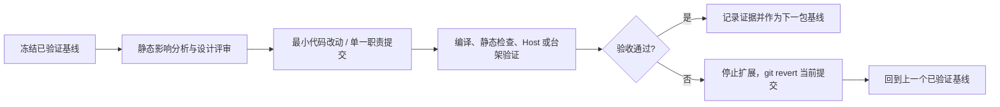

# MSPM0G3507 后续阶段受控整改计划

> **文档状态：计划，尚未授权执行后续业务代码重构。** 
> **编制日期：2026-07-15** 
> **适用工程：** `MSPM0G3507_FreeRTOS` 
> **基线分支：** `refactor/phase1` 
> **最近已验证提交：** `55590bb`（临时、只读的 `encdiag` 板级映射诊断） 
> **关联文档：** [第一阶段基线与 UART 发送路径审计](phase1_safety_realtime_baseline.md)；历史架构审计草稿 `phase_all.md` 已归档在本目录，仅作为风险输入，不作为当前发布规范。

---

## 1. 目的、范围与不做事项

本计划覆盖**第一阶段之后**的两类整改：

1. **第二阶段：状态边界、所有权和模块拆分**；
2. **第三阶段：工程治理、质量体系与发布验证**。

目标不是一次性“大重构”，而是在不破坏已验证电机控制、IMU 采集、编码器映射和串口调试能力的前提下，逐步消除以下架构风险：

- `app_shared_ctx_t` 同时承载 PID、前馈、位置控制、IMU 数据、控制状态和电机使能，形成多任务可写的 God Context；
- 菜单、VOFA、测试路径能够跨层直接修改控制对象或直接操作 BSP；
- IMU 任务以外的模块对滤波器、姿态状态的所有权边界不清；
- `app_vofa.c`、`Application/test/`、`task_menu.c` 混合协议解析、测试编排、领域修改和诊断输出；
- Keil 工程、SysConfig、文档、旧电机抽象和中间产物存在历史漂移；
- 缺少可重复构建、Host 算法回归、静态检查和硬件在环验收闭环。

### 1.1 本计划明确不做的事项

在每一个工作包获得单独授权前，**不得**：

- 修改 PID、前馈、位置控制、滤波算法公式或调参结果；
- 改变 PWM 极性、DRV8870 输出策略、编码器方向、SysConfig 外设/引脚映射；
- 合并“架构迁移 + 功能新增 + 参数优化”到同一提交；
- 使用 `git reset --hard`、覆盖性复制或删除未盘点的工程产物；
- 在未完成第一阶段 P0 验收前，将新的服务任务、队列或诊断日志接入控制实时路径；
- 让菜单、VOFA、测试代码与新命令队列并存两套长期写入路径。

---

## 2. 当前事实与阶段准入门禁

### 2.1 已确认的当前基线

| 项目 | 当前状态 | 证据 / 约束 |
|---|---|---|
| SysConfig 映射 | 已完成一轮 `empty.syscfg` 与项目宏对齐 | 提交 `307824a`；Keil 已构建通过；编码器 ISR 符号存在 |
| UART TX 观测 | 已加入只读 DMA 计数快照 | 提交 `e05676b`；仅诊断，不能作为控制决策 |
| 板级编码器验证 | 已提供临时 `encdiag` 命令 | 提交 `55590bb`；需要真机手动转轮日志确认后再 revert |
| 第一阶段 P0 架构整改 | **未完成** | 尚未建立唯一 UART TX 所有者、未完成 IMU 故障安全降级、未建立周期与资源健康指标 |
| 构建 | Keil V6.24 已通过最近一次构建 | 最近正式验证为 `0 Error(s), 0 Warning(s)` |

### 2.2 后续阶段的硬门禁（Gate-0）

第二阶段和第三阶段**不得越过**以下门禁。任一门禁失败，停止扩展改动，仅处理失败项或回滚当前工作包：

1. **硬件映射确认：** `encdiag` 真机日志证明 LF/LB/RF/RB 的累计值仅随对应物理轮变化；正反转符号可解释；`overflow` 无异常。验证完成后，将临时诊断通过独立 `git revert 55590bb` 回退。
2. **第一阶段 P0 完成：** UART TX 具备单一 DMA 所有者；运行态 `printf` 不再与 DMA 非协调共用 UART；IMU 失效触发明确安全降级；控制周期、队列丢弃、栈/堆水位可观察。
3. **基线可复现：** 在固定 Keil/Arm Compiler 版本下，干净工作区可构建；记录 `.axf/.hex`、代码/RAM 使用量和构建日志。
4. **台架安全条件：** 电机轮可悬空或电机电源可独立切断；有硬件急停/断电路径；上板人员确认不会在未知状态下施加负载。
5. **回归样本可用：** 至少保存一次正常启动、一次无电机手动转码器、一次 IMU 正常数据和一次 IMU 故障的串口记录（允许脱敏）。

> Gate-0 的目的，是避免把尚未收敛的安全/实时问题隐藏在状态拆分或工程清理之后，导致故障定位失去基线。

---

## 3. 总体优先级与受控交付原则

### 3.1 优先级

| 优先级 | 工作包 | 目标 | 可否并行 | 前置条件 |
|---|---|---|---|---|
| G0 | 第一阶段收口与证据归档 | 完成 P0 安全/实时整改验收 | 否 | 当前真机验证 |
| P1 | 2.1 数据契约与只读快照 | 先建立边界，不改变控制行为 | 部分可并行 | G0 通过 |
| P1 | 2.2 命令队列与单一写入者 | 移除外部对控制对象的直接写入 | 否 | 2.1 通过 |
| P1 | 2.3 IMU Service / 健康状态收敛 | 固化滤波器与 IMU 数据所有权 | 部分可并行 | G0、2.1 通过 |
| P1 | 2.4 VOFA、菜单、测试路径拆分 | 协议/测试与领域控制解耦 | 否 | 2.2 通过 |
| P2 | 2.5 收缩 `app_shared_ctx_t` 与 BSP 穿透 | 删除旧写路径与过期字段 | 否 | 2.2~2.4 通过 |
| P2 | 3.1 构建、配置、仓库治理 | 可复现构建与单一配置事实源 | 可与 Host 测试并行 | G0 通过 |
| P2 | 3.2 静态分析、格式、Host 回归 | 建立防回归能力 | 可并行 | 3.1 建立最小构建入口 |
| P2 | 3.3 HIL、发布与变更控制 | 建立上板验收和发布门禁 | 可并行 | G0 通过 |
| P3 | 后续性能/算法优化 | 在架构稳定后再做 | 否 | P1/P2 验收完成 |

### 3.2 每个工作包的强制流程

所有工作包必须遵循同一闭环：

**提交约束：** 一个提交只解决一个可验证问题；提交消息包含阶段和工作包号，例如 `refactor(p2-2): route control updates through command queue`。不得在同一提交里夹带格式化全仓、自动生成文件重排或参数调整。

**回滚约束：** 每个提交上线前都应能通过 `git revert <commit>` 恢复，不通过重写历史或丢弃工作区实现回退。

---

# 4. 第二阶段：状态边界与模块拆分

## 4.1 工作包 2.1 — 定义数据契约和只读快照（P1）

### 目标

以最小改动替代“共享结构任意读写”的隐含约定，先让数据流可描述、可检查；本包**不改变算法输出和任务周期**。

### 涉及现有模块

- `Application/app_main.h`：当前 `app_shared_ctx_t`；
- `Application/Task/task_control.c`：控制状态的生产者；
- `Application/Task/task_imu.c`：IMU 数据与滤波器的生产者；
- `Application/Task/task_menu.c`、`Application/app_vofa.c`、`Application/app_debug.c`：主要消费者与外部入口。

### 执行逻辑

1. **先做只读访问清单。** 为 `pid`、`ff`、`motor_enabled`、`status`、`imu`、`posctrl` 标记“唯一写入者、允许读取者、更新频率、是否允许跨任务修改”。此清单先作为 Markdown/头文件注释提交，不改运行代码。
2. **定义四类数据契约。** 计划新增独立头文件（命名需在实施前确认）：
   - `app_command_t`：外部意图，尚未生效的控制命令；
   - `app_control_snapshot_t`：控制任务发布的只读状态；
   - `app_imu_snapshot_t`：IMU 任务发布的只读状态和数据新鲜度；
   - `app_health_snapshot_t`：Supervisor/健康模块发布的只读许可和故障位。
3. **先用适配器，不迁移行为。** 新增 `get_snapshot()` / `publish_snapshot()` 接口时，首个提交只从现有 `ctx->status`、`ctx->imu` 复制数据，不删除旧字段、不改变调用顺序。
4. **确定一致性策略。** 对多字段快照使用“写入端更新非活动缓冲区 → 在短临界区内切换活动索引/版本号 → 读取端复制同一版本”的策略。不得仅靠 `volatile` 假定结构体读写原子。
5. **固定内存预算。** 所有快照采用静态存储；在提交说明中记录新增 `.bss/.data` 预算和受影响任务栈的高水位。
6. **完成读取侧迁移。** 菜单、遥测、诊断先改为读新快照；旧字段仍只由原有写入者维护。读取侧迁移逐提交进行。

### 验收标准

- 不新增动态分配；不新增控制周期内阻塞操作；
- 控制任务、IMU 任务的周期、PID 输出、姿态输出与基线在容差内一致；
- 菜单和遥测读取不再直接解引用写入端内部对象；
- 版本号/快照一致性在压力读取下无撕裂字段；
- Keil 构建通过，且 RAM 增量已记录并经预算批准。

### 主要风险与缓解

| 风险 | 级别 | 缓解措施 |
|---|---:|---|
| 多字段快照读到半更新数据 | 高 | 先实现并测试双缓冲/版本一致性；在目标 MCU 上使用 OSAL 临界区和必要内存屏障 |
| 新增快照占用 RAM，压缩任务/堆空间 | 高 | 每个提交测量 `.bss`、任务栈高水位、剩余堆；超预算立即停止 |
| 适配器与旧字段双维护出现语义漂移 | 中 | 迁移期间只允许原唯一写入者同时发布；加入断言/诊断比较，设置删除旧字段的截止工作包 |
| 为追求“抽象”改变现有时间顺序 | 高 | 本包禁止改周期、优先级、PID/滤波调用顺序 |

### 回滚方案

- 每个数据契约、每个读取侧迁移各自独立提交；
- 出现输出漂移、栈/堆预算越界或快照不一致时，先 `git revert` 当前小提交；
- 不允许通过把新旧接口同时永久保留来“临时绕过”问题；回滚后重新设计一致性策略。

---

## 4.2 工作包 2.2 — 建立命令队列与控制参数单一写入者（P1）

### 目标

使菜单、VOFA、测试和未来上位机输入只能表达**命令**，而不是直接改写 PID、前馈、位置控制和电机使能对象。控制任务成为这些领域对象的唯一写入者。

### 执行逻辑

1. **命令分类与白名单。** 将命令分为：
   - 查询类：只读，不进入控制队列；
   - 参数类：PID/前馈/目标值，以“完整参数组 + 版本号”提交，禁止逐字段半更新；
   - 模式类：启停、控制模式切换，必须受健康许可和互斥状态约束；
   - 测试类：只在明确的测试模式允许，默认拒绝。
2. **定义固定容量队列。** 使用 FreeRTOS/OSAL 队列或等效静态队列；禁止从命令路径动态分配内存。队列长度、消息大小、生产者、最大处理次数必须在设计说明中量化。
3. **规定队列满行为。** 查询可丢弃；幂等的最新设定值可按规则合并；模式/急停类不得静默丢失，必须返回可观察的拒绝/失败状态。严禁无限等待。
4. **在控制任务边界统一应用。** 控制任务在每个固定周期的确定位置批量取命令、校验版本和安全许可，然后一次性应用。应用结果发布到 `app_control_snapshot_t`。
5. **逐入口迁移。** 迁移顺序：`task_menu.c` → `app_vofa.c` → `Application/test/`。每迁移一个入口，立即删除该入口对 `ctx->pid/ff/posctrl/motor_enabled` 的直接写入。
6. **保留可观察回执。** 为每个命令记录序列号、接受/拒绝原因、生效周期和健康状态；遥测只读输出该回执。

### 验收标准

- 除控制任务外，没有模块直接写 PID、前馈、位置控制或电机使能状态；
- 参数组不存在“只更新 kp 未更新 ki/kd”的可观测中间状态；
- 高速命令压力下，控制周期未超期，队列满和拒绝次数可观测；
- 安全许可失效时，启用/模式命令被可预测拒绝；
- 旧 VOFA、菜单基本操作的外部协议保持兼容，或有明确的版本迁移说明。

### 主要风险与缓解

| 风险 | 级别 | 缓解措施 |
|---|---:|---|
| 命令排队导致控制响应延迟 | 高 | 量化每周期最大处理数；将急停/故障路径置于普通队列之外或最高优先级处理；不在控制任务内做字符串解析 |
| 队列满造成启停命令丢失 | 高 | 为模式/安全命令设计显式确认和拒绝；队列满时不静默覆盖 |
| 两套写路径并存导致竞态仍在 | 高 | 每迁移一个生产者即删除直接写入；代码审查以“唯一写入者”作为阻断条件 |
| VOFA 协议兼容性破坏 | 中 | 先加 Host 协议回放与命令应答对比，再切换入口 |

### 回滚方案

- 队列基础设施、单一命令类型、每个生产者迁移分别提交；
- 发现命令延迟、遗漏或安全状态异常时，回滚最后一个生产者迁移；
- 若队列基础设施自身存在问题，回滚到 2.1 基线；不得在实时控制任务中临时插入阻塞日志解决问题。

---

## 4.3 工作包 2.3 — IMU Service、滤波器所有权与健康快照收敛（P1）

### 目标

将 IMU 原始读取、滤波器实例、故障计数和数据发布时间统一归 IMU Service/IMU 任务所有；其他任务只读取 `app_imu_snapshot_t` 与 `app_health_snapshot_t`。

### 执行逻辑

1. **先冻结现有滤波输出。** 收集固定输入序列和当前输出（姿态、时间戳、异常位）；作为 Host/板端回放基线。未具备基线前不得移动滤波器对象。
2. **封装滤波器实例。** 将滤波器对象和初始化、重置、更新函数限制在 IMU Service 的 `.c` 文件；对外只暴露初始化、轮询、快照读取和健康查询。
3. **明确定义新鲜度。** 快照至少包括 `sample_sequence`、`timestamp_ms`、`valid`、连续失败计数、最近错误码和数据年龄；控制任务只按健康许可使用姿态/位置闭环。
4. **与第一阶段安全机制对接。** IMU Service 不直接决定所有电机细节；它发布健康状态，Supervisor/控制许可层做最终降级决定，避免再次形成跨层直接驱动。
5. **控制任务只读化。** `task_control.c` 从 IMU 快照复制一致数据；不再调用 SPI/滤波器内部 API，不再重置滤波器对象。

### 验收标准

- IMU 任务是滤波器和 IMU 健康状态唯一写入者；
- 控制任务只消费快照并依据许可降级；
- 初始化失败、读取失败、数据超时、恢复成功均有可观察状态转换；
- 固定输入回放的滤波输出在既定容差内一致；
- 断线/恢复台架测试未出现误使能或不可恢复锁死。

### 主要风险与缓解

| 风险 | 级别 | 缓解措施 |
|---|---:|---|
| 移动滤波器对象改变初始化或更新时间点 | 高 | 先建立固定样本回放；一提交只移动所有权，不调公式/参数 |
| 数据年龄计算溢出或时基不一致 | 中 | 使用无符号差值约定，统一毫秒时基并加入边界测试 |
| 故障恢复抖动导致频繁模式切换 | 高 | 在 Supervisor 层实施明确的连续成功/连续失败阈值和恢复滞回；阈值配置化且有台架验证 |

### 回滚方案

- 先提交“快照发布但不切换控制消费者”，再提交“控制消费者切换”；
- 任一回放或断线测试失败，回滚消费者切换；若输出基线已变，则回滚所有权移动提交；
- 保留故障记录和样本，不用修改阈值掩盖根因。

---

## 4.4 工作包 2.4 — VOFA、菜单和测试路径职责拆分（P1）

### 目标

把协议解析、参数校验、命令派发、测试编排、只读诊断拆开，禁止调试入口越过领域边界直接操作电机/滤波器/PID 内部对象。

### 执行逻辑

1. **拆分层次。**
   - `vofa_protocol`：字节帧/文本命令解析和编码，不访问 `app_shared_ctx_t`；
   - `command_router`：校验命令来源、模式和参数范围，然后投递 `app_command_t`；
   - `diagnostic_service`：只读快照格式化；
   - `test_orchestrator`：测试状态机，只发受限测试命令，不直接改驱动。
2. **测试模式硬边界。** 明确普通运行、诊断、受控测试三种模式；进入测试模式前要求电机许可、台架条件与操作确认。测试结束、超时、通信失联和故障都必须回到安全禁能状态。
3. **限制串口职责。** 所有文本输出走第一阶段完成后的统一 TX Service；VOFA 遥测与日志采用可区分帧或独立通道策略，禁止混线解析。
4. **迁移 `app_test_runner`。** 先为现有测试定义状态机和结束条件，再拆分不同测试类型；禁止增加新的无限循环或阻塞等待。
5. **删除调试后门。** 每迁移一个命令，将其对 `ctx`、BSP、滤波器对象的直接写入删除；只读诊断保留为无副作用命令。

### 验收标准

- 协议模块不依赖 BSP、PID、滤波器和任务实现；
- 测试路径可在任何异常/超时下关闭输出并退出测试模式；
- 诊断命令无电机副作用；
- 命令路由可单独进行 Host 输入边界测试；
- 串口遥测、日志、命令回应在压力下可区分且不串帧。

### 主要风险与缓解

| 风险 | 级别 | 缓解措施 |
|---|---:|---|
| 拆分导致旧上位机命令无法识别 | 中 | 建立协议回放样本；先兼容解析，再发布弃用计划 |
| 测试模式退出不完整，电机保持输出 | 高 | 统一退出函数；超时、错误、通信丢失均调用；台架验证要求电机输出为安全值 |
| 日志改造重新引入 UART 竞争 | 高 | 本包依赖第一阶段 TX Service；禁止直接 `printf`/DMA 发送 |

### 回滚方案

- 协议解析、路由、每类测试状态机独立提交；
- 协议兼容失败时，仅回滚相应解析/路由提交；
- 测试安全退出失败时立即停止上板，回滚当前测试迁移提交并检查安全门状态。

---

## 4.5 工作包 2.5 — 收缩 `app_shared_ctx_t` 与 BSP 访问面（P2）

### 目标

在新快照、命令队列和 IMU Service 已稳定后，移除 `app_shared_ctx_t` 中不应跨任务共享的可变领域对象；收敛业务层对 BSP 的直接访问。

### 执行逻辑

1. 生成字段迁移矩阵：字段、唯一写入者、读者、替代接口、删除提交。
2. 按字段分批删除旧访问：先 `imu`、`status` 读取；再参数写入；最后 PID/前馈/位置控制对象与电机使能字段。
3. 保留 `app_main` 仅作为装配根（composition root）：创建任务、注入接口、初始化服务；不继续扩展为共享数据中心。
4. 业务任务仅通过服务接口表达意图；控制任务可访问电机服务，IMU Service 可访问传感器服务，其他模块不得直接操作底层外设。
5. 对旧 `bsp_motor` 与 `bsp_drv8870` 进行只读盘点：确认谁是真正生产驱动入口后，选择“删除旧抽象”或“统一门面”之一；不得让两套电机抽象继续并行写硬件。

### 验收标准

- `app_shared_ctx_t` 不再包含跨任务直接可写的 PID/前馈/滤波器对象；
- 每项硬件资源有唯一写入者清单；
- 编译依赖方向由 Application → Service → BSP/HAL 收敛；
- 通过静态搜索证明菜单、VOFA、测试不再直接写控制对象或调用电机 BSP；
- 原功能的 Host/台架回归均通过。

### 主要风险与缓解

| 风险 | 级别 | 缓解措施 |
|---|---:|---|
| 删除字段遗漏隐蔽调用点 | 高 | 先用结构化符号/调用链分析建立迁移矩阵，再逐字段删除；每次删除后全量构建 |
| BSP 门面变化影响电机极性/时序 | 高 | 本包只收敛调用边界，不改驱动寄存器、PWM 极性或方向逻辑；必须台架回归 |
| 依赖循环 | 中 | 先在头文件层检查依赖图；使用窄接口与前向声明，禁止应用层包含底层实现细节 |

### 回滚方案

- 一次只删除一个字段或一个直接 BSP 入口；
- 运行或构建异常时回滚该删除提交，恢复至上一稳定 API；
- 禁止以宏别名长期掩盖旧接口，兼容层应有明确删除日期和验收项。

---

# 5. 第三阶段：工程治理与质量体系

## 5.1 工作包 3.1 — 构建、SysConfig、仓库与文档事实源治理（P2）

### 目标

让同一份源码、SysConfig 和工具链能够重复构建，且仓库中只保存应版本化的内容。

### 执行逻辑

1. **建立构建清单。** 固定 Keil、Arm Compiler、MSPM0 DFP/SDK 版本，记录项目文件、Target 名称、输出目录和标准构建命令。
2. **建立 SysConfig 变更流程。** 明确 `Config/empty.syscfg` 为配置来源；每次变更必须说明生成的 `ti_msp_dl_config.c/.h`、`project_config.h`、ISR 映射及真机验证影响。
3. **先盘点、后清理产物。** 生成已跟踪的 `Objects/`、`Listings/`、`.o`、`.d`、`.map`、`.lst`、`.htm`、`.axf`、`.hex` 清单；确认哪些为发布制品、哪些为可再生中间文件。
4. **分两次提交。** 第一提交只更新 `.gitignore` 和产物盘点文档；第二提交在团队确认后使用 `git rm --cached` 移除可再生产物，不删除本地文件。
5. **校正文档漂移。** 更新 README、目录图、Keil Target 名称、实际电机驱动抽象、LED/编码器映射说明；文档必须标注来源提交和验证日期。

### 验收标准

- 干净克隆/工作树可按文档构建；
- SysConfig 改动可追溯到生成文件和硬件验证记录；
- 中间产物不再造成无意义 diff；
- 文档中不存在已知的旧引脚、旧电机驱动名称或错误构建入口。

### 主要风险与缓解

| 风险 | 级别 | 缓解措施 |
|---|---:|---|
| 清理产物误删唯一发布文件 | 高 | 先列清单、备份发布制品、只做 `git rm --cached`、先在分支验证干净构建 |
| SysConfig 与手写宏再次漂移 | 高 | 将映射审查列为 PR/提交检查项；修改后必须构建并查看 ISR/宏 |
| 文档大规模改写掩盖技术改动 | 中 | 文档治理和功能代码分开提交；每个文档结论引用代码路径/提交 |

### 回滚方案

- `.gitignore`、文档、索引清理各自独立提交；
- 误清理时 `git revert` 仅恢复相应索引记录，不用复制未知构建目录覆盖工作区；
- SysConfig 映射异常时回滚到上一个已上板验证的配置提交。

---

## 5.2 工作包 3.2 — 可重复构建、静态检查与 Host 算法回归（P2）

### 目标

把“能在某台电脑成功编译”提升为可自动验证的工程能力，但不在未经校准时将静态检查一次性设为阻断门禁。

### 执行逻辑

1. **最小本地构建脚本。** 增加只调用既有 Keil 项目的构建脚本，输出带时间戳的日志、工具链版本、代码/RAM 使用量；脚本不得重写 `.uvprojx` 或 SysConfig 文件。
2. **CI 分层。**
   - L0：工程文件完整性、禁止提交中间产物、文档链接检查；
   - L1：受许可的自托管 Windows/Keil 构建；
   - L2：Host 算法单测与静态检查；
   - L3：可选 HIL 冒烟，不作为无人值守硬件动作。
3. **静态检查先建立基线。** 先只报告 `clang-tidy`/`cppcheck`/MISRA 规则结果；将历史问题分类为立即修复、带期限豁免、误报。禁止“一键格式化全仓”。
4. **Host 测试隔离。** 为 PID、前馈、规划、位置控制、滤波器建立纯 C/C++ 的输入输出测试；底层 HAL、BSP、FreeRTOS 通过接口替身隔离。
5. **回归向量来源。** 使用已有正常串口/传感器记录或人工构造固定样本；每个向量标明单位、采样周期、期望容差和来源版本。
6. **尺寸预算门禁。** 对 Code、RO-data、RW-data、ZI、任务栈高水位、堆余量记录预算；初期只报警，稳定后才设置阈值阻断。

### 验收标准

- 一条命令能够产生可审计构建日志；
- Host 测试不依赖目标板和实际 UART/SPI；
- 静态检查有可复现基线和已批准的豁免列表；
- 每次架构迁移至少有一个受影响算法或协议测试；
- 内存/尺寸变化被记录，异常增长有说明。

### 主要风险与缓解

| 风险 | 级别 | 缓解措施 |
|---|---:|---|
| CI 环境缺 Keil 许可或 SDK，产生假失败 | 中 | 先以本地脚本为事实源；CI 使用固定自托管代理并记录环境版本 |
| Host 与目标浮点/整数行为不同 | 中 | 关键边界在目标板复验；Host 测试作为回归网，不替代 HIL |
| 静态规则噪声过多导致团队绕过检查 | 中 | 渐进式门禁、基线豁免带责任人和到期日 |

### 回滚方案

- 脚本、CI、静态检查配置、每组 Host 测试独立提交；
- CI 误报时回滚规则升级或改为非阻断，不回滚已验证的产品代码；
- 测试向量有误时修正向量并保留原始记录，不为迎合错误用例修改算法。

---

## 5.3 工作包 3.3 — 硬件在环、发布门禁与变更控制（P2）

### 目标

建立可重复、低风险的上板验证流程，使安全、实时、协议和硬件映射在发布前有证据链。

### 执行逻辑

1. **分级台架。**
   - A 级：仅 MCU/串口，无电机电源；
   - B 级：手动转编码器，电机不驱动；
   - C 级：空载电机，限幅、可断电；
   - D 级：受控负载，仅在前三等级全部通过后进行。
2. **测试矩阵固定化。** 最低覆盖：启动、编码器映射、UART 压力、IMU 初始化/断线/恢复、控制周期、命令洪泛、参数原子更新、栈/堆、紧急禁能、滤波回放。
3. **单次测试记录。** 记录固件提交、硬件版本、SysConfig 哈希、串口参数、工具版本、台架等级、执行人、原始日志、结论和已知偏差。
4. **发布候选（RC）锁定。** RC 仅允许修复阻断问题；每个 RC 都有对应构建产物哈希和验收报告。参数调优与架构变更不得混入 RC。
5. **故障处置。** 任意非预期电机动作、控制超期、传感器健康误判、串口死锁/持续乱帧均视为阻断；立即断电/禁能，保留日志，停止继续测试。

### 验收标准

- 每个发布候选具备完整测试记录与可追溯构建；
- 每个 P0/P1 风险都有至少一项正向和故障注入验证；
- 发现阻断问题时能够定位到最近单一职责提交，并完成安全回退；
- 发布说明清楚列出硬件适用范围、已知限制、恢复和回滚步骤。

### 主要风险与缓解

| 风险 | 级别 | 缓解措施 |
|---|---:|---|
| 台架与实际负载差异掩盖问题 | 高 | 分级验证；负载测试单独记录，不以空载通过替代真实验证 |
| 日志不完整导致不可复现 | 中 | 原始日志、构建哈希、硬件配置作为强制字段；测试失败同样归档 |
| 人为操作失误引发电机风险 | 高 | 明确电机断电点、限幅、双人确认（操作/观察）、异常即停止 |

### 回滚方案

- 发布候选不修改历史；出现阻断问题时创建修复提交或 revert 提交；
- 已烧录设备回退到上一个通过相同台架等级的已归档固件；
- 不允许在现场直接手工改参数后继续宣称 RC 通过。

---

# 6. 阶段退出标准与决策点

## 6.1 第二阶段退出标准

只有同时满足以下条件，才允许宣布“状态边界整改完成”：

- 控制对象、IMU/滤波器对象、UART TX、健康许可均有明确唯一写入者；
- 菜单、VOFA、测试路径不能绕过命令路由直接写控制对象或驱动；
- 快照一致性、命令拒绝/生效和 IMU 健康状态可观测；
- `app_shared_ctx_t` 已不再是跨任务的可写领域对象聚合；
- 全量构建、Host 回归和 A/B/C 级台架验证通过；
- 迁移提交均可独立 revert，且没有长期并行写路径。

## 6.2 第三阶段退出标准

只有同时满足以下条件，才允许将工程进入常态迭代：

- 文档化的一条命令可重复构建，工具链/SDK/DFP 版本固定；
- SysConfig、生成文件和项目映射有审查与验证机制；
- 仓库不再提交可再生产物，发布制品有明确归档方式；
- Host 回归、静态检查、尺寸/内存预算和 HIL 检查具备可追溯记录；
- 发布候选和故障回退路径已在台架演练；
- 已知风险、豁免项、硬件限制均记录在发布说明中。

---

# 7. 首次执行建议（仅在获得单独授权后）

建议的**第一个后续动作**不是直接修改 `app_shared_ctx_t`，而是：

1. 完成 `encdiag` 真机验证并归档日志；
2. 完成第一阶段 P0 验收与提交整理；
3. 创建一个仅包含“所有权矩阵 + 数据契约草案”的文档提交；
4. 在该草案评审通过后，实施工作包 2.1 的“只读快照适配器”；
5. 每完成一个小提交即构建、测试、记录证据；失败即 revert，不跨包修补。

这条路径的关键是：**先让状态流和资源所有权可见，再让写入路径唯一，最后删除旧边界。** 它比一次性替换共享上下文或重写任务结构更慢，但对电机控制固件更安全、可诊断、可回退。
