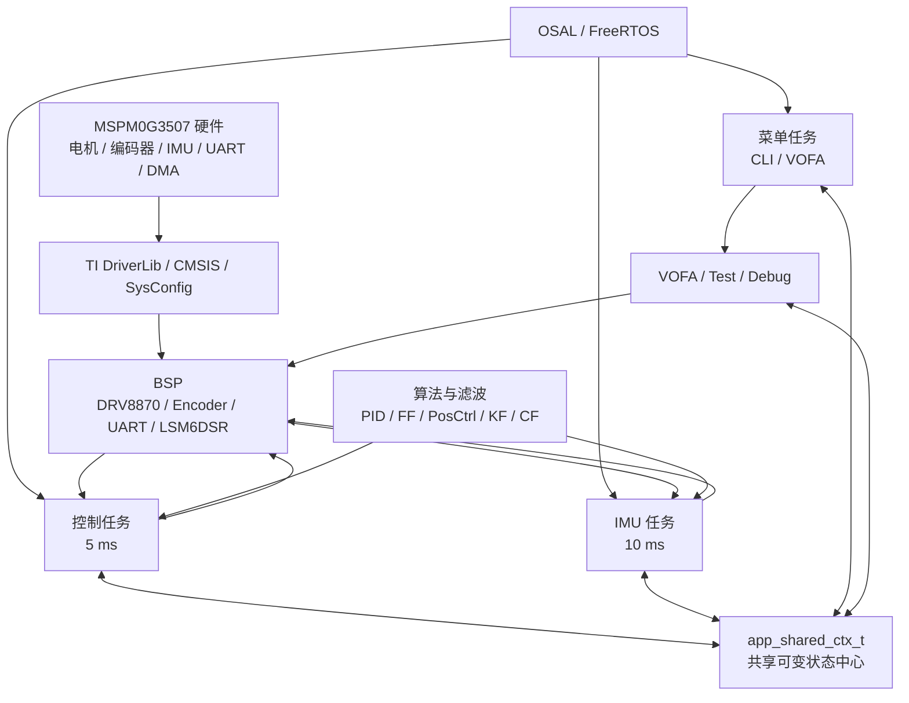
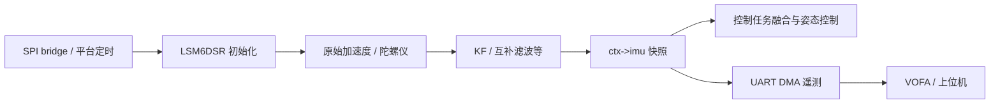
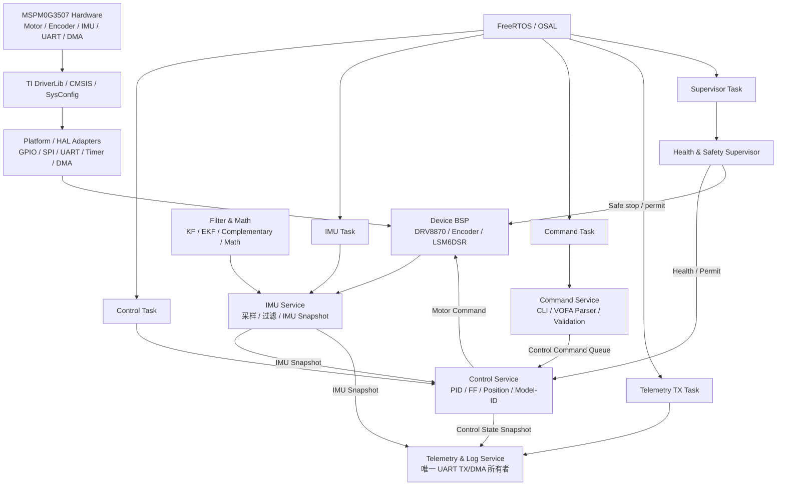

# MSPM0G3507 工程架构深度审核报告

## 1. 审核范围与结论摘要

### 审核范围

本次审核覆盖实际固件工程：

```
D:\msp_project\temp2\MSPM0G3507_Project\MSPM0G3507_FreeRTOS
```

并结合上层 SDK、FreeRTOS 内核、Keil 工程配置、Git 结构和 CodeGraph 静态符号关系进行分析。重点检查了：

- 启动路径与 RTOS 任务模型；
- 目录结构、模块职责、依赖关系；
- 控制、IMU、CLI/VOFA、UART DMA 的数据流；
- 共享状态、并发控制、实时性与故障安全；
- 构建、工程治理、代码组织与可维护性。

### 总体结论

该工程具备较完整的嵌入式应用基础：**TI MSPM0 SDK + FreeRTOS + BSP 驱动 + 控制算法 + IMU 姿态融合 + UART/VOFA 调试体系**。其功能分层意图明确，控制、传感、滤波、驱动及调试模块均已具备。

但当前实现仍属于“**功能集成型**”架构，尚未形成严格的服务边界和并发治理体系。核心风险集中在：

1. **UART DMA 与阻塞日志共用同一通道，且 DMA 发送状态存在竞争窗口；**
2. **IMU 故障后控制链未进入显式安全降级；**
3. **控制、IMU、菜单任务围绕 `app_shared_ctx_t` 共享可变状态，形成 God Context；**
4. **周期任务采用相对延时，控制周期与算法固定 `dt` 可能发生漂移；**
5. **VOFA、运行时测试模块职责过载，并跨层直接操作领域内部状态；**
6. **旧电机抽象、文档、Keil 工程名与实际实现有历史漂移。**

建议将后续改造优先级放在**实时安全性与并发隔离**，再处理模块拆分和工程治理。

> **审计边界说明**：本报告基于静态代码、工程文件与符号依赖分析形成；本机未具备 Keil/Arm Compiler 构建环境，因此未执行目标固件完整编译、上板运行、实时波形和硬件在环验证。静态结论需在目标板上通过压力测试与时序测试进一步确认。

------

# 2. 项目技术栈

| 维度       | 技术与实现                                                   |
| ---------- | ------------------------------------------------------------ |
| 开发语言   | C                                                            |
| MCU 平台   | TI MSPM0G3507，ARM Cortex-M0+                                |
| RTOS       | FreeRTOS，工程配置注释显示版本为 V202112.00                  |
| 芯片 SDK   | TI MSPM0 SDK / DriverLib / SysConfig                         |
| CMSIS      | ARM CMSIS 基础组件                                           |
| 构建工具   | Keil μVision 工程，Arm Compiler 6                            |
| 传感器     | LSM6DSR IMU，SPI 通讯                                        |
| 电机驱动   | DRV8870、编码器、电机速度与位置控制                          |
| 控制算法   | PID、前馈、模型辨识、位置-速度串级控制、轨迹/位置规划        |
| 姿态/滤波  | 互补滤波、KF、EKF、LKF、Mahony、Madgwick、LPF 等             |
| 通讯与调试 | UART RX 环形缓冲、UART DMA TX、VOFA+、AxiomTrace             |
| 数学加速   | 可选 MATHACL 加速路径                                        |
| 工程规模   | 应用/BSP/滤波/OSAL 自研重点代码约 12,000+ 行，不含 SDK 和 FreeRTOS |

------

# 3. 核心目录结构与职责划分

## 3.1 顶层工程结构

```
D:\msp_project\temp2\MSPM0G3507_Project
├─ MSPM0G3507_FreeRTOS/       # 实际应用固件工程
├─ source/                    # TI SDK、DriverLib、CMSIS、第三方基础代码
├─ kernel/                    # FreeRTOS 内核及 TI 相关资源
├─ examples/                  # TI 示例工程
├─ tools/                     # SDK 辅助工具
├─ AxiomTrace-main/           # AxiomTrace 参考/第三方工程
└─ .codegraph/                # 代码图索引元数据
```

### 边界判断

- `MSPM0G3507_FreeRTOS/` 是唯一需要重点维护、构建和交付的业务固件。
- `source/`、`kernel/`、`examples/`、`tools/` 更接近 SDK 依赖或参考资源，不应与应用逻辑混杂维护。
- `AxiomTrace-main/` 具有独立属性，不应被误认为固件自身的 CI 或构建体系。
- 推荐在仓库根目录增加明确的“**可构建目标清单**”，标识哪些目录是产品代码、第三方依赖、示例和工具。

------

## 3.2 固件目录结构

```
MSPM0G3507_FreeRTOS/
├─ Application/
│  ├─ Task/                   # RTOS 任务：控制、IMU、菜单
│  ├─ Algorithm/              # PID、前馈、模型辨识、位置控制等
│  ├─ test/                   # 在线测试、诊断、滤波参数调优
│  ├─ app_main.c/.h           # 应用装配、共享上下文、任务创建
│  ├─ app_vofa.c              # VOFA/CLI 协议与命令处理
│  └─ app_debug.c             # 调试输出
│
├─ BSP/
│  ├─ Peripherals/            # UART、DMA、编码器、DRV8870、LED、ADC 等
│  └─ IMU/                    # LSM6DSR 驱动、SPI 桥接、平台适配
│
├─ Filter/                    # 通用滤波框架与姿态算法
│
├─ Lib/
│  ├─ OSAL/                   # FreeRTOS 抽象封装
│  ├─ FreeRTOS/               # FreeRTOS 适配/相关文件
│  ├─ Math/                   # 数学工具
│  └─ AxiomTrace/             # Trace 移植层
│
├─ Config/                    # SysConfig、板级配置、FreeRTOS 配置
├─ keil/                      # Keil μVision 工程与构建配置
└─ main.c                     # 设备启动入口
```

------

## 3.3 模块职责表

| 模块                     | 主要职责                               | 当前评价                             |
| ------------------------ | -------------------------------------- | ------------------------------------ |
| `main.c`                 | 硬件基础初始化、应用初始化、启动调度器 | 清晰，但缺少全局故障启动策略         |
| `Application/app_main.*` | 模块装配、任务创建、共享状态定义       | 职责过重，是跨模块耦合中心           |
| `Application/Task/`      | 控制、IMU、菜单交互等 RTOS 任务        | 核心业务逻辑合理，但并发边界不足     |
| `Application/Algorithm/` | PID、前馈、模型辨识、位置控制          | 算法资产较完整，建议进一步主机化测试 |
| `Application/app_vofa.c` | 解析命令、参数调节、测试控制、模式切换 | 明显过载，应拆分                     |
| `Application/test/`      | 在线测试、诊断、滤波调参               | 功能丰富，但侵入生产流程较深         |
| `BSP/Peripherals/`       | 外设和设备驱动抽象                     | 基础具备，但 UART TX 的并发封装不足  |
| `BSP/IMU/`               | IMU 设备、SPI 与数据采集               | 职责合理，故障策略需上移至系统层     |
| `Filter/`                | 滤波器生命周期、姿态解算               | 功能丰富，外部可变指针暴露风险较高   |
| `Lib/OSAL/`              | FreeRTOS API 封装                      | 有封装价值，但周期任务能力不完整     |
| `Config/`                | 板级和 SysConfig 生成内容              | 应严格区分生成代码与手写配置         |
| `keil/`                  | 构建入口                               | 工程命名和构建产物管理需治理         |

------

# 4. 当前架构与分层分析

## 4.1 设计意图上的分层

工程的理想分层可概括为：

```
Application
    ↓
Middleware（OSAL / Filter / Math / Trace）
    ↓
BSP（电机、编码器、IMU、UART）
    ↓
HAL / SysConfig generated layer
    ↓
TI DriverLib / CMSIS
    ↓
MSPM0G3507 Hardware
```

该模型本身合理：应用层负责业务流程，算法/中间件承担通用逻辑，BSP 屏蔽硬件设备细节，底层 SDK 对接芯片寄存器与外设。

------

## 4.2 实际架构中的层穿透

实际代码中，边界已经出现明显穿透：

- `Application` 直接依赖多个 `bsp_*` 模块；
- `task_imu.c` 除业务逻辑外，还直接处理 SPI bridge、平台定时和 UART DMA；
- `app_main.h` 对外暴露 PID、前馈、位置控制器以及 BSP 层相关类型；
- `app_vofa.c`、`Application/test/` 可以直接操作控制器、滤波器和电机状态；
- 菜单任务不仅负责命令接入，还承担对核心控制对象的直接修改；
- 所谓 HAL 层并未形成独立、稳定的目录和接口边界，部分内容实际落在 `BSP/Peripherals/` 中。

因此，当前架构更接近：

```
Task / VOFA / Test
   ├─ 直接访问共享上下文
   ├─ 直接访问算法对象
   ├─ 直接调用 BSP
   └─ 直接使用 OSAL / UART DMA
```

这会导致功能新增时倾向于“往共享上下文加字段、往 VOFA 加分支、在任务里直接调驱动”，长期演进成本高。

------

## 4.3 当前架构图

````

````

### 图示解读

最大问题并不在底层驱动能力，而在于：

- `app_shared_ctx_t` 成为多个任务和调试模块的公共写入中心；
- UART、滤波器、电机控制对象没有严格的唯一所有者；
- 调试/测试路径与生产控制路径重叠；
- 业务层对 BSP 和底层资源的直接调用过多。

------

# 5. 启动流程、任务模型与数据流

## 5.1 启动链路

入口位于：

```
D:\msp_project\temp2\MSPM0G3507_Project\MSPM0G3507_FreeRTOS\main.c
```

启动顺序为：

```
main()
  ├─ SYSCFG_DL_init()
  ├─ bsp_timer_init()
  ├─ app_main_init()
  │   ├─ bsp_modules_init()
  │   ├─ PID / 前馈 / 互补滤波 / 模型辨识 / 位置控制器初始化
  │   └─ 创建 RTOS 任务
  └─ vTaskStartScheduler()
```

任务创建位置：

```
D:\msp_project\temp2\MSPM0G3507_Project\MSPM0G3507_FreeRTOS\Application\app_main.c
```

| 任务     | 标称周期   | 优先级 | 栈配置 | 职责                                      |
| -------- | ---------- | ------ | ------ | ----------------------------------------- |
| 控制任务 | 5 ms       | 5      | 256    | 编码器读取、PID、前馈、位置控制、电机驱动 |
| IMU 任务 | 10 ms      | 4      | 1280   | IMU 采样、滤波、诊断/遥测                 |
| 菜单任务 | 非严格周期 | 2      | 384    | CLI/VOFA 命令接收与分发                   |

FreeRTOS 核心参数：

- Tick：`1000 Hz`
- 最大优先级：`6`
- 堆空间：`14 KiB`
- 启用了静态 Idle/Timer 任务内存；
- 业务任务依然使用 `xTaskCreate()` 动态创建；
- 开启了 `configCHECK_FOR_STACK_OVERFLOW=1`；
- 未启用 `configUSE_MALLOC_FAILED_HOOK`；
- `vTaskDelayUntil` 已开启，但控制任务未使用。

------

## 5.2 控制数据流

控制任务位于：

````
D:\msp_project\temp2\MSPM0G3507_Project\MSPM0G3507_FreeRTOS\Application\Task\task_control.c

````

### 优点

- 速度闭环、位置外环、前馈及模型辨识已经形成较完整的控制链；
- 控制任务优先级最高，符合实时控制的基本原则；
- 电机动作路径集中在控制任务中，具备进一步收敛为“控制任务独占电机输出”的基础。

### 风险

- PID 使用固定周期参数，而实际任务使用相对延时，实际 `dt` 可能漂移；
- 位置、速度、IMU 数据通过共享上下文跨任务传递，缺乏稳定快照语义；
- CLI/VOFA 对参数和模式的修改可能与控制任务执行交叉。

------

## 5.3 IMU 数据流

IMU 任务位于：

````
D:\msp_project\temp2\MSPM0G3507_Project\MSPM0G3507_FreeRTOS\Application\Task\task_imu.c

````

### 关键风险：IMU 失败后的控制安全

当前 IMU 初始化失败时，IMU 任务会自行删除，但控制任务仍然继续运行并读取 `ctx->imu` 的默认值、旧值或过期数据。

这意味着：

```
IMU 初始化失败 / 运行时离线
    ↓
IMU 任务停止
    ↓
控制任务仍使用不可确认的新鲜度的 IMU 数据
    ↓
角度/位置闭环可能基于错误状态继续输出电机命令
```

这是典型的**故障安全缺口**。对于涉及电机驱动的系统，应优先整改。

------

## 5.4 菜单、VOFA 与调试流

菜单任务位于：

```
D:\msp_project\temp2\MSPM0G3507_Project\MSPM0G3507_FreeRTOS\Application\Task\task_menu.c
```

VOFA 命令处理位于：

```
D:\msp_project\temp2\MSPM0G3507_Project\MSPM0G3507_FreeRTOS\Application\app_vofa.c
```

当前流程：

```
UART RX 环形缓冲
  → 菜单任务解析
  → CLI / VOFA 命令
  → app_vofa_apply_cmd()
  → 直接修改 PID / FF / 模式 / 电机使能 / 测试流程
```

`app_vofa_apply_cmd()` 是横向依赖密集点，覆盖 PID、前馈、模型辨识、电机停止、位置控制、编码器、任务时钟等多个领域功能。

这使 VOFA 模块实际承担了：

- 协议解析；
- 命令校验；
- 参数更新；
- 模式切换；
- 电机控制；
- 模型辨识；
- 扫频和调参；
- 测试状态机。

属于明显的“**接口层兼任领域编排层**”问题。

------

# 6. 核心耦合点与风险诊断

## 6.1 风险分级总览

| 优先级 | 风险                              | 影响                               |
| ------ | --------------------------------- | ---------------------------------- |
| P0     | UART DMA 发送竞态                 | 帧损坏、DMA 重配、遥测/日志错乱    |
| P0     | DMA 遥测与阻塞 `printf` 共用 UART | 实时性下降、数据流冲突、任务阻塞   |
| P0     | IMU 失败后未安全降级              | 使用过期姿态控制电机，存在安全风险 |
| P1     | 相对延时造成控制周期漂移          | PID、滤波与调度精度受影响          |
| P1     | `app_shared_ctx_t` 多任务读写     | 语义竞态、难定位的偶发故障         |
| P1     | VOFA/Test 直接修改核心对象        | 测试路径污染生产控制路径           |
| P1     | 滤波器内部对象可被外部直接获得    | 生命周期、线程安全和封装风险       |
| P2     | 新旧电机抽象并存                  | 配置漂移、误用、死代码             |
| P2     | 文档与构建工程命名漂移            | 新人理解困难、维护成本提高         |
| P2     | 动静态内存策略混用                | 资源可预测性不足                   |
| P2     | 缺少应用级 CI / Host 测试         | 回归风险较高                       |

------

## 6.2 P0：UART DMA 发送的竞态与单通道冲突

相关实现：

```
D:\msp_project\temp2\MSPM0G3507_Project\MSPM0G3507_FreeRTOS\BSP\Peripherals\bsp_uart.c
```

当前 DMA 发送状态通过 `volatile` 完成标记控制，但“检查空闲 → 设置忙状态 → 配置 DMA”不是一个不可分割的原子过程。

已知发送来源包括：

- IMU 任务遥测；
- 菜单数据输出；
- 调试输出/编码器输出；
- `printf` 重定向。

可能出现的典型竞争：

```
菜单任务：发现 UART DMA 空闲
        ↓ 被高优先级 IMU 任务抢占
IMU 任务：发现 UART DMA 空闲，启动 DMA 发送
        ↓ 切回菜单任务
菜单任务：继续启动另一帧 DMA 发送，覆盖前一传输配置
```

### 后果

- VOFA 帧截断、串帧、校验失败；
- DMA 描述符或 UART 配置被覆盖；
- 调试日志与二进制/FireWater 遥测互相污染；
- 偶发问题难以复现；
- 若异常日志出现在高优先级控制路径，可能造成控制时序抖动。

### 整改建议

**目标方案：UART TX 单一所有者。**

```
控制 / IMU / 菜单 / 日志
        ↓
     Tx Queue
        ↓
UART TX Task（唯一 DMA 所有者）
        ↓
UART / DMA
```

最低限度整改措施：

1. 对“判断空闲 + 置忙 + DMA 启动”增加临界区保护；
2. 增加 DMA busy、drop、timeout、error 计数器；
3. 禁止在控制任务中调用阻塞输出；
4. 对不同数据类型引入帧格式或独立 UART；
5. 若资源允许，**日志 UART** 与 **VOFA 遥测 UART** 物理隔离。

------

## 6.3 P0：阻塞 `printf` 与 DMA 遥测混用

相关代码：

```
D:\msp_project\temp2\MSPM0G3507_Project\MSPM0G3507_FreeRTOS\Config\board.c
```

`fputc()` 以轮询 `DL_UART_isBusy()` 的方式发送字符，具有超时循环。与此同时，遥测数据经 DMA 从同一 UART 输出。

### 主要问题

- `printf` 可造成任务忙等；
- 文本日志与 VOFA 协议数据交叉，破坏上位机解析；
- 若在高优先级任务中打印，实时控制周期可能被明显拉长；
- 超时后的字符丢失通常未被上层业务感知；
- DMA 和轮询同时操作同一个 UART TX，缺乏发送仲裁。

### 建议

- 控制环内禁止 `printf`；
- 使用 RAM Trace Buffer 或无阻塞事件缓冲；
- 所有串口输出经统一 `telemetry_log_service`；
- 将“日志”和“遥测”定义为不同优先级与丢弃策略；
- 生产运行状态下保留关键故障码与计数器，而不是实时打印大量文本。

------

## 6.4 P0：IMU 故障未触发故障安全状态

相关位置：

```
D:\msp_project\temp2\MSPM0G3507_Project\MSPM0G3507_FreeRTOS\Application\Task\task_imu.c
```

当前 IMU 初始化失败后，任务删除自身。系统没有统一的 Supervisor 或 Health 状态来判断：

- IMU 是否成功初始化；
- 最新 IMU 数据是否超时；
- 连续采样失败次数；
- 当前是否允许角度/位置控制；
- 当前是否应该关闭电机输出。

### 建议的最低安全策略

| 故障条件        | 推荐动作                             |
| --------------- | ------------------------------------ |
| IMU 初始化失败  | 禁用姿态/位置闭环，禁止相关模式使能  |
| IMU 数据超时    | 退出姿态控制，切换速度模式或安全停车 |
| 连续采样失败    | 置故障码，停止电机或限制最大输出     |
| UART/传感器故障 | 保留基本控制，但限制模式与输出能力   |
| 控制周期超时    | 累计告警，超过阈值进入降级/停车      |

建议新增：

```
typedef struct {
    bool imu_ready;
    bool imu_data_fresh;
    bool motor_enable_allowed;
    uint32_t imu_error_count;
    uint32_t control_deadline_miss_count;
    uint32_t fault_flags;
} system_health_t;
```

并明确：**只有控制任务或 Supervisor 有权最终决定电机使能。**

------

## 6.5 P1：相对延时导致周期漂移

当前控制和 IMU 任务通过：

```
osal_task_delay_ms(...)
```

间接调用 `vTaskDelay()`。这意味着任务的“执行耗时”会叠加进周期：

```
实际周期 = 本次计算执行时间 + 相对延时
```

对于 5 ms 控制环而言，算法执行时间、UART、临界区、抢占都会直接改变实际周期，进而导致：

- PID 固定 `dt` 与真实采样时间不一致；
- 积分、微分、模型辨识误差增加；
- 姿态滤波器时间步长与实际不一致；
- 长时间运行后任务相位逐步漂移。

### 建议

OSAL 增加绝对节拍接口：

```
void osal_task_delay_until(TickType_t *last_wake_time, uint32_t period_ms);
```

控制任务采用：

```
TickType_t last_wake = xTaskGetTickCount();

for (;;) {
    control_cycle();
    vTaskDelayUntil(&last_wake, pdMS_TO_TICKS(5));
}
```

同时增加：

- 控制循环最大执行时间；
- 实际周期；
- deadline miss 次数；
- 最大抖动；
- 超预算保护策略。

------

## 6.6 P1：`app_shared_ctx_t` 是 God Context

共享上下文定义于：

```
D:\msp_project\temp2\MSPM0G3507_Project\MSPM0G3507_FreeRTOS\Application\app_main.h
```

它包含或关联：

- 四路 PID；
- 四路前馈参数；
- 电机使能状态；
- 速度、输出等控制状态；
- IMU 数据；
- 位置控制器；
- 多任务控制及调试相关状态。

控制、IMU、菜单、VOFA、测试模块共同读写它，形成典型的**共享可变状态中心**。

### 风险

1. **数据竞争**：不同任务对同一字段读写的同步策略不一致；
2. **语义竞争**：即使单字段访问原子，多个参数组合的更新也可能不一致；
3. **扩散耦合**：任何新功能都可能要求在上下文中增加字段；
4. **测试困难**：模块无法脱离全局上下文独立验证；
5. **权限不清晰**：无法回答“哪个模块拥有 PID/IMU/电机状态的写权限”。

### 建议的状态拆分

```
control_command
  - 菜单 / VOFA 产生
  - 控制任务在周期边界消费
  - 通过队列或版本化命令更新

control_state_snapshot
  - 控制任务单写
  - 遥测/UI 只读快照

imu_snapshot
  - IMU 任务单写
  - 控制任务和遥测服务读取快照

system_health
  - Supervisor 单写
  - 控制任务读取以执行安全策略
```

建议使用以下模式之一：

- 双缓冲快照；
- sequence counter；
- RTOS Queue；
- 消息发布订阅；
- 简单版本号 + 周期边界提交。

不要继续以“增加临界区”的方式无限扩展共享上下文；这只能缓解部分线程安全问题，不能解决职责和所有权问题。

------

## 6.7 P1：VOFA 与 Test 模块职责过载

重点文件：

- `D:\msp_project\temp2\MSPM0G3507_Project\MSPM0G3507_FreeRTOS\Application\app_vofa.c`，约 878 行；
- `D:\msp_project\temp2\MSPM0G3507_Project\MSPM0G3507_FreeRTOS\Application\test\app_test_runner.c`，约 1,194 行。

### `app_vofa.c` 当前混合职责

- 通讯协议解析；
- 参数解码和校验；
- PID/前馈更新；
- 模型辨识；
- 电机使能/停止；
- 位置控制模式；
- 扫频和测试控制；
- 任务时钟相关控制。

### 推荐拆分方式

```
Application/Command/
├─ vofa_parser.c              # 字节流 → 命令 DTO
├─ command_validate.c         # 参数边界、权限、当前状态校验
├─ command_dispatch.c         # 命令路由
├─ control_command_handler.c  # PID、速度、位置、使能
├─ test_command_handler.c     # 测试、扫频、调参
└─ telemetry_protocol.c       # 输出协议编码
```

原则：

- VOFA/CLI 只负责“**输入适配**”；
- 领域服务负责“**业务决策**”；
- 控制任务负责“**在控制周期边界实际应用命令**”；
- 测试模块不应绕过控制服务直接写电机、滤波器或共享上下文。

------

## 6.8 P1：滤波器对象封装和所有权不足

IMU 模块中存在获取滤波器内部指针、并可通过测试/调优模块直接操作的路径。

### 风险

- 外部模块可在 IMU 任务运行中改变滤波器内部状态；
- 初始化、销毁、替换滤波器时，外部持有指针可能失效；
- 多个功能同时调参时难以保证一致性；
- 滤波器生命周期与线程归属不清晰。

### 建议

改为受控接口：

```
bool imu_service_set_filter_config(const imu_filter_config_t *cfg);
bool imu_service_reset_filter(void);
bool imu_service_get_filter_diagnostics(imu_filter_diag_t *diag);
```

禁止外部直接获得可写滤波器实例指针。滤波器状态只应由 IMU 服务/任务独占写入。

------

# 7. 代码规范性与可维护性评估

## 7.1 正向评价

| 维度         | 评价                                                 |
| ------------ | ---------------------------------------------------- |
| 注释         | 具备较多 Doxygen 风格注释，接口意图整体可读          |
| 模块覆盖     | 电机、编码器、IMU、滤波、控制、调试、RTOS 封装较完整 |
| 任务优先级   | 控制任务优先级高于 IMU 和菜单，符合基本实时原则      |
| BSP 资产     | 外设与器件驱动已形成一定封装，具备复用基础           |
| 算法积累     | PID、前馈、模型辨识、位置控制、滤波体系较丰富        |
| 静态资源意识 | Idle/Timer 任务采用静态内存，已具备资源可控意识      |

------

## 7.2 可维护性问题

### 1. 大文件集中

主要热点包括：

| 文件                                 | 规模特征    | 问题                                 |
| ------------------------------------ | ----------- | ------------------------------------ |
| `Application/test/app_test_runner.c` | 约 1,194 行 | 测试状态、诊断、调参高度混合         |
| `Filter/filter_ekf.c`                | 约 965 行   | 复杂数学逻辑需要分区和单测保护       |
| `Application/app_vofa.c`             | 约 878 行   | 解析、业务、控制混合                 |
| `Filter/filter_core.c`               | 约 696 行   | 生命周期、分发、算法抽象可能耦合     |
| `BSP/IMU/bsp_lsm6dsr.c`              | 约 597 行   | 驱动、平台适配、数据逻辑应进一步分层 |

大文件不必然代表问题，但当前这些文件同时具有**高复杂度、跨模块依赖、运行时状态机**特征，建议优先拆分。

------

### 2. 命名与工程语义漂移

Keil 工程仍保留类似：

```
empty_LP_MSPM0G3507_nortos_keil
```

但实际工程已使用 FreeRTOS。这会造成：

- 新成员误判项目性质；
- 构建产物和工程配置不易检索；
- 文档与项目实际状态不一致。

建议将 Target、工程文件、输出目录命名统一为类似：

```
MSPM0G3507_FreeRTOS_MotorControl
```

------

### 3. 文档与目录结构不一致

文档中描述的 `Middleware/`、`HAL/`、`CMSIS/`、`Generated/` 等逻辑目录，与当前固件目录实体不是完全一一对应。

建议文档采用两层表达：

1. **逻辑架构图**：Application / Domain / BSP / Platform；
2. **物理目录映射表**：每个逻辑层对应当前哪些实际路径。

避免文档只描述“理想目录”，而工程长期维持另一套现实布局。

------

### 4. 动态与静态内存策略混用

当前系统：

- Idle/Timer 任务使用静态内存；
- 应用任务使用 `xTaskCreate()` 动态分配；
- IMU 过滤器优先静态创建，失败时回退动态分配；
- 堆总量为 14 KiB；
- 未启用 malloc failed hook。

### 风险

- 资源上界不够显式；
- 某些失败场景没有被统一处理；
- 运行期内存分配若被引入，将进一步破坏实时性和稳定性。

### 建议

二选一明确策略：

**方案 A：启动期有限动态分配**

- 只允许系统启动阶段动态创建任务和对象；
- 进入运行态后禁止 `malloc`；
- 启用 malloc failed hook；
- 输出 heap watermark。

**方案 B：完全静态化**

- `xTaskCreateStatic()`；
- 静态队列、静态信号量；
- 静态滤波器工作区；
- 适用于更高可靠性、可审计性要求的产品化场景。

------

# 8. 新旧电机抽象并存问题

当前应用路径主要使用 `bsp_drv8870_*`，但工程内仍存在旧 `bsp_motor.*` 以及对应配置项。

### 风险

- 新旧接口并存，维护者可能误用；
- 配置重复、默认值发生漂移；
- 编译单元存在无调用的历史代码；
- 实际硬件适配与抽象边界不清晰。

### 建议

选择一个明确方向：

### 方案一：移除旧抽象

若 DRV8870 是唯一目标硬件：

- 标记 `bsp_motor` 为 deprecated；
- 删除无调用代码及重复配置；
- 将应用统一改为面向 DRV8870 的业务接口。

### 方案二：保留统一电机抽象

若未来要支持多款电机驱动芯片：

```
motor_service
    ├─ bsp_motor_drv8870_adapter
    ├─ bsp_motor_xxx_adapter
    └─ application 仅依赖 motor_service
```

此时 `bsp_motor` 应成为唯一稳定门面，而不是另一套平行旧实现。

------

# 9. 建议的目标架构

````

````

------

## 9.1 目标架构的关键约束

| 资源/对象            | 唯一写入者   | 其他模块访问方式       |
| -------------------- | ------------ | ---------------------- |
| 电机输出             | 控制任务     | 命令队列、状态快照     |
| IMU 原始数据与滤波器 | IMU 任务     | IMU 快照               |
| UART TX / DMA        | 遥测发送任务 | 消息队列               |
| PID/前馈参数的应用   | 控制任务     | 参数更新命令           |
| 系统故障许可         | Supervisor   | 只读健康状态           |
| VOFA/CLI             | 命令服务     | 不能直改控制器内部结构 |

这套约束比“增加更多临界区”更重要，因为它解决的是**所有权和责任边界**问题。

------

# 10. 分阶段重构建议

## 第一阶段：安全性与实时性整改

**优先级最高，建议先完成。**

1. 建立 UART TX 队列与独立发送任务；
2. UART DMA 只允许一个所有者调用；
3. 禁止控制任务中使用阻塞 `printf`；
4. 将日志、遥测封装为异步服务；
5. 为 IMU 增加初始化状态、数据新鲜度、连续失败计数；
6. IMU 失效时，强制禁用姿态/位置闭环并执行安全降级；
7. 在 OSAL 中增加 `vTaskDelayUntil` 封装；
8. 记录控制周期抖动、deadline miss、DMA 忙/丢帧、IMU 超时；
9. 启用 malloc failed hook；
10. 输出任务栈和堆水位。

### 第一阶段验收标准

- UART 不再出现并发 DMA 启动；
- 控制任务运行路径无阻塞串口输出；
- IMU 掉线后系统进入可观察、可恢复、可预测的安全状态；
- 控制任务周期可测量，超过阈值可统计；
- 可通过上位机读取系统健康指标。

------

## 第二阶段：状态边界与模块拆分

1. 将 `app_shared_ctx_t` 拆为命令、控制状态、IMU 快照、健康状态；
2. 通过 Queue 或版本化命令替代 VOFA 对控制对象的直接写入；
3. 控制状态和 IMU 状态改为双缓冲/快照；
4. 将 `app_vofa.c` 拆为协议、校验、调度和业务处理器；
5. 将 `app_test_runner.c` 按测试类型拆分；
6. 将滤波器对象封装在 IMU Service 内；
7. 将 BSP 设备访问逐步从业务任务中收敛到服务层。

### 第二阶段收益

- 并发问题大幅减少；
- VOFA 和测试功能不再污染控制主流程；
- 模块可独立单测；
- 新功能不再不断扩大共享结构；
- 更容易定位“命令输入—控制生效—电机输出”的完整链路。

------

## 第三阶段：工程治理与质量体系

1. 统一 Keil Target 名称、输出路径、工程说明；
2. 清理已纳入 Git 的 `Objects/`、`Listings/`、`.o`、`.d`、`.map`、`.lst`、`.htm` 等中间产物；
3. 确认 `.gitignore` 对历史已跟踪产物真正生效；
4. 移除旧 `bsp_motor`，或改为唯一电机抽象门面；
5. 更新 README 与真实目录、实际构建流程；
6. 增加 CI；
7. 建立 Host 侧算法测试；
8. 建立硬件在环测试清单。

建议 CI 最低能力：

```
1. Keil / Arm 编译
2. 静态检查（clang-tidy、cppcheck 或 MISRA 检查）
3. 格式检查（clang-format）
4. Host 算法单元测试
5. 固件尺寸与 RAM/Flash 预算检查
6. 栈/堆预算检查
7. 可选：硬件在环冒烟测试
```

------

# 11. 建议补充的测试矩阵

| 测试项           | 目标                                           |
| ---------------- | ---------------------------------------------- |
| UART DMA 压测    | IMU 遥测、菜单输出、日志并发时不串帧、不死锁   |
| IMU 掉线测试     | 初始化失败、运行中断线、连续读取失败时安全停车 |
| 控制周期测试     | 记录 5 ms 任务最大/最小周期与 deadline miss    |
| 命令洪泛测试     | 高频 VOFA 命令不会破坏 PID 参数一致性          |
| 参数原子更新测试 | 多个 PID/前馈参数同时更新时无半更新状态        |
| 任务栈压力测试   | 验证控制、IMU、菜单、TX、Supervisor 任务水位   |
| 堆耗尽测试       | 验证 malloc failed hook 与故障上报             |
| 电机安全测试     | 传感器异常、模式切换、急停条件下输出可预测     |
| 滤波稳定性测试   | 固定数据集回放，验证 KF/CF 参数改动不回归      |

------

# 12. 最终结论

当前项目已经具备从“实验性控制固件”演进为“可维护嵌入式控制平台”的必要基础：硬件驱动、FreeRTOS 调度、控制算法、滤波体系和上位机调试链均已形成。

但要实现稳定产品化，下一步不应继续单纯增加功能，而应优先完成以下四项架构收敛：

1. **UART/DMA 单所有者化；**
2. **IMU 和控制故障的统一安全降级；**
3. **共享上下文拆分为命令、快照和健康状态；**
4. **控制任务采用绝对节拍，并形成可观测的实时性指标。**

完成上述整改后，再推进 VOFA/Test 模块拆分、旧电机抽象清理、CI 与 Host 单测建设，项目的可靠性、可测试性和长期维护效率会有明显提升。

------

## 审计备注

审计期间未修改任何固件业务源文件。当前工作区原本存在以下用户修改，应在后续操作中保留：

- `D:\msp_project\temp2\MSPM0G3507_Project\MSPM0G3507_FreeRTOS\Config\ti_msp_dl_config.c`
- `D:\msp_project\temp2\MSPM0G3507_Project\MSPM0G3507_FreeRTOS\Config\ti_msp_dl_config.h`

此外，CodeGraph 索引同步可能导致 `.codegraph/` 元数据出现变化；若需要清理这些审计产生的索引变更，应仅处理 `.codegraph/`，不要覆盖上述两处用户配置修改。