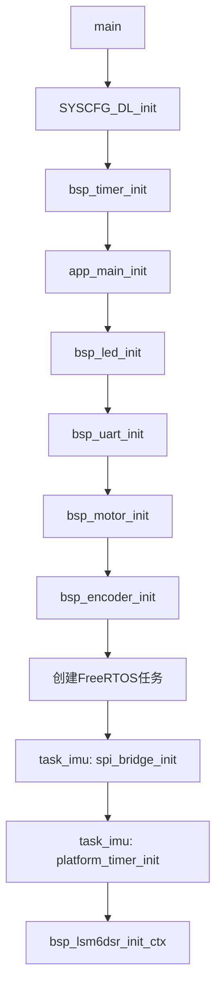

# MSPM0G3507 外设分类开发参考手册

> 工程：`MSPM0G3507_Project/MSPM0G3507_FreeRTOS`
> 适用分支基线：`refactor/phase1`
> 文档日期：2026-07-16
> 文档目标：按外设提供“硬件配置位置、核心 API、参数范围、初始化与调用示例”，并记录当前工程真实映射与已知限制。

---

## 目录

- [1. 阅读约定与快速索引](#1-阅读约定与快速索引)
- [2. 系统时钟与时钟树](#2-系统时钟与时钟树)
- [3. GPIO通用接口](#3-gpio通用接口)
- [4. LED](#4-ledpa27低电平点亮)
- [5. UART0调试串口与TX DMA](#5-uart0调试串口与tx-dma)
- [6. TIMA0四通道PWM](#6-tima0四通道pwm)
- [7. DRV8870电机驱动与PB19电机电源](#7-drv8870电机驱动与pb19电机电源)
- [8. TB6612兼容驱动](#8-tb6612兼容驱动)
- [9. 编码器捕获与M/T测速](#9-编码器捕获与mt测速)
- [10. ADC12](#10-adc12adc1)
- [11. TIMG8系统计时器](#11-timg8系统计时器)
- [12. SPI1与LSM6DSR](#12-spi1与lsm6dsr)
- [13. 软件I²C兼容实现](#13-软件i²c兼容实现当前停用)
- [14. 中断绑定参考](#14-中断绑定参考)
- [15. 配置变更、生成与Keil重建流程](#15-配置变更生成与keil重建流程)
- [16. 已知问题与维护优先级](#16-已知问题与维护优先级)
- [17. 开发者快速选择指南](#17-开发者快速选择指南)
- [18. 最小完整应用骨架](#18-最小完整应用骨架)

---
## 1. 阅读约定与快速索引

### 1.1 配置文件的优先级

本工程的外设配置分为四层：

| 层级 | 作用 | 主要路径 | 是否可直接修改 |
|---|---|---|---|
| SysConfig 源配置 | 时钟、引脚复用、外设实例、DMA、中断等硬件配置 | `Config/empty.syscfg` | **可以，硬件配置首选入口** |
| 工程集中配置 | BSP实例映射、方向修正、周期、阈值、业务参数 | `Config/project_config.h` | **可以** |
| SysConfig 生成文件 | TI DriverLib初始化代码和生成宏 | `Config/ti_msp_dl_config.c`、`Config/ti_msp_dl_config.h` | **禁止手改**，会被重新生成覆盖 |
| HAL/BSP实现 | 对DriverLib的封装与业务安全约束 | `BSP/Peripherals/`、`BSP/IMU/` | 驱动行为修改时可以改 |

> **规则：**引脚、外设实例、时钟源、DMA请求等先改 `empty.syscfg`；方向、比例、周期等工程参数改 `project_config.h`；生成后核对 `ti_msp_dl_config.[ch]`，但不要手工修补生成文件。

### 1.2 系统初始化顺序



入口文件：

- `main.c`
- `Application/app_main.c`
- `Application/Task/task_imu.c`

任何 BSP API 在调用前，都必须先完成 `SYSCFG_DL_init()`；多数BSP还要求调用各自的 `bsp_xxx_init()`。

### 1.3 BSP通用返回码

定义文件：`BSP/bsp_common.h`

| 返回码 | 值 | 含义 |
|---|---:|---|
| `BSP_OK` | 0 | 成功 |
| `BSP_ERR_NULL_PTR` | -1 | 空指针 |
| `BSP_ERR_INVALID_PARAM` | -2 | 参数非法或越界 |
| `BSP_ERR_BUSY` | -3 | 外设忙 |
| `BSP_ERR_TIMEOUT` | -4 | 超时 |
| `BSP_ERR_NOT_INIT` | -5 | 未初始化 |
| `BSP_ERR_NAK` | -6 | 总线从设备未应答 |
| `BSP_ERR_BUF_FULL` | -7 | 缓冲区满 |
| `BSP_ERR_BUF_EMPTY` | -8 | 缓冲区空 |
| `BSP_ERR_HW_FAULT` | -9 | 硬件故障 |
| `BSP_ERR_UNSUPPORTED` | -10 | 当前构建或硬件不支持 |
| `BSP_ERR_NOT_READY` | -11 | 依赖条件未就绪，例如电机电源未开启 |

HAL返回码定义在 `BSP/Peripherals/hal_common.h`，成功统一判断 `HAL_OK`。

---

## 2. 系统时钟与时钟树

### 2.1 功能与当前配置

| 项目 | 当前值 |
|---|---:|
| CPU主频 | 80 MHz |
| 外部晶振引脚 | PA5 / PA6 |
| 外部晶振标称输入 | 8 MHz |
| PWM定时器输入时钟 | 20 MHz |
| UART0输入时钟 | 40 MHz |
| TIMG8计数时钟 | 500 kHz |

当前生成宏：

```c
CPUCLK_FREQ                 80000000
PWM_MOTOR_INST_CLK_FREQ     20000000
UART_0_DEBUG_INST_FREQUENCY 40000000
```

### 2.2 可配置项和文件路径

| 可配置项 | 配置入口 | 生成结果核对位置 |
|---|---|---|
| HFXT使能、频率范围、PA5/PA6复用 | `Config/empty.syscfg` 的 SYSCTL/HFXT | `Config/ti_msp_dl_config.c` 的 `SYSCFG_DL_SYSCTL_init()` |
| SYSPLL参考源、倍频/分频 | `Config/empty.syscfg` 的 SYSPLL | `Config/ti_msp_dl_config.c` 的 `DL_SYSCTL_configSYSPLL()`参数 |
| CPUCLK、MCLK、外设时钟分频 | `Config/empty.syscfg` | `Config/ti_msp_dl_config.h` 频率宏 |
| PWM/UART/ADC/SPI/GPTIMER时钟源 | 各外设的SysConfig页面 | 对应生成的 `*_ClockConfig` |

### 2.3 当前已知风险

`empty.syscfg`声明了8 MHz HFXT且占用PA5/PA6，但当前生成代码同时出现：

```c
.sysPLLRef = DL_SYSCTL_SYSPLL_REF_SYSOSC;
DL_SYSCTL_disableHFXT();
```

即：**界面层配置包含HFXT，但当前生成实现的SYSPLL参考源实际上是SYSOSC，并关闭了HFXT。** 因此：

1. 不要只看SysConfig界面判断系统时钟来源；
2. 每次重新生成后必须核对 `ti_msp_dl_config.c`；
3. 若要让PLL真实使用8 MHz外部晶振，应确认生成的 `sysPLLRef` 为HFXT，并确认板上晶振启动时间、负载电容和频率范围配置；
4. 时钟改动后先做最小化启动验证，再恢复电机、ADC、UART和RTOS任务。

### 2.4 使用教程：安全验证时钟配置

```c
#include "ti_msp_dl_config.h"
#include "bsp_uart.h"
#include <stdio.h>

void clock_smoke_test(void)
{
    /* main()中已经执行 SYSCFG_DL_init() 和 bsp_uart_init() */
    printf("CPU=%lu Hz, PWMCLK=%lu Hz, UARTCLK=%lu Hz\r\n",
           (unsigned long)CPUCLK_FREQ,
           (unsigned long)PWM_MOTOR_INST_CLK_FREQ,
           (unsigned long)UART_0_DEBUG_INST_FREQUENCY);
}
```

该示例只能验证编译期宏和UART是否可运行，不能替代示波器/频率计对真实时钟或PWM输出频率的测量。

---

## 3. GPIO通用接口

### 3.1 硬件可配置项与路径

GPIO的复用、上下拉、输入输出方向、初始输出电平主要在：

- `Config/empty.syscfg`
- `Config/ti_msp_dl_config.h`：生成的 `*_PORT`、`*_PIN`、`*_IOMUX` 宏
- `BSP/Peripherals/hal_common.h`：端口、方向、上下拉抽象类型
- `BSP/Peripherals/hal_gpio.h/.c`：GPIO HAL实现
- `Config/project_config.h`：LED、电机电源、编码器B相等板级映射

当前HAL仅支持：

```c
HAL_GPIO_PORT_A
HAL_GPIO_PORT_B
```

`pin`参数必须传 `DL_GPIO_PIN_x` 位掩码或SysConfig生成的 `xxx_PIN` 宏，**不能传裸数字 `x`**。

### 3.2 API参考

| API | 参数与合法值 | 返回值/说明 |
|---|---|---|
| `hal_gpio_init_output(cfg)` | `cfg != NULL`；`port`为A/B；`pin`为位掩码；`iomux`为`IOMUX_PINCMx` | `HAL_OK`或`HAL_ERR_INVALID_PARAM` |
| `hal_gpio_init_input(cfg, pull)` | `pull`：`HAL_GPIO_PULL_NONE/UP/DOWN` | 初始化输入及上下拉 |
| `hal_gpio_set_pin(port, pin)` | 合法端口、合法位掩码 | 输出高电平 |
| `hal_gpio_clear_pin(port, pin)` | 同上 | 输出低电平 |
| `hal_gpio_write_pin(port, pin, high)` | `high=true/false` | 写高/低 |
| `hal_gpio_read_pin(port, pin)` | 合法端口和位掩码 | 读取DIN；返回`bool` |
| `hal_gpio_read_output_latch(port, pin)` | 同上 | 读取DOUT锁存值，不代表引脚物理电压 |
| `hal_gpio_toggle_pin(port, pin)` | 同上 | 翻转输出 |
| `hal_gpio_set_direction(cfg, dir)` | `dir`为`HAL_GPIO_DIR_INPUT/OUTPUT` | 动态切换方向，软件I²C使用 |

### 3.3 使用教程

```c
#include "hal_gpio.h"
#include "ti_msp_dl_config.h"

static const hal_gpio_pin_config_t s_test_pin = {
    .port  = HAL_GPIO_PORT_B,
    .pin   = POWER_pb19_PIN,
    .iomux = POWER_pb19_IOMUX,
};

void gpio_example(void)
{
    if (hal_gpio_init_output(&s_test_pin) != HAL_OK) {
        return;
    }

    hal_gpio_clear_pin(s_test_pin.port, s_test_pin.pin);
    hal_gpio_set_pin(s_test_pin.port, s_test_pin.pin);

    bool command_high = hal_gpio_read_output_latch(
        s_test_pin.port, s_test_pin.pin);
    (void)command_high;
}
```

> 若引脚已由SysConfig初始化，通常无需再次调用 `hal_gpio_init_*()`；直接通过工程生成宏访问即可。示例使用 `POWER_pb19_PIN` 和 `POWER_pb19_IOMUX`，避免硬编码PINCM编号。

---

## 4. LED（PA27，低电平点亮）

### 4.1 硬件映射与配置路径

| 项目 | 当前值 |
|---|---|
| 引脚 | PA27 |
| 有效电平 | 低电平点亮 |
| SysConfig源 | `Config/empty.syscfg` |
| 工程映射 | `Config/project_config.h`：`PRJ_LED_PORT`、`PRJ_LED_PIN` |
| 驱动 | `BSP/Peripherals/bsp_led.h/.c` |

### 4.2 API参考

| API | 参数 | 说明 |
|---|---|---|
| `bsp_led_init()` | 无 | 初始化LED并默认关闭；成功返回`BSP_OK` |
| `bsp_led_on()` | 无 | 点亮，驱动层处理低有效 |
| `bsp_led_off()` | 无 | 熄灭 |
| `bsp_led_toggle()` | 无 | 翻转状态 |
| `bsp_led_is_on()` | 无 | 返回逻辑点亮状态 |

### 4.3 使用教程

```c
#include "bsp_led.h"
#include "osal.h"

void led_task_demo(void)
{
    if (bsp_led_init() != BSP_OK) {
        return;
    }

    for (;;) {
        bsp_led_toggle();
        osal_task_delay_ms(500U);
    }
}
```

应用层只使用 `bsp_led_*`，不要自行假设高有效或低有效。

---

## 5. UART0调试串口与TX DMA

### 5.1 硬件映射与可配置项

| 项目 | 当前值 |
|---|---|
| UART实例 | UART0 |
| TX/RX | PA10 / PA11 |
| 波特率 | 115200 |
| 输入时钟 | 40 MHz |
| 数据格式 | 由`empty.syscfg`配置 |
| RX FIFO阈值 | 1字节 |
| RX timeout | 10 |
| TX DMA | 开启，DMA通道0，SysConfig对象名`DMA_CH1` |
| RX DMA | 关闭 |
| RX环形缓冲区 | 128字节数组，实际可存127字节 |
| DMA发送最大负载 | 512字节 |

配置与实现路径：

- `Config/empty.syscfg`：波特率、引脚、FIFO、DMA请求、中断
- `Config/project_config.h`：`PRJ_UART_DEBUG_ID`
- `BSP/Peripherals/hal_uart.h/.c`
- `BSP/Peripherals/bsp_uart.h/.c`
- `Config/board.c`：`fputc()`/`printf`重定向和UART ISR绑定

### 5.2 API参考

| API | 参数范围 | 返回值与行为 |
|---|---|---|
| `bsp_uart_init()` | 无 | 清空RX缓冲并使能中断 |
| `bsp_uart_deinit()` | 无 | 关闭中断并清缓冲 |
| `bsp_uart_putc(data)` | `data`：0～255 | 阻塞发送单字节 |
| `bsp_uart_puts(str)` | `str != NULL`且以`\0`结尾 | 阻塞发送字符串 |
| `bsp_uart_getc(data)` | `data != NULL` | 非阻塞；无数据返回`BSP_ERR_BUF_EMPTY` |
| `bsp_uart_rx_count()` | 无 | 返回0～127 |
| `bsp_uart_rx_flush()` | 无 | 清空RX环形缓冲 |
| `bsp_uart_send_dma(data,len)` | `data != NULL`；`len`建议1～512 | 非阻塞；忙返回`BSP_ERR_BUSY`；超长返回`BSP_ERR_INVALID_PARAM` |
| `bsp_uart_tx_idle()` | 无 | `true`表示DMA发送和EOT均完成 |
| `bsp_uart_get_tx_diag(diag)` | `diag != NULL` | 获取诊断快照，不清零计数 |
| `bsp_uart_irq_handler()` | 仅ISR调用 | 处理RX、DMA_DONE_TX和EOT |

> `printf()`最终进入 `Config/board.c:fputc()`，再进入 `bsp_uart_putc()`。任务代码不得直接写UART TXDATA寄存器，否则会绕过轮询发送、DMA和EOT之间的仲裁。

### 5.3 使用教程：命令接收与DMA日志

```c
#include "bsp_uart.h"
#include <string.h>

void uart_demo_poll(void)
{
    uint8_t ch;
    if (bsp_uart_getc(&ch) == BSP_OK) {
        (void)bsp_uart_putc(ch); /* 回显 */
    }
}

void uart_demo_dma(void)
{
    static const uint8_t msg[] = "UART DMA ready\r\n";

    if (bsp_uart_tx_idle()) {
        bsp_status_t st = bsp_uart_send_dma(msg, (uint16_t)(sizeof(msg) - 1U));
        if (st != BSP_OK) {
            /* 记录错误；不要在高频循环中无限重试 */
        }
    }
}
```

### 5.4 并发注意事项

1. DMA发送使用内部bounce buffer，函数返回后调用者可以复用原缓冲区；
2. 多任务同时打印仍可能产生行级交错；建议由单独日志任务串行化；
3. ISR只收字节，不在ISR内解析命令、打印或执行电机控制；
4. `bsp_uart_get_tx_diag()`仅用于观测，不能参与安全控制判定。

---

## 6. TIMA0四通道PWM

### 6.1 当前硬件配置

| 电机 | PWM通道 | 引脚 | 定时器 |
|---|---:|---|---|
| A / M1 | CC0 | PA8 | TIMA0 |
| B / M2 | CC1 | PA9 | TIMA0 |
| C / M3 | CC2 | PB17 | TIMA0 |
| D / M4 | CC3 | PB2 | TIMA0 |

PWM参数：

```text
时钟：20 MHz
计数模式：EDGE_ALIGN_UP
周期：1000 counts
频率：20,000,000 / 1000 = 20 kHz
初始比较值：500，即50%
```

可配置位置：

- `Config/empty.syscfg`：TIMA0实例、四个CC通道、引脚、时钟、计数模式、初始比较值
- `Config/project_config.h`：`PRJ_DRV8870_PWM_TIMER`、`PRJ_DRV8870_PWM_PERIOD`、通道映射
- `BSP/Peripherals/hal_timer.h/.c`：通用PWM写入
- `BSP/Peripherals/bsp_motor.h/.c`：统一电机语义、编译期后端选择和安全联锁
- `BSP/Peripherals/bsp_drv8870.h/.c`、`bsp_tb6612.h/.c`：芯片专属实现

### 6.2 HAL API参考

```c
hal_status_t hal_timer_set_pwm_duty(
    hal_timer_id_t id,
    uint32_t channel,
    uint32_t value);
```

参数：

- `id`：当前PWM仅允许 `HAL_TIMER_PWM_MOTOR`；
- `channel`：0～3，对应CC0～CC3；
- `value`：0～当前PWM周期，当前为0～1000；
- 成功返回 `HAL_OK`，越界返回 `HAL_ERR_INVALID_PARAM`，非PWM实例返回 `HAL_ERR_UNSUPPORTED`。

其他定时器HAL：

| API | 合法参数/用途 |
|---|---|
| `hal_timer_start(id)` / `hal_timer_stop(id)` | `id`为 `HAL_TIMER_PWM_MOTOR`、四路捕获或`HAL_TIMER_SYS_TICK` |
| `hal_timer_enable_irq(id)` / `disable_irq(id)` | 控制对应NVIC |
| `hal_timer_get_count(id)` | 读取当前计数器 |
| `hal_timer_get_irq_flag(id)` | ISR中读取CC0/CC1/LOAD标志 |
| `hal_timer_get_capture_value(id,channel)` | 捕获通道0或1 |
| `hal_timer_reset_count(id)` | 清零定时器计数器 |

### 6.3 使用教程：裸PWM测试

生产控制必须优先使用 `bsp_motor_*`。只有做底层波形验证时才直接调用HAL：

```c
#include "hal_timer.h"

void pwm_waveform_demo(void)
{
    /* 前提：SYSCFG_DL_init()已配置并启动TIMA0 */
    (void)hal_timer_set_pwm_duty(HAL_TIMER_PWM_MOTOR, 0U, 500U); /* 50% */
    (void)hal_timer_set_pwm_duty(HAL_TIMER_PWM_MOTOR, 1U, 250U); /* 25% */
    (void)hal_timer_set_pwm_duty(HAL_TIMER_PWM_MOTOR, 2U, 750U); /* 75% */
    (void)hal_timer_set_pwm_duty(HAL_TIMER_PWM_MOTOR, 3U, 500U); /* 50% */
}
```

> 直接写比较寄存器不会自动执行功率联锁、方向修正、停止语义和后端切换。生产代码不要绕过 `bsp_motor` 统一门面。

---

## 7. DRV8870电机驱动与PB19电机电源

### 7.1 当前硬件模型与实测死区

每个DRV8870由一路TIMA0 PWM驱动：MCU PWM直连IN1，并经S8050反相后送入IN2。该板属于单PWM锁相（Locked Anti-Phase）拓扑，不能由软件独立产生真正的`IN1=IN2=0` Coast或`IN1=IN2=1` Brake。PB19是四路电机电源总开关，高电平有效，SysConfig上电默认保持低电平。

实测绝对PWM占空比定义为：

| 绝对PWM占空比 | 机械状态 | 驱动业务语义 |
|---:|---|---|
| `0% <= duty < 40%` | 反转有效区 | 负速度命令映射区 |
| `40% <= duty <= 55%` | 停止死区 | 仅零命令/诊断可进入 |
| `55% < duty <= 100%` | 正转有效区 | 正速度命令映射区 |
| `50%` | 默认中性点 | `speed == 0` |

> 40%和55%均属于死区。正常控制接口保证任何非零命令严格越过边界；示波器原始接口则允许输出40%、50%、55%以便测量。

当前硬件映射：

| 电机接口 | 车轮位置 | PWM | 反馈编码器 |
|---|---|---|---|
| A / M1 | 右后RB | PA8 / TIMA0 CC0 | `BSP_ENCODER_RB` |
| B / M2 | 右前RF | PA9 / TIMA0 CC1 | `BSP_ENCODER_RF` |
| C / M3 | 左前LF | PB17 / TIMA0 CC2 | `BSP_ENCODER_LF` |
| D / M4 | 左后LB | PB2 / TIMA0 CC3 | `BSP_ENCODER_LB` |

配置路径：

- `Config/empty.syscfg`：PB19输出及上电初值、TIMA0四路PWM、引脚复用、PWM周期；
- `Config/project_config.h`：死区、中性点、安装方向、通道映射、电源延时、机械参数；
- `BSP/Peripherals/bsp_motor.h/.c`：应用公共接口和编译期后端选择；
- `BSP/Peripherals/bsp_drv8870.h/.c`：DRV8870校验、功率联锁和死区分段映射；
- `Application/Task/task_control.c`：将LF/LB/RF/RB编码器顺序重排为A/B/C/D电机顺序；
- `Application/app_main.c`：统一后端初始化、PID输出限幅和配置一致性检查。

### 7.2 可配置项和合法值

核心配置位于`Config/project_config.h`：

| 宏 | 当前值 | 合法值/修改规则 |
|---|---:|---|
| `PRJ_DRV8870_PWM_PERIOD` | 1000 | 必须与SysConfig的TIMA0 LOAD/period一致且不小于2 |
| `PRJ_MOTOR_COMMAND_MAX` / `PRJ_DRV8870_SPEED_COMMAND_MAX` | 500 | 统一业务范围；DRV8870构建要求其等于`PWM_PERIOD/2` |
| `PRJ_DRV8870_DEADBAND_LOW_PERCENT` | 40 | `1~98`，且严格小于高边界 |
| `PRJ_DRV8870_NEUTRAL_PERCENT` | 50 | 必须位于`[low, high]`内 |
| `PRJ_DRV8870_DEADBAND_HIGH_PERCENT` | 55 | `2~99`，且严格大于低边界 |
| `PRJ_DRV8870_ZERO_DUTY_OFFSET` | 0 | timer tick；调整后中性compare仍必须位于死区内 |
| `PRJ_MOTOR_A/B/C/D_INSTALL_DIR_SIGN` | +1 | 仅`+1`或`-1`；正命令应对应统一车体前进方向 |
| `PRJ_DRV8870_POWER_STARTUP_MS` | 20 ms | PB19拉高后到非零命令的最短稳定时间 |
| `PRJ_DRV8870_POWER_SETTLE_MS` | 5 ms | 停止后断电前的保守等待时间 |

DRV8870配置结构：

```c
typedef struct {
    uint32_t pwm_ch;                  /* 0~3，且四路不得重复 */
    int8_t   dir_sign;                /* +1/-1；0兼容视为+1 */
    int16_t  zero_duty_offset;        /* 中性compare偏移 */
    uint8_t  deadband_low_percent;    /* 反转区上边界 */
    uint8_t  neutral_percent;         /* 零命令中性点 */
    uint8_t  deadband_high_percent;   /* 正转区下边界 */
} bsp_drv8870_config_t;
```

初始化会拒绝通道重复、非法方向、非法死区、越界中性点及过小PWM周期。配置失败时PB19保持OFF。

### 7.3 有符号命令到绝对PWM的映射

令`M = period / 2`，先将`speed`限制到`[-M,+M]`，再乘对应电机的`dir_sign`。分段映射为：

```text
speed == 0: compare = neutral + zero_duty_offset
speed >  0: compare = high + ceil(speed * (period - high) / M)
speed <  0: compare = low  - ceil(abs(speed) * low / M)
```

周期1000、死区40%~55%、方向符号`+1`时：

| speed | compare | 绝对占空比 |
|---:|---:|---:|
| -500 | 0 | 0% |
| -300 | 160 | 16% |
| -1 | 399 | 39.9% |
| 0 | 500 | 50% |
| +1 | 551 | 55.1% |
| +300 | 820 | 82% |
| +500 | 1000 | 100% |

使用向上取整是为了保证`+1/-1`也不会落在55%或40%的边界。某路`dir_sign=-1`时，正负有效区自动交换，但应用层仍保持“正命令=车体前进”。

### 7.4 公共API参考

生产应用使用 `bsp_motor.h`：

| API | 参数范围 | 说明 |
|---|---|---|
| `bsp_motor_init()` | `SYSCFG_DL_init()`之后调用 | 装配并初始化当前编译后端；保持安全停止且不自动开启功率 |
| `bsp_motor_power_enable()` | 已初始化 | DRV8870先置中性再拉高PB19；不包含阻塞延时 |
| `bsp_motor_power_disable()` | 无 | 先停止全部，再关闭PB19/待机控制 |
| `bsp_motor_power_is_enabled()` | 无 | 返回软件状态和可用GPIO输出锁存状态，不代表物理12V反馈 |
| `bsp_motor_set_speed(motor,command)` | `motor=A~D`；内部限幅`-500~+500` | 执行安装方向和DRV8870死区补偿；功率未开启返回`BSP_ERR_NOT_READY` |
| `bsp_motor_stop(motor,mode)` | 合法电机ID；COAST/BRAKE | 当前DRV8870两者均写入中性点，不是真Coast/Brake |
| `bsp_motor_stop_all()` | 无 | 四路停止，不自动关闭功率 |
| `bsp_motor_get_command_max()` | 无 | 初始化后返回统一有符号命令最大绝对值，当前500 |
| `bsp_motor_percent_to_command(percent)` | `0~100`，超出按100钳位 | 百分比转换为统一命令幅值，不包含方向 |
| `bsp_motor_get_driver_name()` | 无 | 返回当前后端名称，便于启动日志和诊断 |
| `bsp_motor_get_capabilities()` | 无 | 查询真实Coast/Brake、功率闸门、锁相等能力 |

`bsp_drv8870_init/set_speed/stop/power_*`属于后端接口，只由 `bsp_motor.c` 调用。`bsp_drv8870_hw_scope_*`是例外，仅允许FactoryTest诊断模块使用。

### 7.5 使用教程：安全启动、运行和停机

```c
#include "bsp_motor.h"
#include "project_config.h"
#include "osal.h"

void motor_demo(void)
{
    /* app_main.c已完成bsp_motor_init()。 */
    if (bsp_motor_power_enable() != BSP_OK) {
        return;
    }

    osal_task_delay_ms(PRJ_MOTOR_POWER_STARTUP_MS);

    /* +150是车体前进命令；DRV8870后端会映射到55%以上。 */
    if (bsp_motor_set_speed(BSP_MOTOR_A, +150) != BSP_OK) {
        bsp_motor_power_disable();
        return;
    }

    osal_task_delay_ms(500U);

    /* 安全停机顺序：先停止，再等待，再关闭后端功率。 */
    bsp_motor_stop_all();
    osal_task_delay_ms(PRJ_MOTOR_POWER_SETTLE_MS);
    bsp_motor_power_disable();
}
```

应用层若需要“速度百分比”，应先转换为统一命令：

```c
int32_t speed = (int32_t)bsp_motor_percent_to_command(percent);
(void)bsp_motor_set_speed(BSP_MOTOR_A, speed);
```

不要把 `bsp_drv8870_percent_to_absolute_duty()` 用于闭环速度命令；它是示波器/工厂诊断的原始绝对compare接口。
### 7.6 安装方向、死区和机械参数标定顺序

1. 车轮悬空，PB19默认OFF，先确认四路PWM引脚与M1~M4对应关系；
2. 使用原始示波器接口确认40%、50%、55%边界和20kHz频率；
3. 逐路给低幅正命令，若车轮不是统一车体前进方向，只修改对应`PRJ_MOTOR_x_INSTALL_DIR_SIGN`；
4. 保持电机方向不再变化，手动按车体前进方向转轮；若编码器RPM为负，只修改对应`PRJ_ENCODER_x_DIR_SIGN`；
5. 配置编码器A相PPR、减速比分子/分母和固定二倍频，核对输出轴转一圈的总计数；
6. 以负载状态下的有效滚动周长标定轮径；
7. 最后重新辨识正反向电机模型、前馈和PID。不要沿用死区改造前的参数。

不要同时修改电机方向和编码器方向，否则可能把错误的电机/反馈对应关系伪装成“方向正确”。

### 7.7 安全限制与跨零风险

1. `-1 -> 0 -> +1`会产生约39.9%→50%→55.1%的绝对占空比跳变；控制层仍应增加零点迟滞、输出斜率限制和换向中性保持时间；
2. 软件PWM限幅不能替代DRV8870硬件过流、短路和过温保护；
3. 无电流标定前，ADC放大器输出不能直接换算为安培；
4. 通信失联、控制超时或任务异常时应执行`stop_all()`并关闭PB19；
5. `power_is_enabled()`只验证MCU命令，不保证11.87V电源实际存在；
6. 死区分段映射改变了命令到实际平均电压的比例，模型辨识、前馈和PID必须重新验证。

### 7.8 FactoryTest示波器接口

专用Keil目标`empty_LP_MSPM0G3507_drv8870_factory_test`定义`PRJ_DRV8870_FACTORY_TEST_ENABLE=1`，生产目标保持0。串口命令：

```text
drvscope start       # 四路先置50%，再开启PB19并保持会话
drvscope status      # 显示各通道compare、占空比和PWM频率
drvscope A 40        # A/M1输出原始40%
drvscope B 55        # B/M2输出原始55%
drvscope all 50      # 四路原始50%
drvscope stop        # 四路回中性、关闭PB19并释放会话
```

该接口绕过业务死区映射，只用于悬空车轮、限流电源和示波器测量。生产控制必须使用 `bsp_motor_set_speed()`。

---

## 8. TB6612备用兼容驱动

### 8.1 定位与配置路径

双后端分层如下：

- 公共门面：`BSP/Peripherals/bsp_motor.h/.c`；
- 默认后端：`BSP/Peripherals/bsp_drv8870.h/.c`；
- 备用后端：`BSP/Peripherals/bsp_tb6612.h/.c`；
- 编译选择与板级配置：`Config/project_config.h`；
- 当前DRV8870硬件配置：`Config/empty.syscfg`。

选择宏：

```c
#define PRJ_MOTOR_DRIVER_DRV8870 (1U)
#define PRJ_MOTOR_DRIVER_TB6612  (2U)
#ifndef PRJ_MOTOR_DRIVER
#define PRJ_MOTOR_DRIVER PRJ_MOTOR_DRIVER_DRV8870
#endif
```

应用层始终调用 `bsp_motor_*`，不得使用旧的 `BSP_MOTOR_ENABLE` 条件编译方式，也不得直接初始化TB6612后端。

### 8.2 TB6612硬件资源与真值

每路电机需要1路PWM和2路方向GPIO；每片TB6612的STBY必须有确定电平，不能悬空。

| IN1 | IN2 | PWM | 语义 |
|---:|---:|---:|---|
| 1 | 0 | PWM | 一个方向调速 |
| 0 | 1 | PWM | 另一方向调速 |
| X | X | 0 | 短制动Brake |
| 0 | 0 | 1 | 高阻Coast |

本后端的Coast安全写入顺序是 `PWM=0 → IN1=IN2=0 → PWM=100%`。旧文档中的 `IN1=IN2=0、PWM=0` 不能继续作为真实Coast使用。

跨方向命令不会立即反向驱动：第一次调用先进入真正高阻Coast，至少等待到上层下一次控制调用，再次收到期望命令后才设置新方向和PWM。这是非阻塞保护；单次反向调用可能使电机保持Coast。

### 8.3 历史引脚与当前差异

历史TB6612方向GPIO：

| 电机 | IN1 | IN2 |
|---|---|---|
| A/M1 | PB24 | PB20 |
| B/M2 | PA24 | PA31 |
| C/M3 | PA3 | PA7 |
| D/M4 | PB6 | PB7 |

| 电机 | 历史TB6612 PWM | 当前DRV8870 PWM |
|---|---|---|
| A/M1 | PB8 / CC0 | PA8 / CC0 |
| B/M2 | PA22 / CC1 | PA9 / CC1 |
| C/M3 | PA15 / CC2 | PB17 / CC2 |
| D/M4 | PA17 / CC3 | PB2 / CC3 |

因此不能只恢复8个方向GPIO；必须按备用板原理图同时恢复4路PWM，检查与ADC、UART、SPI、编码器及其他GPIO的冲突。

### 8.4 后端API与公共API

应用层使用：

```c
bsp_motor_init();
bsp_motor_power_enable();
bsp_motor_set_speed(BSP_MOTOR_A, command);
bsp_motor_stop(BSP_MOTOR_A, BSP_MOTOR_MODE_COAST);
bsp_motor_power_disable();
```

`bsp_tb6612_*`只供 `bsp_motor.c` 后端分发使用。后端参数检查包括：

- PWM通道范围0～3且不能重复；
- IN1/IN2必须是单一GPIO位掩码且不能重复；
- `dir_sign`只能为+1或-1；
- `period`和统一命令最大值必须大于0且不超过 `INT32_MAX`；
- 可选STBY引脚不能与方向GPIO重复。

`PRJ_TB6612_STANDBY_CONTROL_ENABLE=0`时，power API只控制软件允许运行状态，不会物理切断VM；STBY必须由硬件可靠固定为有效。设为1时必须补充STBY端口、引脚和有效电平。

### 8.5 安全切换与验证教程

1. 建立Git回退点；
2. 创建独立TB6612 SysConfig profile，按实物恢复PWM、IN1/IN2和STBY；
3. 重新生成 `ti_msp_dl_config.c/h`，不得手工伪造生成宏；
4. 设置 `PRJ_MOTOR_DRIVER=PRJ_MOTOR_DRIVER_TB6612`；
5. 确认DRV8870 FactoryTest宏为0；
6. Rebuild并检查0 warning；
7. VM关闭时验证GPIO初值、PWM频率、Coast/Brake和STBY；
8. 限流电源、单轮悬空、低命令逐路验证；
9. 验证跨向先Coast、车体方向、编码器符号、急停和通信失联；
10. 通过后才做四轮与负载闭环。

当前 `empty.syscfg` 不含TB6612方向GPIO。若仅切换后端宏，预期由 `project_config.h` 给出缺失 `MOTOR_AIN1..MOTOR_DIN2` 的编译错误。该门禁用于阻止错误固件，不应绕过。

> TB6612后端当前仅完成静态设计和编译安全门禁，尚未完成备用硬件实测。完整架构、切换、验收和回滚见《电机驱动双后端分层与切换指南.md》。

---
## 9. 编码器捕获与M/T测速

### 9.1 硬件映射与机械参数

| BSP ID | 车轮/电机 | A相捕获 | B相GPIO | 当前编码器方向修正 |
|---|---|---|---|---:|
| `BSP_ENCODER_LF` | LF / M3 / 电机C | TIMG7 CC0 / PA26 | PA25 | -1 |
| `BSP_ENCODER_LB` | LB / M4 / 电机D | TIMA1 CC0 / PA28 | PA4 | -1 |
| `BSP_ENCODER_RF` | RF / M2 / 电机B | TIMG6 CC0 / PA21 | PA14 | +1 |
| `BSP_ENCODER_RB` | RB / M1 / 电机A | TIMG0 CC0 / PA12 | PA13 | +1 |

捕获与机械参数：

| 配置 | 当前值 | 含义/合法规则 |
|---|---:|---|
| `PRJ_MOTOR_ENCODER_PPR` | 13 | 编码器A相在电机轴每转的完整周期数，必须大于0 |
| `PRJ_ENCODER_DECODE_MULTIPLIER` | 2 | 当前ISR统计A相上升沿和下降沿，必须保持2 |
| `PRJ_MOTOR_GEAR_RATIO_NUMERATOR` | 20 | 减速比输入转数/输出转数的分子，必须大于0 |
| `PRJ_MOTOR_GEAR_RATIO_DENOMINATOR` | 1 | 减速比分母，必须大于0 |
| `PRJ_MOTOR_OUTPUT_PULSES_PER_REV` | 520 | `13 × 20 × 2 / 1`，由上面四项派生 |
| `PRJ_MOTOR_WHEEL_DIAMETER_MM` | 60.0 mm | 负载状态下的有效滚动直径，需实车标定 |
| 捕获计数频率 | 100 kHz | SysConfig定时器分频派生 |
| LOAD | 65535 | 单次周期655.36 ms |

减速比允许使用分数，例如`298:11`应配置为分子298、分母11。当前实现要求最终输出轴每转计数为整数，否则编译期报错；若实物参数不能整除，应先确认厂商PPR定义，再决定是否将BSP改为有理数/浮点换算，不能直接截断。

配置路径：

- `Config/empty.syscfg`：四个捕获定时器、A相引脚、双边沿、LOAD、时钟和B相GPIO；
- `Config/project_config.h`：PPR、减速比、倍频、轮径、方向符号、中断映射、电机到编码器映射；
- `BSP/Peripherals/bsp_encoder.h/.c`：ISR、累计计数和M/T测速；
- `Application/Task/task_control.c`：编码器逻辑顺序到电机顺序的重排。

### 9.2 配置结构

```c
typedef struct {
    hal_timer_id_t  timer;
    hal_gpio_port_t b_port;
    uint32_t        b_pin;
    int8_t          dir_sign; /* +1/-1，0按+1 */
} bsp_encoder_config_t;
```

合法定时器：

```c
HAL_TIMER_CAPTURE_LF
HAL_TIMER_CAPTURE_LB
HAL_TIMER_CAPTURE_RF
HAL_TIMER_CAPTURE_RB
```

### 9.3 API参考

| API | 参数约束 | 行为 |
|---|---|---|
| `bsp_encoder_init(cfg,count,pulses_per_rev)` | `cfg != NULL`；`count`为1～4；`pulses_per_rev>0` | 清零状态并使能捕获中断 |
| `bsp_encoder_get_count(id)` | `id`为LF/LB/RF/RB | 读取当前窗口累计，不清零 |
| `bsp_encoder_get_all_counts(counts)` | 数组至少4个`int32_t` | 读取窗口计数，不清零 |
| `bsp_encoder_get_all_totals(totals)` | 数组至少4个 | 读取上电累计总数，不受测速窗口清零影响 |
| `bsp_encoder_clear_count(id)` | 合法ID | 清单路窗口计数 |
| `bsp_encoder_clear_all_counts()` | 无 | 清全部窗口计数 |
| `bsp_encoder_get_and_clear_count(id)` | 合法ID | 原子读取并清单路窗口 |
| `bsp_encoder_get_and_clear_all(deltas)` | 数组至少4个 | 原子读取并清全部窗口 |
| `bsp_encoder_get_all_rpm_mt(rpms,had_edge)` | `rpms`至少4个且非NULL；`had_edge`可为NULL | 当前推荐的M/T测速；读取后推进/清理测速窗口 |
| `bsp_encoder_get_pulses_per_rev()` | 无 | 返回初始化时PPR |
| `bsp_encoder_counts_to_rpm(delta,dt_ms)` | `dt_ms>0` | M法换算，返回整数RPM |
| `bsp_encoder_rpm_to_pulse(rpm,dt_ms)` | `dt_ms>0` | RPM转采样周期脉冲数 |
| `bsp_encoder_get_diag(id,out)` | 合法ID；`out != NULL` | 获取ISR状态快照，不清零 |
| `bsp_encoder_irq_handler(id)` | 仅对应捕获ISR调用 | 更新计数、方向、边沿时间和溢出状态 |

`bsp_encoder_get_rpm()`、`bsp_encoder_get_all_rpm()`属于旧M法接口，新代码不要使用。

### 9.4 使用教程：周期读取四轮RPM和累计里程脉冲

```c
#include "bsp_encoder.h"
#include "project_config.h"
#include "osal.h"
#include <stdbool.h>
#include <stdint.h>

void encoder_monitor_task(void)
{
    int32_t rpm[BSP_ENCODER_COUNT];
    int32_t total[BSP_ENCODER_COUNT];
    bool had_edge[BSP_ENCODER_COUNT];

    for (;;) {
        if (bsp_encoder_get_all_rpm_mt(rpm, had_edge) == BSP_OK &&
            bsp_encoder_get_all_totals(total) == BSP_OK) {
            /* rpm[]用于速度控制；total[]用于累计位移/诊断。 */
            /* had_edge[i]==false表示当前窗口没有捕获到有效边沿。 */
        }

        osal_task_delay_ms(20U);
    }
}
```

### 9.5 注意事项与标定方法

- BSP编码器和位置控制`target_rpm[]`的数组顺序固定为LF、LB、RF、RB，不等同于DRV8870的A、B、C、D；控制任务统一通过`PRJ_MOTOR_ENCODER_MAP`重排，角度模式不得直接按数组下标写入电机PID；
- 当前物理对应关系为A/M1→RB、B/M2→RF、C/M3→LF、D/M4→LB；
- `get_all_rpm_mt()`会推进测速窗口状态，同一控制周期只应由一个任务读取；
- PPR必须按本工程定义填写：**A相完整周期/电机轴转**，不要把已经二倍频或四倍频的CPR再次乘入；
- 输出轴慢速旋转一整圈，累计绝对计数应接近`PRJ_MOTOR_OUTPUT_PULSES_PER_REV`。偏差恰为2倍或1/2时，优先检查PPR/倍频定义；
- 按统一车体前进方向手转四轮，RPM应全部为正。某一路符号错误只修改对应`PRJ_ENCODER_x_DIR_SIGN`；
- B相悬空、接触不良或相序错误会导致方向抖动，必须保持有效上拉和可靠共地；
- 轮径不要只量空载外径。应让车辆在正常载荷下直行已知距离，用实际脉冲反算有效滚动周长。

轮径校准公式：

```text
有效周长_mm = 实际行驶距离_mm × 输出轴每转计数 / 实测脉冲数
有效轮径_mm = 有效周长_mm / π
```

## 10. ADC12（ADC1）

### 10.1 当前硬件配置

| 项目 | 当前值 |
|---|---|
| 实例 | ADC1，生成对象`ADC_VOLTAGE` |
| 分辨率 | 12 bit |
| 数据格式 | unsigned |
| 参考电压 | VDDA，按3.3V计算 |
| 模式 | Repeat |
| 触发 | 软件触发 |
| 时钟 | SYSOSC / 8 |
| 采样时间 | 10 ms（SysConfig配置） |
| 中断 | MEM0结果中断 |

SysConfig序列当前包含：

| MEM | 通道 | 引脚 |
|---:|---:|---|
| MEM0 | CH0 | PA15 |
| MEM1 | CH1 | PA16 |
| MEM2 | CH2 | PA17 |
| MEM3 | CH8 | PA22 |
| MEM4 | CH0 | PA15 |

**但当前BSP只抽象 `BSP_ADC_CH_VOLTAGE`，实现只读取MEM0。** 不要据此文档宣称BSP已经支持MEM1～MEM4。

配置路径：

- `Config/empty.syscfg`：ADC实例、通道、引脚、采样时间、触发、重复模式、中断
- `Config/ti_msp_dl_config.[ch]`：生成的MEM配置
- `BSP/Peripherals/bsp_adc.h/.c`

> `bsp_adc.h/.c`中仍有“ADC0/PA27”旧注释，与当前ADC1/MEM0/PA15不一致；开发以生成配置和实际实现为准。

### 10.2 API参考

当前唯一合法通道：

```c
BSP_ADC_CH_VOLTAGE
```

| API | 参数 | 返回值/说明 |
|---|---|---|
| `bsp_adc_init()` | 无 | 初始化软件状态并使能ADC中断 |
| `bsp_adc_read_raw(channel,&raw)` | 通道必须为`BSP_ADC_CH_VOLTAGE`；`raw != NULL` | 阻塞完成一次采样；raw为0～4095 |
| `bsp_adc_read_voltage(channel,&mv)` | 同上 | 返回0～3299 mV |
| `bsp_adc_start_conversion(channel)` | 当前仅合法通道0 | 启动非阻塞转换 |
| `bsp_adc_is_conversion_done()` | 无 | 查询中断完成标志 |
| `bsp_adc_get_last_raw(channel)` | 当前仅通道0 | 返回最近raw |
| `bsp_adc_get_last_voltage(channel)` | 当前仅通道0 | 返回最近mV |
| `bsp_adc_clear_done_flag()` | 无 | 清软件完成标志 |
| `bsp_adc_irq_handler()` | 仅ISR调用 | 读取结果并更新缓存 |

换算公式：

```text
mV = raw × 3300 / 4096
raw合法范围：0～4095
理论换算范围：0～3299 mV
```

### 10.3 使用教程：阻塞采样

```c
#include "bsp_adc.h"
#include <stdio.h>

void adc_blocking_demo(void)
{
    uint16_t raw = 0U;
    uint32_t mv = 0U;

    if (bsp_adc_read_raw(BSP_ADC_CH_VOLTAGE, &raw) == BSP_OK &&
        bsp_adc_read_voltage(BSP_ADC_CH_VOLTAGE, &mv) == BSP_OK) {
        printf("ADC1 MEM0: raw=%u, mv=%lu\r\n",
               (unsigned)raw, (unsigned long)mv);
    }
}
```

### 10.4 使用教程：非阻塞采样

```c
void adc_nonblocking_start(void)
{
    bsp_adc_clear_done_flag();
    (void)bsp_adc_start_conversion(BSP_ADC_CH_VOLTAGE);
}

bool adc_nonblocking_poll(uint16_t *raw)
{
    if (raw == NULL || !bsp_adc_is_conversion_done()) {
        return false;
    }

    *raw = bsp_adc_get_last_raw(BSP_ADC_CH_VOLTAGE);
    bsp_adc_clear_done_flag();
    return true;
}
```

### 10.5 扩展多通道的正确步骤

如需支持四路电流采样，不应只增加枚举：

1. 在 `empty.syscfg`确认每个MEM、通道和引脚无复用冲突；
2. 明确序列起止MEM和重复转换行为；
3. 在 `bsp_adc_channel_t`增加通道；
4. 建立“BSP通道→ADC MEM索引”映射表；
5. ISR读取所有需要的MEM结果；
6. 为每路增加独立完成位、最新值和标定系数；
7. 验证采样顺序、采样周期、串扰、零点和满量程；
8. 电流换算必须加入运放增益、采样电阻、偏置和容差标定。

---

## 11. TIMG8系统计时器

### 11.1 当前硬件配置

| 项目 | 当前值 |
|---|---:|
| 实例 | TIMG8 / `TIMER_0` |
| 计数频率 | 500 kHz |
| 单tick | 2 μs |
| LOAD | 32767 |
| 周期 | 65.536 ms |
| 中断优先级 | 3 |

配置路径：

- `Config/empty.syscfg`
- `BSP/Peripherals/bsp_timer.h/.c`
- `BSP/IMU/Ports/mspm0g3507/platform_mspm0.c`
- `main.c`
- `Application/Task/task_imu.c`

### 11.2 API参考

```c
void     bsp_timer_init(void);
uint32_t bsp_get_us(void);
uint32_t bsp_get_ms(void);
void     bsp_delay_us(uint32_t us);
void     bsp_delay_ms(uint32_t ms);
```

### 11.3 重要实现缺陷

当前实现存在时间单位错误，修复前必须按“已知缺陷API”使用：

1. TIMG8为500 kHz，即1 tick=2 μs；
2. `bsp_get_us()`当前返回 `overflow * 32768 + counter`，没有乘2，实际是tick数而不是真实微秒；
3. `bsp_get_ms()`、`bsp_delay_us()`、`bsp_delay_ms()`继承该误差，延时约为期望的一半；
4. `platform_mspm0.c:mspm0_get_tick_us()`把16位counter乘2，但没有叠加溢出，每65.536 ms回绕；
5. IMU跨回绕计算时间差可能出现异常大值；
6. `main.c`已调用 `bsp_timer_init()`，`task_imu.c`又调用 `platform_timer_init()`，重复启动同一TIMG8。

因此在修复前：

- 不要将该API用于精确PWM死区、电机保护窗口或通信超时安全判定；
- FreeRTOS任务延时优先使用 `osal_task_delay_ms()`；
- 微秒级硬件时序应先修复并用逻辑分析仪验证。

### 11.4 临时使用示例

```c
#include "osal.h"

void safe_task_delay_demo(void)
{
    /* 当前工程的任务级毫秒延时优先使用OSAL，而非bsp_delay_ms。 */
    osal_task_delay_ms(20U);
}
```

---

## 12. SPI1与LSM6DSR

### 12.1 SPI1真实硬件映射

| 信号 | 当前引脚 |
|---|---|
| SCLK | PB16 |
| MOSI / PICO | PB15 |
| MISO / POCI | PB14 |
| SysConfig硬件CS0 | PA2 |
| SPI桥接层手动CS | PB9 |

SPI参数：

```text
角色：Controller
模式：Mode 0
数据宽度：8 bit
位序：MSB first
频率：8 MHz
```

配置路径：

- `Config/empty.syscfg`：SPI1、PB16/PB15/PB14、PA2硬件CS、频率与模式
- `BSP/IMU/Ports/mspm0g3507/spi_bridge.h/.c`：PB9手动CS和 `lsm6dsr_io_spi`
- `BSP/IMU/lsm6dsr.h/.c`：寄存器级驱动
- `BSP/IMU/bsp_lsm6dsr.h/.c`：姿态、标定和滤波集成
- `Application/Task/task_imu.c`：实际初始化与周期更新

> `spi_bridge.c/.h`顶部旧注释仍写PB9 SCK、PA18 MOSI、PA16 MISO、PA25 CS，这些注释已过期。真实数据引脚以 `ti_msp_dl_config.[ch]` 为准，当前桥接层手动CS是PB9。

### 12.2 双CS风险

SysConfig配置了PA2为SPI1硬件CS0，而桥接实现又手动控制PB9。修改SPI配置时必须确认：

1. SPI硬件是否会自动驱动PA2；
2. LSM6DSR实际CS网络连接的是PA2还是PB9；
3. 未使用CS是否会影响板上其他器件；
4. 事务开始/结束是否仅由一个CS实现控制。

在未澄清硬件网络前，不要删除PA2配置或随意改PB9。

### 12.3 LSM6DSR底层API和合法值

接口上下文：

```c
typedef struct {
    int8_t (*read)(void *ctx, uint8_t reg,
                   uint8_t *buf, uint16_t len);
    int8_t (*write)(void *ctx, uint8_t reg,
                    const uint8_t *buf, uint16_t len);
    void *ctx;
} lsm6dsr_io_t;
```

常用状态码：

```c
LSM6DSR_OK
LSM6DSR_ERROR
LSM6DSR_TIMEOUT
LSM6DSR_NOT_FOUND
LSM6DSR_INVALID_PARAM
LSM6DSR_NULL_PTR
```

加速度ODR合法值：

```c
LSM6DSR_ACCEL_ODR_OFF
LSM6DSR_ACCEL_ODR_12_5HZ
LSM6DSR_ACCEL_ODR_26HZ
LSM6DSR_ACCEL_ODR_52HZ
LSM6DSR_ACCEL_ODR_104HZ
LSM6DSR_ACCEL_ODR_208HZ
LSM6DSR_ACCEL_ODR_416HZ
LSM6DSR_ACCEL_ODR_833HZ
LSM6DSR_ACCEL_ODR_1_66KHZ
LSM6DSR_ACCEL_ODR_3_33KHZ
LSM6DSR_ACCEL_ODR_6_66KHZ
```

陀螺ODR使用同一组频率，宏名为 `LSM6DSR_GYRO_ODR_*`。

加速度量程：

```c
LSM6DSR_ACCEL_FS_2G
LSM6DSR_ACCEL_FS_4G
LSM6DSR_ACCEL_FS_8G
LSM6DSR_ACCEL_FS_16G
```

陀螺量程：

```c
LSM6DSR_GYRO_FS_250DPS
LSM6DSR_GYRO_FS_500DPS
LSM6DSR_GYRO_FS_1000DPS
LSM6DSR_GYRO_FS_2000DPS
```

常用底层API：

| API | 参数与范围 | 说明 |
|---|---|---|
| `lsm6dsr_verify_id(io)` | `io != NULL`且回调有效 | WHO_AM_I应为0x6B |
| `lsm6dsr_reset(io)` | 同上 | 软件复位 |
| `lsm6dsr_accel_config(io,odr,fs)` | ODR和FS取上述枚举 | 配置加速度计 |
| `lsm6dsr_gyro_config(io,odr,fs)` | ODR和FS取上述枚举 | 配置陀螺仪 |
| `lsm6dsr_read_accel_float(io,&ax,&ay,&az,fs)` | 输出指针非NULL；FS应与当前寄存器配置一致 | 输出物理量 |
| `lsm6dsr_read_gyro_float(io,&gx,&gy,&gz,fs)` | 同上 | 输出dps |
| `lsm6dsr_read_temp(io,&temp)` | `temp != NULL` | 输出摄氏度 |
| `lsm6dsr_get_drdy(io,&accel,&gyro)` | 输出指针非NULL | 查询数据就绪 |
| `lsm6dsr_set_bdu(io,enable)` | `enable`为0或1 | 块数据更新 |
| `lsm6dsr_set_if_inc(io,enable)` | 0或1 | 多字节地址自增 |

### 12.4 BSP上下文API

新代码优先使用上下文API：

| API | 参数 | 返回值/说明 |
|---|---|---|
| `bsp_lsm6dsr_init_ctx(ctx)` | `ctx != NULL` | 0成功，非0失败；创建默认滤波器并初始化传感器 |
| `bsp_lsm6dsr_update_ctx(ctx,data)` | 两者非NULL | 读取传感器并更新姿态 |
| `bsp_lsm6dsr_calibrate_ctx(ctx)` | `ctx != NULL`，设备需保持静止 | 标定陀螺偏置 |
| `bsp_lsm6dsr_destroy_ctx(ctx)` | `ctx != NULL` | 释放滤波器等资源 |
| `bsp_lsm6dsr_get_bias_ctx(ctx,&bx,&by,&bz)` | 输出指针应有效 | 获取dps偏置 |
| `bsp_lsm6dsr_is_stationary_ctx(ctx)` | `ctx != NULL` | 1静止，0运动 |
| `bsp_lsm6dsr_set_filter_ctx(ctx,type)` | `type`为合法滤波器枚举 | 0成功，-1失败 |
| `bsp_lsm6dsr_set_filter_param_ctx(ctx,param,value)` | 参数必须被当前滤波器支持 | 0成功，-1失败 |

数据结构：

```c
typedef struct {
    float ax, ay, az;       /* m/s² */
    float gx, gy, gz;       /* dps */
    float pitch, roll, yaw; /* degree */
    float temperature;      /* °C */
} bsp_lsm6dsr_data_t;
```

### 12.5 滤波器合法类型和参数

定义路径：`Filter/filter.h`、`Filter/filter_config.h`

合法类型：

```c
FILTER_TYPE_COMPLEMENTARY
FILTER_TYPE_LPF
FILTER_TYPE_EKF
FILTER_TYPE_LKF
FILTER_TYPE_MAHONY
FILTER_TYPE_MADGWICK
FILTER_TYPE_KF
```

`FILTER_TYPE_COUNT`仅作边界，不得作为实际类型。

可设置参数：

```c
FILTER_PARAM_ALPHA
FILTER_PARAM_CUTOFF_FREQ
FILTER_PARAM_Q_ANGLE
FILTER_PARAM_Q_BIAS
FILTER_PARAM_R_MEASURE
FILTER_PARAM_KP
FILTER_PARAM_KI
FILTER_PARAM_BIAS_LIMIT_DPS
FILTER_PARAM_CHI2_THRESHOLD
FILTER_PARAM_R_ADAPT_ENABLE
FILTER_PARAM_R_ADAPT_FACTOR
FILTER_PARAM_KF_Q_ANGLE
FILTER_PARAM_KF_Q_BIAS
FILTER_PARAM_KF_R_MEASURE
FILTER_PARAM_KF_R_ZUPT
```

参数由 `Filter/filter_config.h/.c` 校验。当前主要参数范围如下：

| 参数 | 适用滤波器 | 默认值 | 合法范围 | 单位/说明 |
|---|---|---:|---:|---|
| `FILTER_PARAM_ALPHA` | Complementary | 0.98 | 0.90～0.99 | 无量纲 |
| `FILTER_PARAM_CUTOFF_FREQ` | LPF | 10.0 | 1.0～50.0 | Hz |
| `FILTER_PARAM_Q_ANGLE` | EKF/LKF | 0.001 | 0.0001～0.1 | rad²/s |
| `FILTER_PARAM_Q_BIAS` | EKF/LKF | 0.002 | 0.0001～0.1 | dps²/s |
| `FILTER_PARAM_R_MEASURE` | EKF/LKF | 0.001 | 0.0001～1.0 | g² |
| `FILTER_PARAM_BIAS_LIMIT_DPS` | EKF | 20.0 | 5.0～50.0 | dps |
| `FILTER_PARAM_CHI2_THRESHOLD` | EKF | 11.34 | 5.0～20.0 | 无量纲 |
| `FILTER_PARAM_R_ADAPT_ENABLE` | EKF | 0 | 0或1 | 动态R适配开关 |
| `FILTER_PARAM_R_ADAPT_FACTOR` | EKF | 1.0 | 0.1～10.0 | R缩放因子 |
| `FILTER_PARAM_KP` | Mahony | 10.0 | 0.1～10.0 | 比例增益 |
| `FILTER_PARAM_KI` | Mahony | 0.3 | 0.0～0.5 | 积分增益 |
| `FILTER_PARAM_KP` | Madgwick | 0.5 | 0.001～0.5 | 在该实现中映射为β |
| `FILTER_PARAM_KF_Q_ANGLE` | KF | 0.003 | 0.0001～0.01 | deg²/s |
| `FILTER_PARAM_KF_Q_BIAS` | KF | 0.001 | 0.0001～0.01 | dps²/s |
| `FILTER_PARAM_KF_R_MEASURE` | KF | 0.03 | 0.001～0.5 | deg² |
| `FILTER_PARAM_KF_R_ZUPT` | KF | 1e6 | 0.0001～1e6 | dps²；1e6近似禁用ZUPT |

不同滤波器只接受与自身相关的参数；调用后必须检查返回值，不要假设所有参数对所有滤波器有效。

### 12.6 使用教程：初始化并读取IMU

```c
#include "spi_bridge.h"
#include "bsp_lsm6dsr.h"
#include "filter.h"

static bsp_lsm6dsr_ctx_t s_imu;

int imu_demo_init(void)
{
    spi_bridge_init();

    if (bsp_lsm6dsr_init_ctx(&s_imu) != 0) {
        return -1;
    }

    if (bsp_lsm6dsr_set_filter_ctx(&s_imu,
                                    FILTER_TYPE_COMPLEMENTARY) != 0) {
        bsp_lsm6dsr_destroy_ctx(&s_imu);
        return -2;
    }

    return 0;
}

int imu_demo_update(bsp_lsm6dsr_data_t *out)
{
    if (out == NULL) {
        return -1;
    }
    return bsp_lsm6dsr_update_ctx(&s_imu, out);
}

void imu_demo_deinit(void)
{
    bsp_lsm6dsr_destroy_ctx(&s_imu);
}
```

> 当前 `task_imu.c`在默认初始化后又切换到静态分配KF。若修改滤波器，请先阅读该任务实际逻辑，避免文档示例与生产任务同时操作同一上下文。

---

## 13. 软件I²C兼容实现（当前停用）

### 13.1 硬件映射与状态

| 信号 | 引脚 |
|---|---|
| SCL | PA0 |
| SDA | PA1 |
| 目标速率 | 约100 kHz |
| LSM6DSR 7位地址 | 0x6A |

路径：

- `BSP/IMU/Ports/mspm0g3507/soft_i2c_bridge.h/.c`
- `BSP/Peripherals/hal_gpio.h/.c`

当前实现整体由 `#if 0` 包裹，**不参与编译，也不是当前LSM6DSR通信路径**。

### 13.2 地址规则

地址宏 `0x6A` 是标准7位地址。发送地址字节时才进行：

```c
(0x6A << 1) | rw_bit
```

旧注释中“地址已经左移1位”的表述不正确。

### 13.3 停用接口参考

删除外层 `#if 0` 后，历史接口为：

| API | 参数范围 | 说明 |
|---|---|---|
| `soft_i2c_init()` | 无 | 初始化PA0/PA1位模拟总线 |
| `lsm6dsr_io_init()` | 无 | 初始化全局 `lsm6dsr_io` |
| `soft_i2c_get_io()` | 无 | 返回 `lsm6dsr_io_t *` |
| `soft_i2c_read(ctx,reg,buf,len)` | `buf != NULL`；`len>0`；`reg`为0～255；`ctx`未使用 | 0成功；历史实现负数表示NULL/NACK等错误 |
| `soft_i2c_write(ctx,reg,buf,len)` | `buf != NULL`；`len>0`；`reg`为0～255；`ctx`未使用 | 0成功，负数失败 |

### 13.4 恢复与调用教程

1. 确认PA0/PA1没有被其他外设占用；
2. 确认板上有合适的SCL/SDA上拉电阻；
3. 移除或调整 `#if 0`，并把 `.c` 纳入Keil工程；
4. 使用GPIO开漏语义：输出低表示拉低，输入/高阻表示释放；
5. 验证START、STOP、ACK、时钟拉伸和总线恢复；
6. 用逻辑分析仪确认约100 kHz和7位地址0x6A；
7. 将BSP使用的 `lsm6dsr_io_t` 切换到I²C桥接实例；
8. 不要同时让SPI和I²C访问同一传感器。

```c
/* 只有恢复soft_i2c_bridge并重新纳入构建后才可使用。 */
#include "soft_i2c_bridge.h"
#include "lsm6dsr.h"

int soft_i2c_lsm6dsr_smoke_test(void)
{
    soft_i2c_init();
    lsm6dsr_io_t *io = soft_i2c_get_io();
    if (io == NULL) {
        return -1;
    }
    return (lsm6dsr_verify_id(io) == LSM6DSR_OK) ? 0 : -2;
}
```

> 当前头文件把全部声明放在 `#if 0` 中，因此上述示例在当前Production构建中会故意编译失败；必须先完成恢复步骤。

---

## 14. 中断绑定参考

### 14.1 当前中断入口

| 外设 | ISR位置 | 转发函数 |
|---|---|---|
| UART0 | `Config/board.c` | `bsp_uart_irq_handler()` |
| ADC1/MEM0 | `BSP/Peripherals/bsp_adc.c` | `bsp_adc_irq_handler()` |
| TIMG8 | `BSP/Peripherals/bsp_timer.c` | 更新溢出计数 |
| LF/LB/RF/RB捕获 | `BSP/Peripherals/bsp_encoder.c` | `bsp_encoder_irq_handler(id)` |

编码器IRQ函数名由 `Config/project_config.h` 的：

```c
PRJ_ENCODER_LF_IRQ_HANDLER
PRJ_ENCODER_LB_IRQ_HANDLER
PRJ_ENCODER_RF_IRQ_HANDLER
PRJ_ENCODER_RB_IRQ_HANDLER
```

映射到SysConfig生成实例。

### 14.2 ISR开发规则

1. ISR只采集必要寄存器、更新轻量状态或发送任务通知；
2. 不在ISR中调用阻塞UART、`printf`、动态内存或电机长流程；
3. 共享变量使用 `volatile` 只是可见性要求，不等价于原子性；
4. 多字节快照由BSP临界区保护；
5. 修改SysConfig实例名后同步核对中断函数名，否则链接成功也可能没有进入正确ISR；
6. FreeRTOS ISR API必须使用 `FromISR` 版本，并遵守中断优先级约束。

---

## 15. 配置变更、生成与Keil重建流程

### 15.1 标准步骤

1. 修改 `Config/empty.syscfg`；
2. 保存并让SysConfig重新生成 `ti_msp_dl_config.c/.h`；
3. 检查生成差异：时钟源、PINCM、端口、通道、DMA请求、IRQ名称；
4. 同步修改 `Config/project_config.h` 的板级映射；
5. 检查HAL/BSP是否仍支持新的实例和通道；
6. 在Keil执行完整Rebuild，而不是只Build；
7. 先烧录最小化外设测试，再启动完整FreeRTOS应用；
8. 保留可回退Git提交或标签；
9. 硬件验证通过后再合入生产配置。

### 15.2 每次必须核对的项目

```text
[ ] CPU和PLL真实参考源
[ ] PWM输入时钟、周期、实际频率
[ ] 引脚复用是否冲突
[ ] GPIO上电默认电平是否安全
[ ] PB19是否保持默认OFF
[ ] UART波特率和DMA通道
[ ] ADC实例、MEM序列和引脚
[ ] SPI数据脚与CS实际连接
[ ] 编码器定时器、中断、A/B相和方向
[ ] TIMG8计数频率与软件时间单位
[ ] Keil源文件/Include路径是否包含新增驱动
```

### 15.3 回滚建议

配置改动前：

```powershell
git status --short
git add -A
git commit -m "checkpoint: before peripheral config change"
```

验证失败时优先使用非破坏方式：

```powershell
git diff <checkpoint> -- Config/empty.syscfg Config/ti_msp_dl_config.c Config/ti_msp_dl_config.h
git restore --source <checkpoint> -- <明确文件路径>
```

不要在存在未保存实验代码时直接执行全仓库 `git reset --hard`。

---

## 16. 已知问题与维护优先级

| 优先级 | 问题 | 影响 | 建议 |
|---|---|---|---|
| P0 | TIMG8 500 kHz但`bsp_get_us()`按1 MHz解释 | 延时、超时和IMU时间差错误 | 统一为真实微秒64/32位时间基准，并测试回绕 |
| P0 | `mspm0_get_tick_us()`未累计溢出 | 每65.536 ms回绕，跨回绕差值异常 | 与`bsp_timer`共用唯一单调时间源 |
| P1 | `main.c`和`task_imu.c`重复初始化TIMG8 | 状态重复清零/时序不清晰 | 只在系统入口初始化一次 |
| P1 | HFXT界面声明与生成代码SYSOSC参考不一致 | 时钟判断和故障定位困难 | 固化时钟基线并审核生成代码 |
| P1 | SPI存在PA2硬件CS和PB9手动CS | 可能产生双CS或误选设备 | 根据原理图确定唯一CS策略 |
| P1 | ADC SysConfig有多个MEM，BSP仅支持MEM0 | 多通道误用、错误电流判断 | 建立显式MEM映射和多通道状态 |
| P2 | ADC、DRV8870、SPI等头文件存在过期引脚注释 | 开发者按错误引脚调试 | 更新注释并让文档/宏成为单一事实源 |
| P2 | 软件I²C被`#if 0`停用但文件仍存在 | 易误认为可用 | 标记Legacy或移入明确的兼容目录 |
| P2 | TB6612兼容配置与当前硬件脱节 | 误启用可能驱动错误引脚 | 建立独立构建开关和板型配置 |

---

## 17. 开发者快速选择指南

| 需求 | 应使用的API/文件 |
|---|---|
| 点亮/闪烁状态灯 | `bsp_led_*` |
| 打印日志、接收命令 | `bsp_uart_*`，`printf`经`board.c`重定向 |
| 运行四路DRV8870 | `bsp_drv8870_*`，先电源使能后设速度 |
| 只看PWM波形 | FactoryTest下 `bsp_drv8870_hw_scope_*` |
| 获取四轮速度 | `bsp_encoder_get_all_rpm_mt()` |
| 获取累计编码器脉冲 | `bsp_encoder_get_all_totals()` |
| 读取当前ADC1 MEM0 | `bsp_adc_read_raw/voltage()` |
| 读取IMU姿态 | `bsp_lsm6dsr_*_ctx()` |
| FreeRTOS任务毫秒延时 | `osal_task_delay_ms()` |
| 修改硬件引脚/时钟 | `Config/empty.syscfg`，然后核对生成文件 |
| 修改方向/PPR/周期等工程参数 | `Config/project_config.h` |

---

## 18. 最小完整应用骨架

以下示例展示推荐的依赖顺序。实际工程的 `main.c` 和 `app_main.c` 已完成大部分初始化，不应重复初始化同一外设。

```c
#include "ti_msp_dl_config.h"
#include "bsp_led.h"
#include "bsp_uart.h"
#include "bsp_drv8870.h"
#include "bsp_encoder.h"
#include "project_config.h"
#include "osal.h"
#include <stdio.h>

void peripheral_demo_after_app_init(void)
{
    int32_t totals[BSP_ENCODER_COUNT];

    bsp_led_on();
    printf("peripheral demo start\r\n");

    if (bsp_drv8870_power_enable() == BSP_OK) {
        osal_task_delay_ms(PRJ_DRV8870_POWER_STARTUP_MS);

        (void)bsp_drv8870_set_speed(BSP_DRV8870_A, 100);
        osal_task_delay_ms(200U);

        bsp_drv8870_stop_all();
        bsp_drv8870_power_disable();
    }

    if (bsp_encoder_get_all_totals(totals) == BSP_OK) {
        printf("enc LF=%ld LB=%ld RF=%ld RB=%ld\r\n",
               (long)totals[0], (long)totals[1],
               (long)totals[2], (long)totals[3]);
    }

    bsp_led_off();
}
```

安全前提：车轮悬空、实验电源限流、确认PB19逻辑和PWM中性点、附近有人可立即断开硬件电源。该示例只用于低风险功能验证，不用于堵转、短路、过流或热保护测试。
