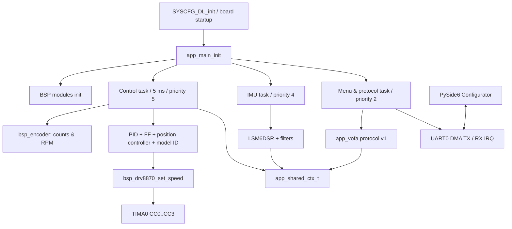

# MSPM0G3507 四电机控制工程架构与重构报告（v0.1.0）

> 审核日期：2026-07-18
> 固件版本：0.1.0；通信协议：v1；目标芯片：TI MSPM0G3507；电机驱动：DRV8870 锁相单 PWM。

## 1. 结论摘要

工程已形成“配置/生成层 → HAL → BSP → 算法与任务 → 串口协议/上位机”的基本分层，控制主链路清晰，5 ms 控制任务与 30 ms 遥测任务在职责上可区分。0.1 版本采用低风险收敛而非大规模搬迁：保留现有文件布局和 Keil Target，引入统一版本头、稳定遥测通道表、机器可解析查询命令以及独立 PySide6 上位机。

当前最高风险仍是：`task_menu.c`同时承担菜单、协议调度、工厂调试和遥测循环；共享 UART 的人类日志与 FireWater 流可能交织；位置/角度控制和机械参数尚需实车标定；DRV8870 单 PWM 锁相硬件无法提供真正独立的 Coast/Brake，且跨越 40%~55%死区时存在占空比跳变。

## 2. 技术栈

| 范畴 | 技术 |
|---|---|
| MCU/内核 | MSPM0G3507，Arm Cortex-M0+ |
| 编译工具 | Keil MDK，ARMCLANG 6.24 |
| RTOS | FreeRTOS，经 OSAL 封装 |
| 芯片库 | TI MSPM0 DriverLib + SysConfig 生成代码 |
| 电机 | 四路 DRV8870，TIMA0 CC0~CC3 单 PWM 锁相驱动 |
| 反馈 | 四路正交编码器；输出轴 520 counts/rev（待标定） |
| IMU | LSM6DSR，SPI，姿态/滤波算法 |
| 通信 | UART0 115200 8-N-1；FireWater 文本、JustFloat 二进制、文本命令协议 v1 |
| PC 工具 | Python 3.10+、PySide6、pyserial、QtCharts |

## 3. 分层与目录职责

```text
MSPM0G3507_FreeRTOS/
├─ Config/                 硬件映射、机械参数、SysConfig生成文件、版本契约
├─ BSP/Peripherals/
│  ├─ hal_*.c/h            DriverLib薄封装，不含业务策略
│  ├─ bsp_*.c/h            UART/ADC/编码器/LED/定时器板级语义
│  ├─ bsp_drv8870.c/h      当前生产电机驱动
│  └─ bsp_motor.c/h        TB6612兼容实现，默认不编译
├─ BSP/IMU/                LSM6DSR设备层及MSPM0端口桥接
├─ Application/
│  ├─ Algorithm/           PID、前馈、规划、位置控制、辨识、融合
│  ├─ Task/                控制、IMU、菜单/协议任务
│  ├─ app_main.c/h         初始化、共享上下文、任务创建
│  ├─ app_vofa.c/h         串口协议编解码与命令执行
│  └─ app_debug.c/h        诊断及FactoryTest专用入口
├─ Lib/OSAL/               RTOS抽象
├─ Filter/                 IMU滤波实现
├─ Docs/                   审查、接口、协议、发布文档
└─ keil/                   生产与FactoryTest Target

tools/mspm0_configurator/  v0.1 PySide6双语配置与绘图工具
```

## 4. 运行时架构



### 控制数据流

1. 编码器 BSP 采集计数并计算四路 RPM。
2. `app_control_task`读取 RPM、IMU 和控制模式。
3. 速度模式执行前馈与 PID；位置/角度模式先由规划器和外环生成四轮目标 RPM。
4. 有符号命令限制在 `-500..+500`，传入 `bsp_drv8870_set_speed()`。
5. 驱动将负命令映射到 `<40%`，零命令映射到 50%，正命令映射到 `>55%`。
6. PWM compare 写入 TIMA0，PB19 为四路电机电源总开关。
7. 状态写入 `app_shared_ctx_t`，菜单任务以 11 通道 FireWater 帧上报。

## 5. 模块依赖与耦合点

| 耦合点 | 现状 | 风险 | 0.1处置 |
|---|---|---|---|
| `task_menu.c`职责过多 | 菜单、协议、遥测、FactoryTest、测试运行器均在同一任务 | 修改一处可能影响串口状态机；代码继续膨胀 | 暂不搬迁，稳定协议常量并文档化；0.2再拆分 |
| `app_vofa.c`直接修改共享控制对象 | 协议解析与业务执行在同文件 | 难以单元测试，命令权限边界弱 | 0.1增加严格匹配和机器查询；后续拆Command Router |
| 全局共享上下文 | 临界区保护粒度较粗 | 读取快照不一致或阻塞控制任务 | 查询只复制最小字段；后续引入状态快照结构 |
| 共用UART | 日志、菜单、命令回显、遥测共享一个发送资源 | 遥测帧中夹日志，GUI/VOFA解析污染 | GUI按11列严格识别；机器消息以`@`开头；建议0.2统一TX仲裁 |
| 驱动与机械方向 | A/B/C/D、LF/LB/RF/RB历史命名并存 | 映射错误会导致控制发散 | 0.1固定 A=M1=RB、B=M2=RF、C=M3=LF、D=M4=LB，并集中方向符号 |
| 单PWM锁相硬件 | IN2由外部三极管反相，软件不能独立控制两输入 | 无真正Coast/Brake，边沿不对称、零点漂移 | 中性50%、死区映射、限斜率；硬件保护不可由软件替代 |
| FactoryTest与生产固件 | 同源码、不同宏/Target | 测试命令误入生产版本 | `PRJ_DRV8870_FACTORY_TEST_ENABLE`默认0；保持独立Target |

## 6. 安全与实时性诊断

### 已具备

- 控制任务最高优先级，5 ms固定周期；菜单/串口低优先级。
- UART DMA发送，忙时丢弃遥测帧，不阻塞控制环。
- 电机电源PB19默认关闭；驱动初始化先设置四路中性。
- PID、目标RPM、模型辨识命令均有限幅。
- `StopAll`、`abort`和FactoryTest退出路径均回到中性/关电源。
- 0.1将无参数命令改为完整匹配，避免`runXYZ`、`stopping`等误触发。

### 尚存风险

1. **软件不能实现硬件过流/短路保护**：ADC电流通道尚未完成标定和闭环限流，不得以当前ADC日志替代保险丝、限流电源和DRV8870内部保护。
2. **死区跨越跳变**：任意非零命令直接越过40%或55%边界；零附近频繁换向会产生冲击。建议控制层增加速度命令斜率限制、换向中性保持和最小启动力矩标定。
3. **串口协议为ASCII命令**：没有鉴权、CRC或事务号，仅适合本地调试串口，不能直接暴露至不可信网络。
4. **阻塞辨识流程**：Sweep/Step/Auto在菜单任务中长时间运行，虽不阻塞控制任务，但占用协议任务；GUI 0.1不自动触发这些高风险命令。
5. **参数不持久化**：重启后恢复编译默认值；GUI JSON只是PC侧配置，不代表写入MCU Flash。

## 7. 0.1重构边界

### 已执行

- 新增`Config/project_version.h`，统一固件版本和协议版本。
- 在`app_vofa.h`定义稳定的11通道遥测枚举。
- 新增`Info?`、`Config?`、`Status?`/`Status=n`机器查询。
- 新增`Stream=1/0`，可在不启动电机的情况下启停遥测。
- 收紧Run/Stop/Step/Auto/Sweep/Menu/abort和模式值的匹配规则。
- PySide6串口工作线程与UI线程隔离；协议解析、设置存储、绘图组件分层。

### 明确不在0.1执行

- 不重写控制任务和PID算法。
- 不改SysConfig时钟、引脚和定时器资源。
- 不引入Flash参数存储。
- 不删除TB6612兼容驱动。
- 不将FactoryTest接口并入生产协议。

## 8. 后续重构路线

### P0：发布后立即验证

- 四轮悬空逐路验证正向命令对应车体前进；核对编码器正号。
- 使用示波器测四通道0%、40%、50%、55%、100%及换向边沿。
- 限流电源下标定电流采样零点、增益和堵转阈值。

### P1：0.2协议与任务解耦

- 拆分`app_command_parser`、`app_command_service`、`app_telemetry`。
- 建立UART TX单写者队列，区分LOG/ACK/TELEMETRY优先级。
- 引入`app_status_snapshot_t`，控制任务一次写入，协议任务无长临界区读取。
- 所有命令返回`@ACK`或`@ERR,code=...`。

### P1：电机安全状态机

- `POWER_OFF → NEUTRAL_SETTLE → READY → RUN → REVERSING → FAULT`。
- 换向必须先降到零、保持中性若干周期、再进入反方向有效区。
- 增加命令斜率、目标RPM斜率、连续饱和和编码器失步监测。

### P2：参数管理

- 参数结构带版本、长度和CRC；双页Flash原子更新。
- GUI实现读回、校验、写入、恢复出厂值。
- 将PPR、减速比、轮径、轮距、安装方向作为受控参数，修改后必须重新标定。

## 9. 可维护性评价

- 优点：头文件注释较完整，配置集中，HAL/BSP边界基本明确，控制算法按模块拆分，编译目标可区分生产/工厂测试。
- 问题：历史命名和文档存在TB6612残留；应用协议与业务耦合；部分全局状态；测试主要依赖硬件人工观察。
- 0.1基线建议：所有新增公共API必须写参数范围、返回值和线程上下文；所有协议变更必须同步`通信协议_v1.md`和GUI单元测试；生产/FactoryTest均保持0错误0警告。
