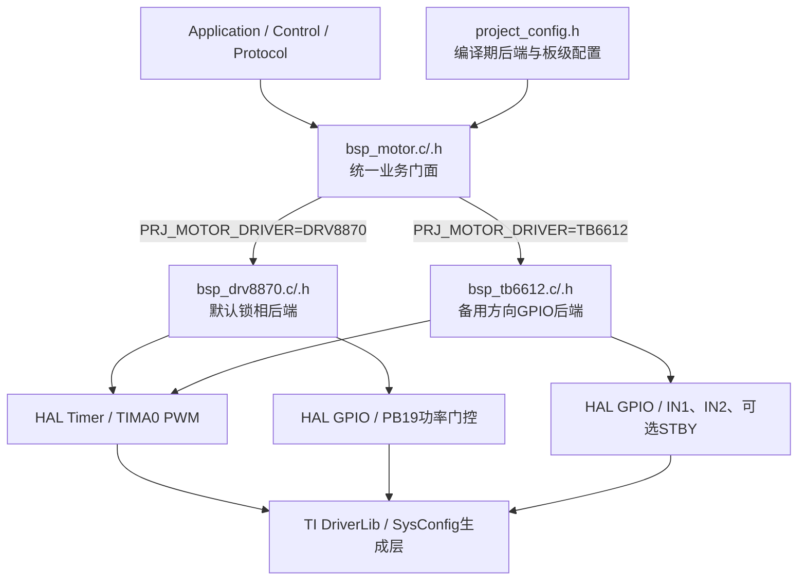

# 电机驱动双后端分层与切换指南

> - 工程：`MSPM0G3507_Project/MSPM0G3507_FreeRTOS`
> - 适用分支：`refactor/phase1`
> - 文档日期：2026-07-18
> - 当前默认后端：DRV8870
> - 备用兼容后端：TB6612FNG

## 1. 目标与安全边界

本工程同时维护两套电机驱动实现，但任一固件只能选择一个后端：

- 应用层、控制算法、模型辨识和通信协议只依赖 `bsp_motor.h`；
- `bsp_motor.c` 在编译期选择 DRV8870 或 TB6612；
- 两个芯片后端可以同时加入 Keil 工程，但只有所选后端会被统一门面调用；
- 当前 `Config/empty.syscfg` 只与现有 DRV8870 板级资源匹配；
- TB6612 后端已完成静态设计、参数检查和编译门禁，**尚未完成当前硬件实测验收**；
- 切换后端不等于仅修改一个宏。必须同时切换对应的 SysConfig profile、引脚复用和实物板卡。

严禁在同一固件中同时初始化两套后端，严禁让两套驱动共同占用 TIMA0 或同一组 PWM/GPIO。

## 2. 分层架构



### 2.1 各层职责

| 层级 | 文件 | 职责 | 禁止事项 |
|---|---|---|---|
| 应用层 | `Application/` | 启停、速度闭环、模型辨识、协议命令 | 不得直接调用普通 `bsp_drv8870_*` 或 `bsp_tb6612_*` |
| 统一门面 | `BSP/Peripherals/bsp_motor.[ch]` | 统一编号、命令量纲、停止语义、后端选择、板级配置装配 | 不实现芯片专属时序 |
| DRV8870后端 | `BSP/Peripherals/bsp_drv8870.[ch]` | 锁相PWM映射、死区、中性点、PB19联锁、专属示波器诊断 | 不向上层承诺真实Coast/Brake |
| TB6612后端 | `BSP/Peripherals/bsp_tb6612.[ch]` | PWM+方向GPIO、真实Coast/Brake、换向保护、可选STBY | 未恢复TB6612 SysConfig时不得编译启用 |
| 工程配置 | `Config/project_config.h` | 后端选择、安装方向、通道、阈值、延时、机械参数 | 不硬编码不存在的生成宏绕过门禁 |
| 硬件生成层 | `Config/empty.syscfg`、`ti_msp_dl_config.[ch]` | 时钟、引脚复用、GPIO初值、PWM实例 | 不手改生成的 `.c/.h` |

## 3. 统一业务契约

### 3.1 电机编号

| 公共ID | 板端接口 | 车轮位置 | 编码器反馈 |
|---|---|---|---|
| `BSP_MOTOR_A` | M1 | 右后 RB | `BSP_ENCODER_RB` |
| `BSP_MOTOR_B` | M2 | 右前 RF | `BSP_ENCODER_RF` |
| `BSP_MOTOR_C` | M3 | 左前 LF | `BSP_ENCODER_LF` |
| `BSP_MOTOR_D` | M4 | 左后 LB | `BSP_ENCODER_LB` |

### 3.2 命令范围与方向

统一命令范围由下式定义：

```c
#define PRJ_MOTOR_COMMAND_MAX (500U)
```

合法业务命令为 `[-500, +500]`：

- 正值：车体前进方向；
- 负值：车体后退方向；
- 0：停止；
- 超界值由后端限幅；
- 安装方向只通过 `PRJ_MOTOR_A_INSTALL_DIR_SIGN` 到 `PRJ_MOTOR_D_INSTALL_DIR_SIGN` 修正；
- 不要同时修改电机安装方向与编码器方向来掩盖接线或映射错误。

### 3.3 公共API

```c
bsp_status_t bsp_motor_init(void);
bsp_status_t bsp_motor_power_enable(void);
void         bsp_motor_power_disable(void);
bool         bsp_motor_power_is_enabled(void);

bsp_status_t bsp_motor_set_speed(bsp_motor_id_t motor, int32_t command);
bsp_status_t bsp_motor_stop(bsp_motor_id_t motor,
                            bsp_motor_stop_mode_t mode);
void         bsp_motor_stop_all(void);

uint32_t     bsp_motor_get_command_max(void);
uint32_t     bsp_motor_percent_to_command(uint32_t percent);
bsp_motor_driver_t bsp_motor_get_driver(void);
const char  *bsp_motor_get_driver_name(void);
uint32_t     bsp_motor_get_capabilities(void);
```

公共能力位用于表达硬件差异：

| 能力位 | DRV8870当前板 | TB6612备用后端 |
|---|---:|---:|
| `BSP_MOTOR_CAP_POWER_GATE` | 是，PB19 | 仅在配置STBY时为是 |
| `BSP_MOTOR_CAP_TRUE_COAST` | 否 | 是 |
| `BSP_MOTOR_CAP_TRUE_BRAKE` | 否 | 是 |
| `BSP_MOTOR_CAP_LOCKED_ANTIPHASE` | 是 | 否 |
| `BSP_MOTOR_CAP_DIRECTION_GPIO` | 否 | 是 |

> 当前公共 `bsp_motor_stop()` 为兼容接口。DRV8870后端会把COAST/BRAKE都安全降级为50%中性主动阻尼；若业务逻辑必须依赖真实滑行或短制动，应先检查能力位，不能按名称假设硬件支持。

## 4. 默认DRV8870后端

### 4.1 当前硬件模型

当前板上每个DRV8870只使用一路PWM：

```text
MCU PWM ─────────────> IN1
MCU PWM ──S8050反相──> IN2
```

这是 Locked Anti-Phase 锁相驱动。软件无法独立控制IN1和IN2，因此无法可靠生成真正的 `00` Coast 或 `11` Brake。

四路PWM映射：

| 电机 | TIMA0通道 | 当前引脚 |
|---|---:|---|
| A/M1 | CC0 | PA8 |
| B/M2 | CC1 | PA9 |
| C/M3 | CC2 | PB17 |
| D/M4 | CC3 | PB2 |

PB19为四路电机功率总开关，高电平有效；SysConfig必须保证上电初始为低。

### 4.2 死区与命令映射

当前实测机械区间：

| 绝对PWM占空比 | 含义 |
|---:|---|
| `<40%` | 反转有效区 |
| `40%~55%`（含边界） | 机械停止死区 |
| `>55%` | 正转有效区 |
| `50%` | 默认中性点 |

业务命令并非直接等于绝对占空比：

- `command == 0` → 50%中性；
- `command > 0` → 严格映射到55%以上；
- `command < 0` → 严格映射到40%以下；
- `PRJ_DRV8870_ZERO_DUTY_OFFSET`仅用于实测零点微调，调整后中性仍必须落在死区内。

### 4.3 DRV8870安全启动/停机

```c
#include "bsp_motor.h"
#include "project_config.h"
#include "osal.h"

void motor_demo(void)
{
    if (bsp_motor_power_enable() != BSP_OK) {
        return;
    }

    osal_task_delay_ms(PRJ_MOTOR_POWER_STARTUP_MS);

    if (bsp_motor_set_speed(BSP_MOTOR_A, +150) != BSP_OK) {
        bsp_motor_power_disable();
        return;
    }

    osal_task_delay_ms(500U);
    bsp_motor_stop_all();
    osal_task_delay_ms(PRJ_MOTOR_POWER_SETTLE_MS);
    bsp_motor_power_disable();
}
```

安全边界：

1. `power_enable()`仅完成安全输出和PB19命令，不包含阻塞启动延时；
2. `power_is_enabled()`检查软件状态和GPIO输出锁存，不等于物理12V反馈；
3. 软件限幅、死区和斜率控制不能替代DRV8870的OCP、TSD、UVLO及正确硬件布局；
4. 禁止用短接输出、堵转到热保护等方式测试保护；
5. 通信失联、任务异常和控制超时必须先 `stop_all()`，再关闭PB19；
6. FactoryTest诊断不属于生产API。

### 4.4 DRV8870专属诊断

`bsp_drv8870_hw_scope_*()`只供专用Keil Target：

```text
empty_LP_MSPM0G3507_drv8870_factory_test
```

生产Target中 `PRJ_DRV8870_FACTORY_TEST_ENABLE` 必须为0。诊断接口允许直接设置原始compare，绕过业务死区，只能在车轮悬空、实验室电源限流、硬件关断可用时执行。

## 5. 备用TB6612后端

### 5.1 控制模型

每个电机需要：

- 1路PWM；
- 2路方向GPIO（IN1、IN2）；
- 每片TB6612另有STBY。STBY不得悬空。

TB6612单通道使用PWM输入时的关键状态：

| IN1 | IN2 | PWM | 输出语义 |
|---:|---:|---:|---|
| 1 | 0 | PWM | 一个方向调速 |
| 0 | 1 | PWM | 另一方向调速 |
| X | X | 0 | 短制动 |
| 0 | 0 | 1 | 高阻滑行 |

**注意：`IN1=0、IN2=0、PWM=0`不是本实现采用的真实Coast。** 后端以 `IN1=IN2=0、PWM=100%` 实现单通道高阻滑行。

为避免方向脚切换时出现意外驱动脉冲，Coast写入顺序为：

```text
PWM=0（先短制动）
→ IN1=IN2=0
→ PWM=100%（进入高阻滑行）
```

### 5.2 换向保护

TB6612后端记录每路上次方向。正反方向跨越时：

1. 当前调用只进入真正高阻Coast；
2. 清除上次方向状态；
3. 至少等到上层下一次控制调用，才允许设置新方向和PWM。

这是一项非阻塞安全策略。若调用方只发送一次反向命令，电机会保持Coast而不会自动换向；周期控制任务应在下一周期重复期望命令。需要更长换向时间时，应在控制层增加基于tick的中性保持状态机，不能通过阻塞延时卡住控制任务。

### 5.3 STBY与软件功率闸门

```c
#define PRJ_TB6612_STANDBY_CONTROL_ENABLE (0U)
```

- `1`：必须定义STBY端口、引脚和有效电平；统一门面的 power API 会实际控制STBY；
- `0`：表示STBY已由硬件可靠固定为有效，power API仅作为软件允许运行闸门，不能切断VM或驱动器；
- 无论哪种模式，STBY都不得悬空；
- 如果一块板上有两片TB6612且STBY未并联，应扩展配置为两路STBY，不能假设单GPIO覆盖两片器件。

### 5.4 备用引脚历史记录

历史TB6612方向GPIO（来自旧版SysConfig生成结果）：

| 电机 | IN1 | IN2 |
|---|---|---|
| A/M1 | PB24 | PB20 |
| B/M2 | PA24 | PA31 |
| C/M3 | PA3 | PA7 |
| D/M4 | PB6 | PB7 |

历史TB6612 PWM与当前DRV8870 PWM不同：

| 电机 | 历史TB6612 PWM | 当前DRV8870 PWM |
|---|---|---|
| A/M1 | PB8 / CC0 | PA8 / CC0 |
| B/M2 | PA22 / CC1 | PA9 / CC1 |
| C/M3 | PA15 / CC2 | PB17 / CC2 |
| D/M4 | PA17 / CC3 | PB2 / CC3 |

因此恢复TB6612时必须同时核对四路PWM和八路方向GPIO。只恢复方向GPIO而继续使用当前DRV8870 PWM映射，除非原理图明确支持，否则不能认为兼容。

### 5.5 当前编译门禁

当选择TB6612而当前生成头文件不存在以下宏时，`project_config.h`会主动终止编译：

```text
MOTOR_AIN1_PIN ... MOTOR_DIN2_PIN
```

预期错误：

```text
TB6612 selected: restore MOTOR_AIN1..MOTOR_DIN2 in SysConfig and regenerate ti_msp_dl_config
```

这不是构建故障，而是防止错误固件烧录到不匹配硬件的安全门禁。不得通过伪造宏绕过。

## 6. 编译期切换步骤

### 6.1 切换到TB6612

1. 保存当前代码状态并建立回退分支/标签；
2. 准备独立的TB6612 SysConfig profile，建议命名为 `empty_tb6612.syscfg`；
3. 按实物原理图配置四路PWM、八路IN1/IN2 GPIO和全部STBY；
4. GPIO初值必须与STBY禁用/安全Coast策略一致；
5. 重新生成 `ti_msp_dl_config.c/h`，核对引脚、PWM频率、周期和输出极性；
6. 在构建宏或 `project_config.h` 中设置：

```c
#define PRJ_MOTOR_DRIVER PRJ_MOTOR_DRIVER_TB6612
```

7. 确认FactoryTest宏为0；DRV8870 FactoryTest Target不得与TB6612组合；
8. Rebuild并审阅所有警告；
9. 不接电机，先验证STBY、IN1/IN2和PWM真值；
10. 使用限流电源、悬空单轮和低命令逐路验证；
11. 验证车体前进方向、编码器符号、急停、通信失联和换向Coast；
12. 全部验收后再进行闭环、模型辨识和负载测试。

### 6.2 恢复到默认DRV8870

1. 恢复DRV8870对应的 `empty.syscfg` 和生成文件；
2. 设置 `PRJ_MOTOR_DRIVER=PRJ_MOTOR_DRIVER_DRV8870`，或删除外部覆盖以使用默认值；
3. 确认PWM为PA8、PA9、PB17、PB2，初始compare为500；
4. 确认PB19为低电平上电默认、软件高电平使能；
5. 确认死区为40%～55%，中性为50%；
6. 构建普通Target和DRV8870 FactoryTest Target；
7. 烧录普通Target，先验证串口与中性输出，再使能PB19；
8. 必要时才使用FactoryTest做示波器检查。

## 7. 独立SysConfig profile建议

不要在同一个 `empty.syscfg` 中反复手工改两种板级映射。建议维护：

```text
Config/board_drv8870/empty.syscfg
Config/board_tb6612/empty.syscfg
```

或使用两个明确命名的Keil Target，将各自生成目录隔离。每个profile必须共同维护：

- TIMA0实例、PWM时钟、周期、输出极性和四路引脚；
- 方向GPIO和STBY（仅TB6612）；
- PB19功率GPIO（仅当前DRV8870板）；
- ADC、SPI、UART、编码器等潜在引脚冲突；
- `project_config.h`中与该profile对应的生成宏。

在实现生成目录隔离前，切换profile后必须检查Git差异，防止无意覆盖另一板型配置。

## 8. 测试、验收与回滚

### 8.1 分级测试顺序

| 阶段 | 条件 | 操作 | 验收条件 |
|---|---|---|---|
| G0 编译门禁 | 不改当前SysConfig | 临时选择TB6612并构建 | 只出现预期缺GPIO `#error`，恢复后无临时差异 |
| G1 默认构建 | DRV8870配置 | 构建普通Target和FactoryTest Target | 0 error、0 warning |
| G2 无电机静态 | VM关闭 | 测GPIO初值、PWM频率、STBY/PB19 | 上电无意外驱动；通道映射正确 |
| G3 单轮空载 | 悬空、限流 | 逐路低命令正反转、停止、断电 | 方向、编码器、停机、功率闸门正确 |
| G4 四轮空载 | 悬空、限流 | 并发控制和急停 | 无误通道、无失控换向 |
| G5 负载闭环 | 机械安全区 | PID、模型辨识、通信失联 | 无过流、无看门狗/任务超时、急停有效 |

### 8.2 主要风险与回滚

| 风险 | 影响 | 预防 | 回滚 |
|---|---|---|---|
| SysConfig引脚冲突 | 无法启动或误驱动 | 独立profile、生成后diff和无电机验证 | 恢复DRV8870 SysConfig及生成文件 |
| 两后端同时占资源 | PWM/GPIO竞争 | 应用只依赖门面、编译期单选 | 恢复默认宏并清理非门面调用 |
| STBY悬空/极性错误 | 上电不可控 | 硬件上下拉、核对有效电平 | 断VM，恢复固定禁用状态 |
| TB6612 Coast真值错误 | 误制动或误驱动 | 使用 `00 + PWM高`，按数据手册实测 | 断VM，回退已验证固件 |
| DRV8870死区错误 | 不转、偏转、发热 | 保留40%～55%和50%中性 | 回退死区参数并重新标定 |
| 安装方向/反馈符号混改 | 正反馈失控 | 分开验证电机方向与编码器方向 | 恢复配置，单轮重新标定 |
| 软件功率闸门被误认为物理断电 | 故障时仍带电 | 明确无STBY时仅为逻辑闸门 | 使用硬件总开关断电 |

紧急回滚顺序：

1. 使用硬件开关切断电机电源；
2. 烧录最后一个已验证DRV8870普通固件；
3. 恢复 `PRJ_MOTOR_DRIVER_DRV8870` 和DRV8870 SysConfig；
4. 只验证串口、PWM中性和PB19默认OFF；
5. 单轮悬空验收后再恢复四轮。

## 9. 维护约束

1. 新业务代码只包含 `bsp_motor.h`；
2. 芯片后端头文件只允许门面、后端内部或明确的工厂诊断模块包含；
3. 统一命令范围变化必须同步检查PID、模型辨识、协议文档和GUI校验；
4. 修改PWM周期时必须检查DRV8870 `command_max == period/2` 的编译约束；
5. 修改TB6612 PWM极性时必须重新审查Coast/Brake真值；
6. 所有硬件参数变更先记录回退提交，再做单轮验证；
7. 未经硬件测试，不得把TB6612标记为“生产已验证”。

## 10. 当前验证状态

| 项目 | 状态 |
|---|---|
| 应用层普通控制已迁移到 `bsp_motor` | 已完成 |
| 默认DRV8870普通Target构建 | 已通过 |
| DRV8870 FactoryTest Target构建 | 已通过 |
| TB6612缺失SysConfig时编译门禁 | 已通过：仅保留缺方向GPIO主错误，无级联未定义标识符，配置文件按字节恢复一致 |
| TB6612后端硬件功能 | 未验证 |
| TB6612过流、短路、热保护 | 禁止以破坏性方法验证；未验证 |

TB6612FNG真值与电气限制应以Toshiba官方数据手册为最终依据；DRV8870保护和时序应以Texas Instruments官方数据手册为最终依据。